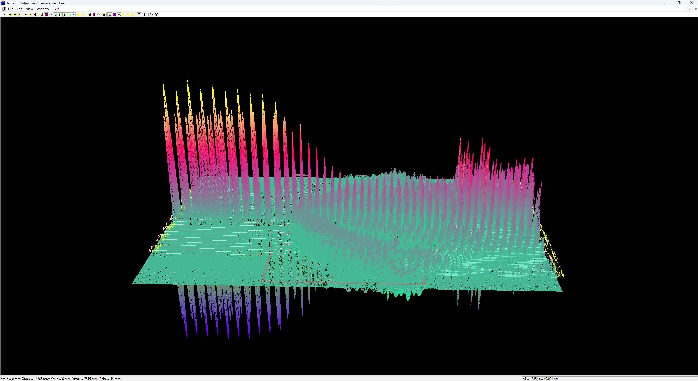
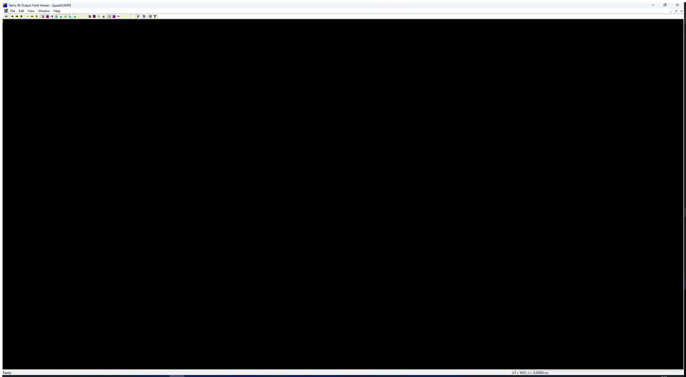
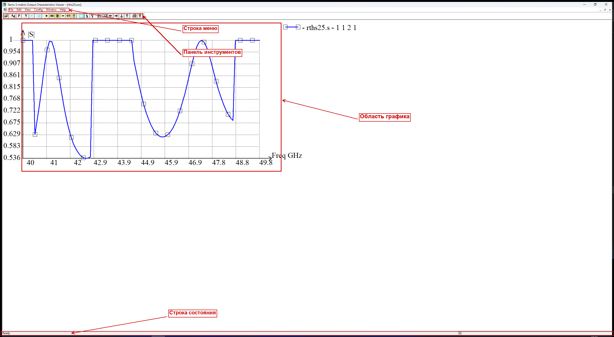

<div align="center">

# TMC Suite

**Scientific software package for electrodynamic simulation of planar structures**

C++ · MFC · OpenGL · Windows (32/64-bit)

**English** · [Русский](#tmc-suite-русская-версия)



</div>

---

## Overview

**TMC Suite** is an authorial scientific software package by **K. N. Klimov** for electrodynamic
computation and visualization of planar structures (H-polarization and X-mode). It computes
scattering matrices, radiation (directional) patterns, time-domain signals and electromagnetic
fields, and provides interactive OpenGL/MFC viewers to explore the results.

The package consists of **6 programs** and **6 libraries**, sharing a single source tree and built
for both **win32** and **win64**.

## Components

### Computational kernels
| Program | Executable | Purpose |
|---|---|---|
| **PlanarRT_H** | `tmc_rth.exe` | Ray-tracing solver, H-polarization |
| **PlanarRT_X** | `tmc_rtx.exe` | Ray-tracing solver, X-mode (incl. magnetized plasma) |

### Viewers & visualization
| Program | Purpose |
|---|---|
| **TMCGROUT** | Scattering-matrix plots |
| **TMC_DN** | Radiation (directional) patterns |
| **TMCROS** | Time-domain signals |
| **FieldView** | Interactive OpenGL visualization of electromagnetic fields |

### Libraries
`SFILE95` · `complex` · `exprint` · `TMCLibError` · `PREPR` · `TMCIndan`

## Screenshots

| Field visualization (FieldView) | Scattering matrix (TMCGROUT) |
|---|---|
|  |  |

| Radiation pattern (TMC_DN) | Solver (PlanarRT_X) |
|---|---|
|  |  |

## Input format

Simulations are described in **`.tpl`** text files (the TAMIC input language): geometry, materials,
sources, frequency sweeps and output requests.

## Building (Windows)

The package is built with **Microsoft Visual Studio / MSBuild**. Source is shared; build outputs are
kept per-platform.

```bat
:: win32
msbuild <Solution>.sln /p:Platform=Win32 /p:Configuration=Release

:: win64
msbuild <Solution>.sln /p:Platform=x64 /p:Configuration=Release
```

> **Build order matters.** Build all 6 libraries first, then the viewers, then the kernels, then
> FieldView. See the full step-by-step guide in the documentation (`docs/build-guide/`).

## Documentation

Full documentation (in Russian) lives in [`docs/`](docs/): API reference, build guide, user manuals
with screenshots, architecture notes and training materials.

## Author & links

- **Author:** K. N. Klimov
- **Website:** *(TAMIC — coming soon)*
- Social links are provided on the author's profile.

## License

See [`LICENSE`](LICENSE).

---
---

<div align="center">

# TMC Suite (русская версия)

**Научный пакет для электродинамического моделирования планарных структур**

C++ · MFC · OpenGL · Windows (32/64 бита)

[English](#tmc-suite) · **Русский**

</div>

## О проекте

**TMC Suite** — авторская научная разработка **К. Н. Климова** для электродинамических расчётов и
визуализации планарных структур (H-поляризация и X-мода). Пакет вычисляет матрицы рассеяния,
диаграммы направленности, временные сигналы и электромагнитные поля, а также предоставляет
интерактивные вьюверы на OpenGL/MFC для просмотра результатов.

Пакет состоит из **6 программ** и **6 библиотек** с единым деревом исходников; собирается под
**win32** и **win64**.

## Состав

### Счётные ядра
| Программа | Исполняемый файл | Назначение |
|---|---|---|
| **PlanarRT_H** | `tmc_rth.exe` | Расчётное ядро, H-поляризация |
| **PlanarRT_X** | `tmc_rtx.exe` | Расчётное ядро, X-мода (в т.ч. замагниченная плазма) |

### Вьюверы и визуализация
| Программа | Назначение |
|---|---|
| **TMCGROUT** | Графики матриц рассеяния |
| **TMC_DN** | Диаграммы направленности |
| **TMCROS** | Временные сигналы |
| **FieldView** | Интерактивная OpenGL-визуализация электромагнитных полей |

### Библиотеки
`SFILE95` · `complex` · `exprint` · `TMCLibError` · `PREPR` · `TMCIndan`

## Скриншоты

| Визуализация полей (FieldView) | Матрица рассеяния (TMCGROUT) |
|---|---|
|  |  |

| Диаграмма направленности (TMC_DN) | Счётное ядро (PlanarRT_X) |
|---|---|
|  |  |

## Формат входных данных

Задачи описываются в текстовых файлах **`.tpl`** (входной язык TAMIC): геометрия, материалы,
источники, частотные развёртки и запросы на вывод.

## Сборка (Windows)

Пакет собирается в **Microsoft Visual Studio / MSBuild**. Исходники общие, результаты сборки —
раздельные по платформам.

```bat
:: win32
msbuild <Solution>.sln /p:Platform=Win32 /p:Configuration=Release

:: win64
msbuild <Solution>.sln /p:Platform=x64 /p:Configuration=Release
```

> **Важен порядок сборки.** Сначала все 6 библиотек, затем вьюверы, затем счётные ядра, затем
> FieldView. Подробная пошаговая инструкция — в документации (`docs/build-guide/`).

## Документация

Полная документация (на русском) — в папке [`docs/`](docs/): описание API, инструкция по сборке,
руководства пользователя со скриншотами, архитектура и учебные материалы.

## Автор и ссылки

- **Автор:** К. Н. Климов
- **Сайт:** *(ТАМИC — скоро)*
- Ссылки на соцсети указаны в профиле автора.

## Лицензия

См. файл [`LICENSE`](LICENSE).
