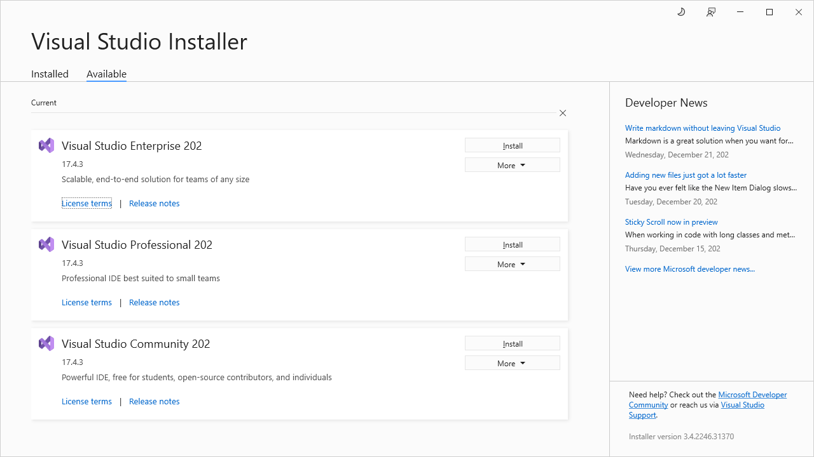
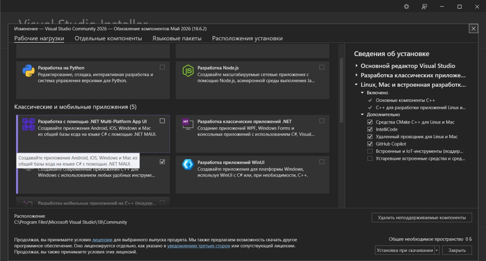
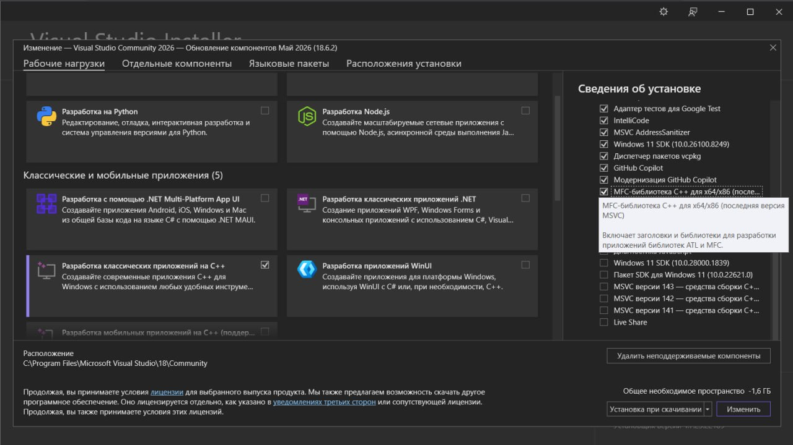

============================================================================
win32 · Шаг 1. Что установить
============================================================================

Прежде чем собирать TMC Suite под 32 бита, установите перечисленное ниже ПО.
Раздел рассчитан на человека, который делает это впервые.

----

1.1 Visual Studio
=================

Нужна **Microsoft Visual Studio Community 2026** (версия **v18.6**).

.. note::

   Именно эта версия использовалась при реальной сборке проекта (зафиксировано в
   журнале ``CHANGELOG.md``). Набор инструментов компилятора (PlatformToolset) — **v145**.

.. warning::

   ⚠️ Уточнить версию: точный номер сборки (билд) Windows SDK, который шёл с этой
   установкой, не зафиксирован — см. чек-лист в конце файла.

Где скачать
-----------

Официальный установщик Visual Studio Community — бесплатный, с сайта Microsoft
(``visualstudio.microsoft.com``). Скачайте установщик **Visual Studio Installer** и
запустите его.

   Стартовое окно **Visual Studio Installer**, редакция Community 2026.

Какие компоненты (рабочие нагрузки) отметить
--------------------------------------------

В установщике на вкладке **Workloads** (Рабочие нагрузки) отметьте:

1. **Desktop development with C++** (Разработка классических приложений на C++) —
   обязательно. Это даёт сам компилятор C++ (MSVC, toolset v145), линкер и среду.

   Вкладка **Workloads** с отмеченной «Desktop development with C++».

Отдельные компоненты, которые надо добавить вручную
---------------------------------------------------

Перейдите на вкладку **Individual components** (Отдельные компоненты) и убедитесь,
что отмечено:

2. **MFC** — **Microsoft Foundation Classes** для актуального набора инструментов
   (компонент вида «C++ MFC for latest build tools (x86 & x64)»). Все программы
   TMC Suite — MFC-приложения, без этого компонента они не соберутся.

   Вкладка **Individual components** с отмеченным «C++ MFC for latest build tools».

3. **Windows SDK** — комплект средств разработки Windows. Из него берутся системные
   заголовки и библиотеки, в том числе **OpenGL** (см. раздел 1.2). Обычно SDK
   ставится автоматически вместе с рабочей нагрузкой C++; проверьте, что хотя бы одна
   версия Windows SDK отмечена.

После выбора компонентов нажмите **Install** (Установить) и дождитесь окончания.

----

1.2 OpenGL для FieldView (входит в Windows SDK)
===============================================

Программа **FieldView** использует OpenGL. **Отдельно ничего скачивать и устанавливать
не нужно** — всё необходимое входит в Windows SDK, который вы поставили вместе с
Visual Studio.

Что именно берётся из SDK:

- **Заголовки** ``GL.h`` и ``GLU.h`` — подтягиваются из Windows SDK автоматически
  (компилятор находит их по стандартным путям SDK; вручную прописывать пути к ним
  не требуется).
- **Библиотеки линковки**:

  - ``opengl32.lib`` — основная библиотека OpenGL;
  - ``glu32.lib`` — библиотека утилит GLU.

  Для 32-битной сборки эти ``.lib`` берутся из 32-битной части SDK (папка ``um\x86``).
  Visual Studio выбирает их автоматически при платформе ``Win32``.

.. warning::

   ⚠️ Важно: устаревшая вспомогательная библиотека **GLAUX** (``glaux.h`` / ``glaux.lib``)
   в современном Windows SDK отсутствует. В коде FieldView ссылка на неё удалена
   (правка **Ф4-1**, см. файл ``06-build-fieldview``). Никаких действий по установке
   GLAUX выполнять НЕ нужно.

.. warning::

   ⚠️ Уточнить версию: в данном проекте Windows SDK физически находился на диске **F:**.
   На другой машине путь будет иным; точный номер версии SDK не зафиксирован — см.
   чек-лист.

----

1.3 Настройки набора символов и линковки MFC (информация)
=========================================================

Все проекты TMC Suite настроены на:

- **Статическую линковку MFC** (MFC встраивается в ``.exe``, отдельные DLL MFC при
  запуске не требуются).
- Набор символов **MultiByte (MBCS)** — многобайтовая кодировка, не Unicode.

Эти параметры уже заданы в файлах проектов (``.vcxproj``). Менять их вручную не нужно —
информация приведена, чтобы вы понимали, почему при установке требовался компонент MFC.

----

1.4 Проверка перед началом
==========================

После установки откройте Visual Studio. Если в окне создания проекта доступны шаблоны
C++, а в установленных компонентах виден MFC — окружение готово.

Переходите к файлу **``02-setup-paths``**.

----
