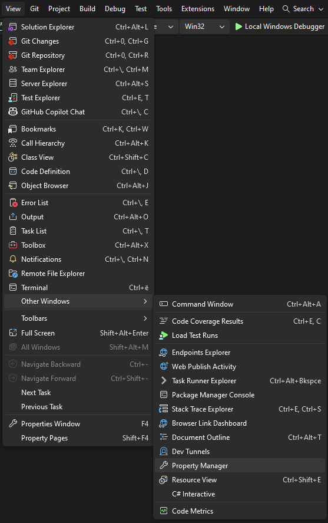
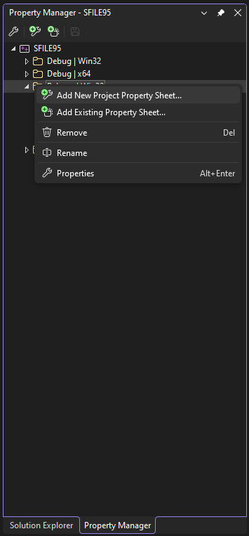
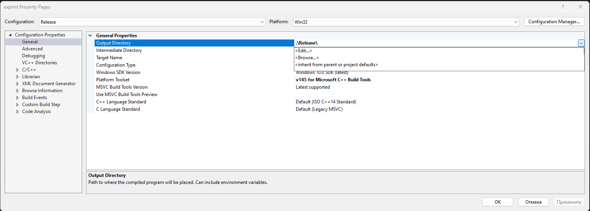

=====================================
win32 · Шаг 2. Пути и property sheets
=====================================

На этом шаге вы подготовите общие настройки путей (property sheets) и папки, в которые
будут складываться результаты сборки. Делается один раз.

.. note::

   Везде ниже считается, что корень проекта — папка, в которой лежат ``src\``, ``build\``,
   ``dist\``, ``samples\``. В примерах он обозначен как ``<КОРЕНЬ>``.

----

2.1 Создайте папки результатов (если их ещё нет)
================================================

В корне проекта должны существовать четыре папки. Для **win32** обязательны две из них::

   <КОРЕНЬ>\dist\win32\lib    ← сюда лягут 6 файлов .lib
   <КОРЕНЬ>\dist\win32\bin    ← сюда лягут 6 файлов .exe

(Папки ``dist\win64\lib`` и ``dist\win64\bin`` нужны только для 64-битной сборки —
для win32 их можно не трогать.)

Если папок нет — создайте их вручную в проводнике или командой PowerShell:

.. code-block:: powershell

   New-Item -ItemType Directory -Force -Path "<КОРЕНЬ>\dist\win32\lib", "<КОРЕНЬ>\dist\win32\bin"

----

2.2 Зачем нужны property sheets
===============================

**Property sheet** (лист свойств, файл ``.props``) — это файл общих настроек, который
подключается к проектам Visual Studio. Настроили один раз — применилось ко всем
проектам. Благодаря им не нужно в каждом проекте вручную прописывать пути к заголовкам,
библиотекам и папкам вывода.

В проекте уже подготовлены три листа свойств в папке ``<КОРЕНЬ>\build\``:

.. list-table::
   :header-rows: 1
   :widths: 30 70

   * - Файл
     - Назначение
   * - ``Common.props``
     - общие пути: заголовки ``src\Include``, библиотеки ``dist\<платформа>\lib``
   * - ``LibOutput.props``
     - куда класть готовый ``.lib`` (для библиотек)
   * - ``ExeOutput.props``
     - куда класть готовый ``.exe`` (для программ)

Ключевой момент: внутри ``Common.props`` папка платформы выбирается **автоматически** по
текущей платформе сборки:

- платформа ``Win32`` → папка ``win32``;
- платформа ``x64`` → папка ``win64``.

Поэтому один и тот же ``.props`` корректно работает и для 32-, и для 64-битной сборки —
ничего переключать вручную не нужно.

.. note::

   В проектах TMC Suite эти property sheets **уже подключены** (это часть выполненной
   настройки сборки). Раздел 2.3 нужен только если вы открываете «голый» проект, где
   листа свойств нет.

----

2.3 Как подключить property sheet к проекту (если не подключён)
===============================================================

1. В Visual Studio откройте меню **View → Property Manager** (Вид → Диспетчер свойств).

   Меню **View → Property Manager**.

2. В окне **Property Manager** раскройте проект, затем конфигурацию
   **Release | Win32**.
3. Щёлкните правой кнопкой по конфигурации → **Add Existing Property Sheet…**
   (Добавить существующий лист свойств).

   Контекстное меню **Add Existing Property Sheet…**.

4. Выберите нужный файл из ``<КОРЕНЬ>\build\``:

   - для **библиотеки** — ``LibOutput.props``;
   - для **программы** (вьювер, ядро, FieldView) — ``ExeOutput.props``.

   (Оба этих файла внутри сами подключают ``Common.props``, поэтому отдельно его
   добавлять не нужно.)

После подключения пути к заголовкам (``src\Include``), к библиотекам
(``dist\win32\lib``) и папка вывода подставятся автоматически.

2.3.1 Проверьте, что проект не перебивает пути вывода (ВАЖНО)
-------------------------------------------------------------

Подключить property sheet **недостаточно**, если в самом проекте остались **жёстко
прописанные пути вывода** — они **перебивают** property sheet (явное значение в проекте
сильнее унаследованного). Признак проблемы: после сборки ``.lib`` попадает не в
``dist\win32\lib``, а, например, в ``d:\work\lib``, и в окне Output появляется
предупреждение **MSB8012**:

.. code-block:: text

   warning MSB8012: TargetPath(...\SFILE95\Release\SFILE95.lib) does not match the Library's
   OutputFile property value (d:\work\lib\sfile95.lib).

Чтобы вывод шёл в ``dist\win32\lib``, верните «наследование» из property sheet:

1. ПКМ по проекту → **Properties**, вверху конфигурация **Release | Win32**.
2. **Configuration Properties → General → Output Directory** — если стоит жёсткий путь
   (``.\Release\`` и т. п.), раскройте стрелку справа →
   **<inherit from parent or project defaults>** (вернётся ``$(OutDir)`` из property sheet
   → ``dist\win32\lib``).
3. **Configuration Properties → Librarian → General → Output File** — если стоит жёсткий путь
   (``d:\work\lib\sfile95.lib`` и т. п.), раскройте стрелку справа →
   **<inherit from parent or project defaults>** (станет ``$(OutDir)$(TargetName)$(TargetExt)``).
4. **OK**. После пересборки ``.lib`` ляжет в ``dist\win32\lib``, предупреждение MSB8012 исчезнет.

   Output Directory и Output File со значением «inherit…» (General и Librarian → General).

.. warning::

   ⚠️ Проверяйте это для **каждого** проекта (все 6 библиотек, программы): жёсткие пути
   ``d:\work``, ``e:\work``, ``.\Release\`` могли остаться в любом из них и в любой
   конфигурации.

----

2.4 Выбор платформы и конфигурации (важно на каждой сборке)
===========================================================

В верхней панели Visual Studio, рядом с кнопкой запуска, есть два выпадающих списка:

- **Конфигурация** — выберите **Release**.
- **Платформа** — выберите **Win32**.

.. figure:: ../../../screenshots/build/vs-config-release-win32.png
   :alt: Выпадающие списки «Release» и «Win32»

   Выпадающие списки конфигурации (**Release**) и платформы (**Win32**).

.. warning::

   ⚠️ На протяжении ВСЕЙ 32-битной сборки конфигурация должна быть **Release**, а
   платформа — **Win32**. Перед каждой сборкой проверяйте эти два списка.

----

2.5 Проверка, что проект отмечен на сборку (Configuration Manager)
==================================================================

Даже когда вверху выбраны **Release** и **Win32**, проект может быть **не отмечен на
сборку** для этой конфигурации. Тогда ``Build → Build Solution`` молча его пропустит,
и ``.lib`` не появится. В окне Output это выглядит так:

.. code-block:: text

   1>------ Skipped Build: Project: SFILE95, Configuration: Release Win32 ------
   1>Project not selected to build for this solution configuration
   ========== Build: 0 succeeded or up-to-date, 0 failed, 1 skipped ==========

**Причина:** в файле решения ``.sln`` для конфигурации ``Release|Win32`` есть привязка
проекта (``ActiveCfg``), но снят флаг сборки (``Build.0``) — то есть галочка **Build** в
Configuration Manager пустая. В исходных ``.sln`` библиотек этот флаг был выставлен
только для ``Release|x64``.

Проверьте и при необходимости включите галочку:

1. Меню **Build → Configuration Manager…** (Сборка → Диспетчер конфигураций).
2. Вверху: **Active solution configuration = Release**, **Active solution platform = Win32**.
3. В строке проекта (например, **SFILE95**) проверьте колонку **Build** — галочка
   должна стоять. Если пустая — **поставьте её**.
4. Нажмите **Close** (Закрыть).

.. figure:: ../../../screenshots/build/vs-configuration-manager-build.png
   :alt: Configuration Manager с включённой галочкой Build

   Configuration Manager: включённая галочка **Build** для Release/Win32.

.. warning::

   ⚠️ Тот же изъян встречается в ``.sln`` **всех 6 библиотек** (и может быть в проектах
   программ). Если на сборке вы получили «Project not selected to build» — первым делом
   проверяйте эту галочку для конкретного проекта.

----

2.6 Проверка набора инструментов (toolset v145)
===============================================

Если проект создавался под старую версию Visual Studio, набор инструментов мог
остаться неправильным. В проектах TMC Suite он уже переключён на **v145**. Проверить
можно так:

1. Правой кнопкой по проекту → **Properties** (Свойства).
2. Раздел **Configuration Properties → General** (Общие).
3. Параметр **Platform Toolset** должен быть **v145** (или «Visual Studio 2026 (v145)»).

.. figure:: ../../../screenshots/build/vs-platform-toolset-v145.png
   :alt: Свойства проекта: Platform Toolset = v145

   Свойства проекта: **Platform Toolset = v145**.

Готово. Переходите к **``03-build-libs``** (Фаза 1 — библиотеки).
