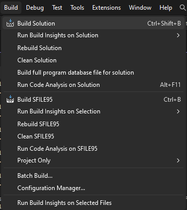
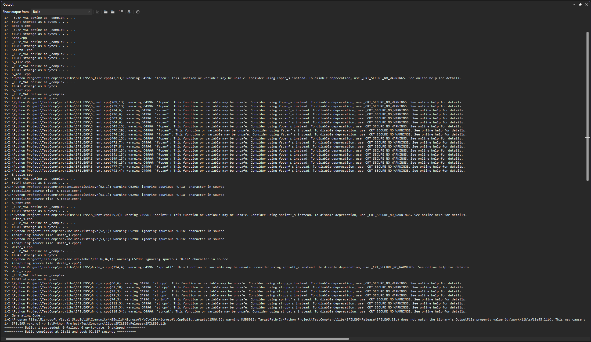

============================================================================
win32 · Шаг 3. Фаза 1 — сборка библиотек (6 штук)
============================================================================

На этом шаге собираются все 6 библиотек (``.lib``) под 32 бита. Их нужно собрать
**до** любых программ: вьюверы и ядра линкуются с готовыми библиотеками.

.. note::

   Порядок между самими библиотеками не важен — каждая ``.lib`` компилируется
   независимо. Главное — собрать все 6 до начала Фазы 2.

.. note::

   Перед сборкой убедитесь (см. ``02-setup-paths``, раздел 2.4): конфигурация
   **Release**, платформа **Win32**.

----

3.0 Общие правки, уже внесённые в проекты библиотек
===================================================

Эти изменения были сделаны при первой сборке под современным компилятором (toolset
v145) и нужны и для win32, и для win64. Они **уже применены** — пересказаны здесь,
чтобы вы понимали, что в проектах не «по умолчанию».

**Правки настроек сборки (``.vcxproj``), не код:**

- Набор инструментов переключён с ``v100`` (VS2010, не установлен) на **``v145``**.
- Подключён ``build\LibOutput.props`` (общие пути Include/Lib + вывод в
  ``dist\<платформа>\lib``).
- Удалены жёстко прописанные пути ``E:\WORK``, ``D:\work``, ``Z:\work``, ``d:\tmc\lib``.
- Сняты устаревшие переопределения ``ObjectFileName`` / ``ProgramDataBaseFileName=.\Release/``,
  которые вызывали ошибку **C1041** (несколько ``cl.exe`` писали в один ``.pdb``).
- Для ``complex`` создан новый ``complex.vcxproj`` (старый формат ``.vcproj`` от VS2008
  сконвертирован, настройки ``/MT`` перенесены).

**Правки в коде (общие, нужны и для win32) — для совместимости с современным
компилятором:**

- **С-1** — конфликт имени ``ETIME`` в общем заголовке ``src\Include\MAINWNDW.H``
  (член ``enum ST_ITEMS``). Современный ``<errno.h>`` (UCRT) определяет макрос ``ETIME``,
  из-за чего возникали ошибки ``C2143/C2059``. Перед enum добавлено
  ``#ifdef ETIME / #undef ETIME / #endif``. Имя ``ETIME`` используется только в этом enum.
  Математика не затронута.
- **С-2** — в ``src\libs\SFILE95\Sadd.cpp`` (строка 25) заголовок ``<error.h>`` не найден
  (``C1083``). Заменено на ``#include <Error1.h>`` — там лежат те же ``#define``-коды ошибок.
  Математика не затронута.

.. note::

   Эти правки касаются совместимости с компилятором, а не разрядности. На результаты
   расчётов они не влияют.

----

3.1 Общая последовательность для каждой библиотеки
==================================================

Для каждой из 6 библиотек шаги одинаковые:

1. В Visual Studio: **File → Open → Project/Solution…** и выбрать файл проекта
   **``<Имя>.vcxproj``** из папки библиотеки (точное имя — в разделах 3.2–3.7 ниже).

   .. warning::

      ⚠️ **Открывайте именно ``.vcxproj``, а НЕ ``.sln``/``.vcproj``.** В папках библиотек
      рядом лежат старые файлы ``*.vcproj`` и ``*.sln`` (формат VS2008). Многие ``.sln``
      ссылаются на **устаревший ``.vcproj``** — с жёсткими путями (``d:\work\lib``) и без
      галочки Build. Если открыть ``.sln``, вы соберёте старый проект и столкнётесь с
      «Project not selected to build» (раздел 2.5) и ``.lib`` в ``d:\work\lib`` (раздел
      2.3.1). Новый, уже настроенный проект — это ``<Имя>.vcxproj``.

2. Проверить: конфигурация **Release**, платформа **Win32**.
3. **Build → Build Solution** (Сборка → Собрать решение). Если хотите чистую сборку —
   **Build → Rebuild Solution** (Пересобрать решение).
4. Дождаться сообщения **``Build: 1 succeeded, 0 failed``** в окне Output.
5. Убедиться, что файл ``.lib`` появился в ``dist\win32\lib``.

.. warning::

   ⚠️ Если в Output появилось **``Skipped Build … Project not selected to build``**
   (``Build: … 1 skipped``) — проект не отмечен на сборку. Включите галочку **Build** в
   Configuration Manager: см. ``02-setup-paths``, раздел **2.5**.

   Меню **Build → Build Solution**.

   Окно Output: **Build: 1 succeeded, 0 failed**.

----

3.2 sfile95.lib
===============

- Папка: ``src\libs\SFILE95``
- Проект (открывать этот файл): ``SFILE95.vcxproj``
- Заголовки берутся из ``src\Include`` (через ``Common.props``)
- Результат: ``dist\win32\lib\sfile95.lib``

Соберите по последовательности из 3.1.

----

3.3 complex.lib
===============

- Папка: ``src\libs\complex``
- Проект (открывать этот файл): ``complex.vcxproj``
- Результат: ``dist\win32\lib\complex.lib``

----

3.4 exprint.lib
===============

- Папка: ``src\libs\exprint``
- Проект (открывать этот файл): ``exprint.vcxproj``
- Результат: ``dist\win32\lib\exprint.lib``

.. note::

   Эта библиотека использует исходники из соседних папок ``src\libs\Expr`` и
   ``src\libs\Inter`` (на них ссылается ``exprint.vcxproj``). Они уже на месте.

----

3.5 TMCLibError.lib
===================

- Папка: ``src\libs\TMCLibError``
- Проект (открывать этот файл): ``TMCLibError.vcxproj``
- Результат: ``dist\win32\lib\TMCLibError.lib``

----

3.6 prepr.lib
=============

- Папка: ``src\libs\PREPR``
- Проект (открывать этот файл): ``Prepr.vcxproj``
- Результат: ``dist\win32\lib\prepr.lib``

----

3.7 TMCIndan.lib
================

- Папка: ``src\libs\TMCIndan``
- Проект (открывать этот файл): ``TMCIndan.vcxproj``
- Результат: ``dist\win32\lib\TMCIndan.lib``

----

3.8 Проверка Фазы 1
===================

Откройте папку ``<КОРЕНЬ>\dist\win32\lib``. В ней должны лежать **все 6 файлов**::

   sfile95.lib
   complex.lib
   exprint.lib
   TMCLibError.lib
   prepr.lib
   TMCIndan.lib

Если все 6 на месте — Фаза 1 завершена. Переходите к **``04-build-viewers``**.

.. note::

   Предупреждения компилятора при сборке библиотек (``C4996`` небезопасные CRT,
   ``C4267`` size_t→short, ``C4700`` неинициализированная переменная) — это легаси-шум,
   на сборку и на расчёты они не влияют.
