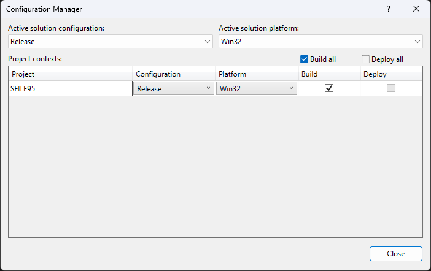
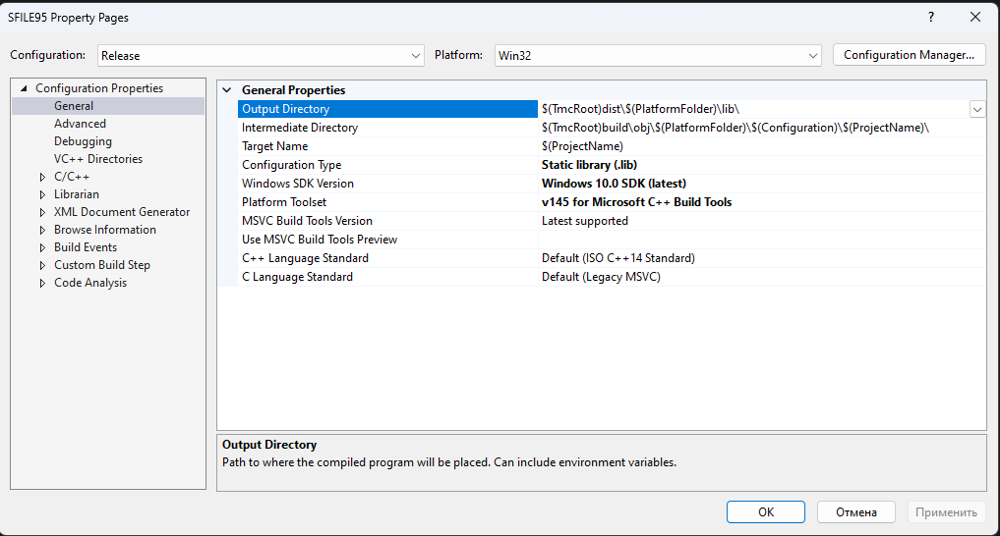

============================================================================
win64 · Шаг 2. Пути, property sheets и добавление платформы x64
============================================================================

На этом шаге вы подготовите общие настройки путей (property sheets), папки результатов
**и убедитесь, что в проектах есть платформа x64**. Делается один раз.

.. note::

   ``<КОРЕНЬ>`` — папка проекта, в которой лежат ``src\``, ``build\``, ``dist\``,
   ``samples\``.

----

2.1 Создайте папки результатов (если их ещё нет)
============================================================================

Для **win64** обязательны две папки::

   <КОРЕНЬ>\dist\win64\lib    ← сюда лягут 6 файлов .lib
   <КОРЕНЬ>\dist\win64\bin    ← сюда лягут 6 файлов .exe

Если их нет — создайте:

.. code-block:: powershell

   New-Item -ItemType Directory -Force -Path "<КОРЕНЬ>\dist\win64\lib", "<КОРЕНЬ>\dist\win64\bin"

----

2.2 Property sheets (общие настройки путей)
============================================================================

**Property sheet** (``.props``) — файл общих настроек, подключаемый к проектам. В папке
``<КОРЕНЬ>\build\`` уже готовы три:

.. list-table::
   :header-rows: 1
   :widths: 30 70

   * - Файл
     - Назначение
   * - ``Common.props``
     - пути: заголовки ``src\Include``, библиотеки ``dist\<платформа>\lib``
   * - ``LibOutput.props``
     - вывод ``.lib`` (для библиотек)
   * - ``ExeOutput.props``
     - вывод ``.exe`` (для программ)

Внутри ``Common.props`` папка платформы выбирается **автоматически**:

- платформа ``Win32`` → ``win32``;
- платформа ``x64`` → ``win64``.

Поэтому для 64-битной сборки (платформа ``x64``) результаты сами попадают в
``dist\win64\…``. Ничего вручную переключать не нужно.

В проектах TMC Suite листы свойств **уже подключены**. Если открываете «голый» проект —
подключите их: **View → Property Manager** → раскрыть проект → конфигурация
**Release | x64** → правой кнопкой → **Add Existing Property Sheet…** → выбрать
``LibOutput.props`` (для библиотеки) или ``ExeOutput.props`` (для программы).

----

2.3 ⭐ Добавление платформы x64 (если её нет в проекте)
============================================================================

В большинстве проектов TMC Suite конфигурации x64 **уже добавлены** (Win32/x64 ×
Debug/Release). Этот раздел нужен, если вы открыли проект, где есть только ``Win32``.

Чтобы добавить платформу x64 **один раз**:

1. Меню **Build → Configuration Manager…** (Сборка → Диспетчер конфигураций).

   Окно Configuration Manager (меню **Build → Configuration Manager**).

.. note::

   Отдельного скриншота для x64 нет — показано то же окно Configuration Manager, что и в инструкции win32. Здесь работайте со списком **Active solution platform** (шаги 2–3 ниже).

2. В столбце **Active solution platform** (Активная платформа решения) откройте
   выпадающий список и выберите **<New…>** (Создать…).

3. В окне **New Solution Platform**:

   - **New platform**: выберите **x64**.
   - **Copy settings from**: выберите **Win32** (чтобы скопировать рабочие настройки
     32-битной конфигурации как основу).
   - Галочка **Create new project platforms** — оставьте включённой.
   - Нажмите **OK**.

4. Закройте Configuration Manager.

После этого у проекта появится платформа **x64**.

.. note::

   При реальной сборке для 5 библиотек (complex, exprint, TMCLibError, Prepr,
   TMCIndan) x64-конфигурации добавлялись именно так — зеркально win32, toolset v145.
   У SFILE95 они уже были. Правок **кода** ради этого не потребовалось (см.
   ``08-porting-changes``, раздел про Фазу 1).

----

2.4 Выбор платформы и конфигурации (на каждой сборке)
============================================================================

В верхней панели Visual Studio:

- **Конфигурация** → **Release**.
- **Платформа** → **x64**.

   Выпадающие списки конфигурации и платформы.

.. note::

   Скриншот общий с инструкцией win32 — окно то же. На снимке показана платформа ``Win32``; для 64-битной сборки в этом же списке выберите ``x64`` (конфигурация — ``Release``).

.. warning::

   На протяжении ВСЕЙ 64-битной сборки: конфигурация **Release**, платформа **x64**.

----

2.5 Проверка toolset (v145)
============================================================================

Правой кнопкой по проекту → **Properties → Configuration Properties → General** →
**Platform Toolset** должен быть **v145**.

   Свойства проекта: Platform Toolset = v145.

.. note::

   Скриншот общий с инструкцией win32 — окно свойств то же, toolset тот же **v145**. Открывайте свойства при выбранной платформе ``x64``.

Готово. Переходите к **``03-build-libs``**.
