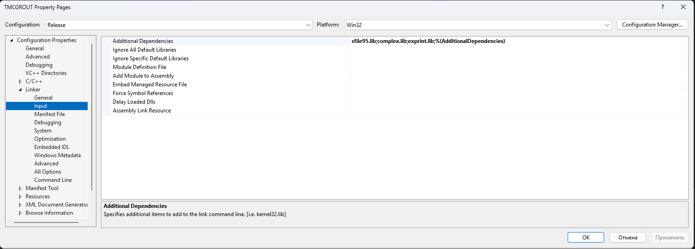

============================================================================
win64 · Шаг 4. Фаза 2 — сборка вьюверов (3 программы)
============================================================================

На этом шаге собираются три вьювера под 64 бита: **TMCROS.exe**, **TMCGROUT.exe**,
**TMC_DN.exe**. Все — MFC-приложения (статическая MFC, MultiByte), линкуются с
**sfile95**, **complex**, **exprint**.

.. note::

   Перед сборкой: все 6 библиотек Фазы 1 лежат в ``dist\win64\lib``. Конфигурация
   **Release**, платформа **x64**.

.. note::

   🔧 Именно во вьюверах при 64-битной сборке потребовались правки кода ради
   разрядности (**П-1** и **П-2**). Они уже внесены; подробности — в
   **``08-porting-changes``**.

----

4.0 Что уже сделано в проектах вьюверов
============================================================================

**Настройки сборки (``.vcxproj``/``.sln``):** старые ``.vcproj`` заменены на
``.vcxproj`` (toolset **v145**), подключён ``build\ExeOutput.props`` (вывод в
``dist\<платформа>\bin``), убраны жёсткие пути ``D:\work``, ``c:\tmc``. Добавлены
конфигурации x64.

**Правка runtime-бага вьюверов (Баг #5)** — уже в коде; нужна и для win32, и для win64
(это **не** разрядность). Кратко: ``SetPathName(..., FALSE)`` в ``MakeDocFileName``,
``AfxOleInit()`` + ``SetRegistryKey()`` в ``InitInstance``, ``#include <afxdisp.h>`` в
``StdAfx.h``. Полное описание — в ``07-troubleshooting``.

**🔧 64-битные правки кода (только x64 по смыслу, совместимы с win32):**

- **П-1** — ``DoModal()`` объявлялся как ``int``, в 64-битной MFC базовый
  ``CDialog::DoModal()`` возвращает ``INT_PTR`` → ошибка ``C2555``. Тип возврата
  изменён на ``INT_PTR``.
- **П-2** — обработчик таймера ``OnTimer(UINT)`` в 64-битной MFC должен быть
  ``OnTimer(UINT_PTR)`` → ошибки ``C2440``/``C2737`` в карте сообщений ``ON_WM_TIMER``.

.. note::

   🔧 Здесь применены изменения для 64 бит — см. ``08-porting-changes``, пункты **П-1**
   и **П-2** (там перечислены конкретные файлы каждого вьювера). На win32 эти типы
   совпадают (``INT_PTR≡int``, ``UINT_PTR≡UINT``), поведение не меняется.

----

4.1 Последовательность для каждого вьювера
============================================================================

1. **File → Open → Project/Solution…**, открыть решение вьювера.
2. Конфигурация **Release**, платформа **x64**.
3. Проверить линковку: **Properties → Linker → Input → Additional Dependencies** →
   должны быть ``sfile95.lib``, ``complex.lib``, ``exprint.lib``.
4. **Build → Build Solution** (или **Rebuild Solution**).
5. Дождаться ``Build: succeeded``.
6. Убедиться, что ``.exe`` в ``dist\win64\bin``.

   Linker → Input → Additional Dependencies для вьювера.

.. note::

   Скриншот общий с инструкцией win32 — список библиотек тот же (``sfile95``, ``complex``, ``exprint``). Открывайте свойства при выбранной платформе ``x64``, конфигурация ``Release``.

----

4.2 TMCROS.exe — вьювер временных сигналов
============================================================================

- Папка: ``src\viewers\Tmcrtout`` → ``dist\win64\bin\TMCROS.exe``
- 🔧 Правки **П-1**, **П-2** применены (файлы — в ``08-porting-changes``).

4.3 TMCGROUT.exe — вьювер матриц рассеяния
============================================================================

- Папка: ``src\viewers\Tmcgrout`` → ``dist\win64\bin\TMCGROUT.exe``
- 🔧 Правки **П-1**, **П-2** применены.

4.4 TMC_DN.exe — вьювер диаграмм направленностей
============================================================================

- Папка: ``src\viewers\DiaNapGr`` → ``dist\win64\bin\TMC_DN.exe``
- 🔧 Правки **П-1**, **П-2** применены.
- Использует модули ``c2DArray``/``cIzl`` из ``src\viewers\DiaNapr`` (общий
  предкомпилированный заголовок). На разрядность эти модули не повлияли.

----

4.5 Проверка Фазы 2
============================================================================

В ``<КОРЕНЬ>\dist\win64\bin`` должны быть ``TMCROS.exe``, ``TMCGROUT.exe``,
``TMC_DN.exe``. Запустите каждый — окно должно открыться без ошибки «Encountered an
improper argument». Для проверки открытия файла используйте ``samples\SAMPLE_R``
(например, ``horns.soc``).

Переходите к **``05-build-kernels``**.
