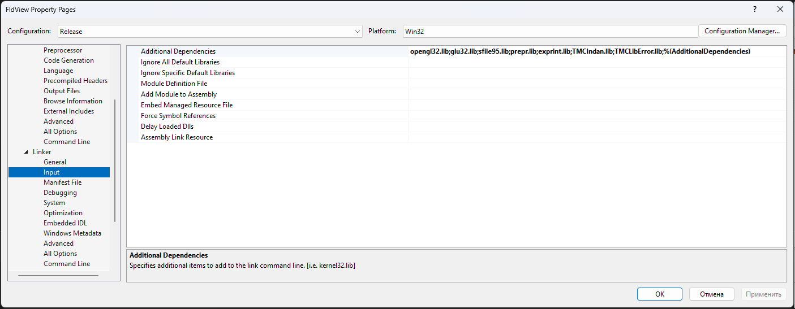

============================================================================
win64 · Шаг 6. Фаза 4 — сборка FieldView (OpenGL)
============================================================================

На этом шаге собирается **FieldView.exe** — визуализатор полей (OpenGL) — под 64 бита.
MFC-приложение (статическая MFC, MultiByte). Линкуется с OpenGL (``opengl32``,
``glu32``) и TMC-библиотеками **sfile95**, **prepr**, **exprint**, **TMCIndan**,
**TMCLibError**.

.. note::

   Перед сборкой: все 6 библиотек Фазы 1 готовы; конфигурация **Release**, платформа
   **x64**.

.. note::

   🔧 В FieldView под 64 бита применены те же правки разрядности, что во вьюверах
   (**П-1**, **П-2**), плюс общая правка **Ф4-1**. Все — в ``08-porting-changes``.

----

6.1 Подготовка OpenGL (x64) — ничего скачивать не нужно
============================================================================

OpenGL входит в Windows SDK (см. ``01-requirements``, раздел 1.2).

- Заголовки ``GL.h``, ``GLU.h`` — подтягиваются автоматически (общие для x86/x64).
- Библиотеки ``opengl32.lib``, ``glu32.lib`` — для платформы ``x64`` берутся из
  **``um\x64``** части SDK. Имя файла остаётся ``opengl32.lib`` (отдельной «OpenGL64»
  нет); нужную разрядность Visual Studio выбирает сама по платформе сборки.

Проверить линковку: **Properties → Linker → Input → Additional Dependencies** —
помимо TMC-библиотек должны быть::

   opengl32.lib
   glu32.lib

   Linker → Input для FieldView (opengl32.lib, glu32.lib + TMC-библиотеки).

.. note::

   Скриншот общий с инструкцией win32 — список тот же. Открывайте свойства при выбранной платформе ``x64`` (``opengl32.lib``/``glu32.lib`` для x64 берутся из ``um\x64``, имя файла то же).

.. warning::

   ``glaux.lib`` в списке быть **не должно** — GLAUX удалён из современного SDK
   (правка **Ф4-1**).

----

6.2 Что уже сделано в проекте FieldView
============================================================================

**Настройки сборки (``.vcxproj``/``.sln``):** ``FldView.vcxproj`` переписан по образцу
ядер (toolset **v145**, 4 конфигурации Win32/x64 × Debug/Release, подключён
``build\ExeOutput.props``); удалён жёсткий путь ``C:\TMC\EXE\FldView.exe`` и опция
``/MACHINE:I386``; имя exe — ``<TargetName>FieldView</TargetName>``; из линкера убран
``glaux.lib``; ссылки ``..\INCLUDE\...`` → ``..\Include\...``; ``.sln`` пересохранён с
x64-платформами.

**🔧 Правки кода:**

- **Ф4-1** (общая, нужна и для win32): в ``src\fieldview\TmcGLText.h`` удалён мёртвый
  ``#include <gl\glaux.h>`` (``C1083``). Ни одна ``aux*``-функция не используется; текст
  рисуется через GDI и ядро OpenGL. Математика не затронута.
- **П-1** (64 бит): в ``TMCDialogPropet.h``/``.cpp`` ``int DoModal()`` →
  ``INT_PTR DoModal()`` (override ``CPropertySheet::DoModal``, ошибка ``C2555``).
- **П-2** (64 бит): в ``FldViewView.h``/``.cpp`` ``OnTimer(UINT)`` →
  ``OnTimer(UINT_PTR)`` (``C2440``/``C2737``).

.. note::

   🔧 Здесь применены изменения для 64 бит — см. ``08-porting-changes``, пункты **П-1**,
   **П-2** (раздел «Фаза 4») и общая **Ф4-1**.

.. note::

   Файлы ``TmcRTH_BlockList1.cpp/.h`` (жёсткий путь ``z:\work\...``) в проект НЕ
   включены.

----

6.3 Сборка FieldView (x64)
============================================================================

1. Открыть решение из ``src\fieldview``.
2. Конфигурация **Release**, платформа **x64**.
3. Проверить линковку (6.1): ``opengl32.lib``, ``glu32.lib``, ``sfile95.lib``,
   ``prepr.lib``, ``exprint.lib``, ``TMCIndan.lib``, ``TMCLibError.lib``.
4. **Build → Clean Solution**, затем **Build → Build Solution**.
5. Результат: ``dist\win64\bin\FieldView.exe``.

.. note::

   Предупреждения (``C4996``, ``C4477``) — легаси-шум, на работу/расчёты не влияют.

----

6.4 Итоговая проверка всей 64-битной сборки
============================================================================

После Фазы 4::

   dist\win64\lib\   → 6 файлов .lib
                       sfile95, complex, exprint, TMCLibError, prepr, TMCIndan

   dist\win64\bin\   → 6 файлов .exe
                       TMCROS, TMCGROUT, TMC_DN, tmc_rth, tmc_rtx, FieldView

Запустите ``FieldView.exe`` — окно должно открыться и рисовать поля. Прогоните тесты
``samples\SAMPLE_R`` на ядрах.

64-битная сборка завершена. При проблемах — **``07-troubleshooting``**. Полный журнал
изменений ради 64 бит — **``08-porting-changes``**.
