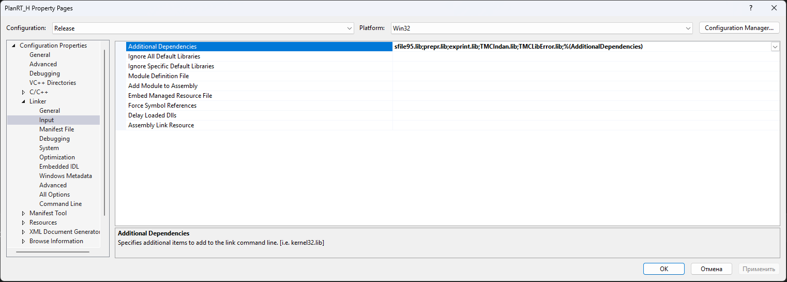
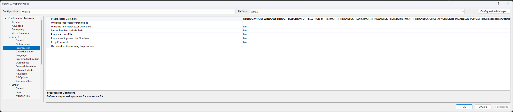

# win64 · Шаг 5. Фаза 3 — сборка счётных ядер (H и X)

На этом шаге собираются два счётных ядра под 64 бита:

- **tmc_rth.exe** — H‑поляризация (о‑мода);
- **tmc_rtx.exe** — X‑мода (требует 6 макросов).

Оба — MFC‑приложения (статическая MFC, MultiByte). Линкуются с пятью библиотеками:
**sfile95**, **prepr**, **exprint**, **TMCIndan**, **TMCLibError**.

> Перед сборкой: все 6 библиотек Фазы 1 готовы; конфигурация **Release**, платформа
> **x64**.

---

## 5.0 Что уже сделано в проектах ядер

**Настройки сборки (`.vcxproj`/`.sln`):** toolset **v145**; добавлены конфигурации
Win32/x64 × Debug/Release; `.sln` пересохранены с x64‑платформами; подключён
`build\ExeOutput.props`; имя exe — через `<TargetName>` (`tmc_rth`/`tmc_rtx`); убраны
жёсткие пути `E:\WORK…`, `c:\tmc\exe\…`. Убрана опция `/MACHINE:I386` (несовместима с
x64). Исправлены пути к общим исходникам `..\..\viewers\Tmcrtout\…`. У X‑моды задан
свой `ProjectGuid`, чтобы каталоги сборки H и X не пересекались.

**🔧 Правка кода П‑3 (нужна и для win32, и для win64):**

- В `kernels\PlanarRT_H\PL_GLFUN.CPP` и `kernels\PlanarRT_X\Pl_glfun.cpp`, функция
  `s_tone`: интринсики прямого доступа к портам `outp`/`inp` удалены из современного
  компилятора (`error C3861`); на x64 прямой доступ к портам в принципе невозможен.
  Ветка Windows 95 заменена на `Beep(freq, time)`. Ветка на современных ОС недостижима.
  Математика расчётов не затронута.

> 🔧 Здесь применено изменение — см. `08-porting-changes.md`, пункт **П‑3**.

---

## 5.1 tmc_rth.exe — H‑поляризация

1. Открыть решение из `src\kernels\PlanarRT_H`.
2. Конфигурация **Release**, платформа **x64**.
3. Проверить линковку (**Properties → Linker → Input → Additional Dependencies**):

   ```
   sfile95.lib
   prepr.lib
   exprint.lib
   TMCIndan.lib
   TMCLibError.lib
   ```

4. **Build → Clean Solution**, затем **Build → Build Solution**.
5. Результат: `dist\win64\bin\tmc_rth.exe`.

> 🔧 Правка **П‑3** применена.



> Скриншот общий с инструкцией win32 — список тот же (5 библиотек). **Открывайте свойства при выбранной платформе `x64`, конфигурация `Release`.**

---

## 5.2 tmc_rtx.exe — X‑мода (СНАЧАЛА задать 6 макросов!)

X‑мода требует **6 макросов препроцессора**, задаваемых **только в проекте X‑моды**
через настройки — НЕ в общих заголовках (`Typerth.h`, `Tmcgrviw.h` используются и
H‑модой, и вьюверами).

### Шаг А — задать макросы

1. Открыть проект X из `src\kernels\PlanarRT_X`.
2. Правой кнопкой по проекту → **Properties**.
3. **C/C++ → Preprocessor → Preprocessor Definitions**.
4. Добавить шесть макросов (через `;`), сохранив `%(PreprocessorDefinitions)` в конце:

   ```
   ELECTRON_Q___;ELECTRON_M___;CTMCRTH_INDANBLCK_FILEY;CTMCRTH_INDANBLCK_RECTSTATY;CTMCRTH_INDANBLCK_CIRCSTATY;CTMCRTH_INDANBLCK_POLYGSTTY;%(PreprocessorDefinitions)
   ```

5. **OK**. (Эти макросы уже заданы во всех 4 конфигурациях X‑моды, включая x64.)



> Скриншот общий с инструкцией win32 — набор макросов тот же. **Задавайте их при выбранной платформе `x64`** (макросы уже заданы во всех конфигурациях, включая x64).

### Назначение макросов

| Макрос | Что включает |
|--------|--------------|
| `ELECTRON_Q___` | использование заряда электрона в расчёте X‑моды |
| `ELECTRON_M___` | использование массы электрона в расчёте X‑моды |
| `CTMCRTH_INDANBLCK_FILEY` | блок задания структуры из файла |
| `CTMCRTH_INDANBLCK_RECTSTATY` | блок прямоугольных включений |
| `CTMCRTH_INDANBLCK_CIRCSTATY` | блок круглых включений |
| `CTMCRTH_INDANBLCK_POLYGSTTY` | блок полигональных включений |

### Шаг Б — собрать

1. Конфигурация **Release**, платформа **x64**.
2. Линковка — те же 5 библиотек, что у H‑моды (5.1).
3. **Build → Clean Solution**, затем **Build → Build Solution**.
4. Результат: `dist\win64\bin\tmc_rtx.exe`.

> 🔧 Правка **П‑3** применена и в X‑моде.

> Признак, что макросы применились: `tmc_rtx.exe` крупнее `tmc_rth.exe`.

---

## 5.3 Проверка Фазы 3

В `<КОРЕНЬ>\dist\win64\bin` добавились `tmc_rth.exe`, `tmc_rtx.exe`. Прогоните оба на
тестах `samples\SAMPLE_R`.

> ⚠️ Кнопка «Статистика» (Shift+F4): ранее крашила программу (Баг #1), сейчас
> **исправлена** (см. `07-troubleshooting.md`). 64‑битные сборки ядер пересобраны с
> исправлением.

Переходите к **`06-build-fieldview.md`**.

---

## Чек‑лист «что уточнить»

- [ ] Согласовать с автором (К.Н. Климов) физическую трактовку 6 макросов X‑моды.
