# Руководство пользователя — FieldView (`FieldView.exe`)

> Программа: **Tamic Rt Output Field Viewer** (внутреннее имя проекта — *FldView*, исполняемый файл `FieldView.exe`, версия 4.1).
> Интерфейс программы англоязычный — в руководстве приводятся английские названия пунктов как в программе, а рядом — русское пояснение. Подписи на скриншотах русские.

---

## 1. Назначение программы

**FieldView** — это **вьювер (программа просмотра) распределения поля** пакета TMC Suite. Счётные ядра
**PlanarRT_H** и **PlanarRT_X** во время электродинамического расчёта сохраняют «карты» поля в расчётной
области, а FieldView рисует эти карты в виде **двумерных цветных картин** или **трёхмерных поверхностей**
(с помощью OpenGL).

Простыми словами: ядро посчитало, *как поле распределено по плоскости модели*, и записало это в файл;
FieldView открывает такой файл и показывает его как картинку — где поле сильнее, где слабее, как оно
устроено внутри рупора, линзы, резонатора и т. п.

Программа умеет показывать **три независимых «слоя» (layer)** одной и той же области, каждый со своими
настройками цвета и отрисовки:

| Слой | Что показывает |
|------|----------------|
| **Field** (Поле) | основное распределение поля из открытого файла; |
| **Eps** (ε) | распределение диэлектрической проницаемости среды; |
| **Topology** (Топология) | геометрия модели и её границы (металл, поглотитель, диэлектрик, вход, магнитная стенка). |

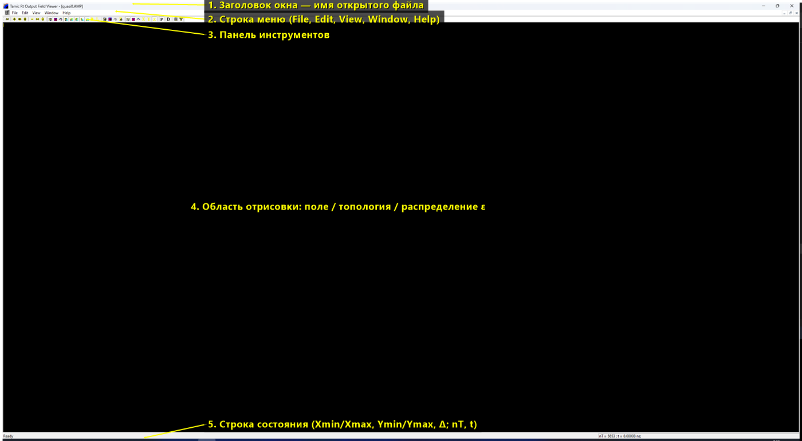

> 💡 Это **MDI-программа**: в одном окне можно открыть сразу несколько файлов поля и сравнивать их
> (меню **Window**).

---

## 2. Запуск программы и открытие данных

1. Запустите файл `FieldView.exe` (папка `dist/win32/bin/` или `dist/win64/bin/`). Откроется главное окно.
2. Откройте файл поля: меню **File → Open…** (или кнопка 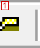 на панели инструментов, или `Ctrl+O`).
3. В диалоге выбора файла укажите файл одного из поддерживаемых типов — **`.tf`**, **`.AMP`** или **`.FAZ`**
   (например, `samples/SAMPLE_R/1/quasi0.AMP`). Подробно о форматах — раздел 8.
4. После открытия имя файла появится в заголовке окна: `Tamic Rt Output Field Viewer - [quasi0.AMP]`.
5. Поле отрисуется в рабочей области. Если изображения не видно — проверьте включён ли слой **Field**
   (кнопки 22–23 на панели или меню **View → Field**) и нажмите **View → Default** (`Ctrl+D`), чтобы
   вернуть стандартный масштаб и положение.

> Можно запустить программу сразу с файлом: перетащите `.AMP`/`.FAZ`/`.tf` на значок программы или
> передайте путь аргументом командной строки: `FieldView.exe "путь\к\файлу.AMP"`.

---

## 3. Главное окно

Главное окно состоит из пяти зон (показаны цифрами на рисунке в разделе 1):

| № | Зона | Назначение |
|---|------|-----------|
| 1 | **Заголовок окна** | Название программы и имя открытого файла. |
| 2 | **Строка меню** | Все команды: `File`, `Edit`, `View`, `Window`, `Help`. |
| 3 | **Панель инструментов** | Кнопки быстрого доступа к самым частым командам (35 кнопок). |
| 4 | **Область отрисовки** | Здесь OpenGL рисует поле / топологию / распределение ε. Управляется мышью и клавишами (масштаб, поворот, сдвиг). |
| 5 | **Строка состояния** | Слева — служебные сообщения и текущие границы вида (`Xmin/Xmax`, `Ymin/Ymax`, `Delta`); справа — параметры открытого файла (`nT` — номер шага, `t` — время). |

> ⚠️ **О скриншотах области отрисовки.** Часть обзорных картинок этого руководства сделана в среде, где
> содержимое окна OpenGL не попадает в снимок экрана, поэтому область отрисовки (зона 4) на них
> **выглядит чёрной**. На реальном компьютере здесь отображается цветная картина поля (примеры «живого»
> результата — `main-window-field.png`, `field-3d.png`, `eps-layer.png`).

---

## 4. Панель инструментов

Панель инструментов дублирует самые нужные команды. Кнопки слева направо пронумерованы 1–35 и
сгруппированы (группы разделены вертикальными промежутками):

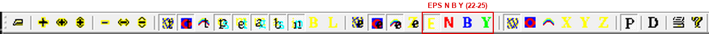

| № | Кнопка | Команда | Клавиша | Что делает |
|---|--------|---------|---------|------------|
| 1 |  | File → Open | `Ctrl+O` | Открыть файл поля (`.tf/.AMP/.FAZ/.ex`). |
| 2 | 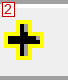 | Zoom + | `+` | Увеличить масштаб (по обеим осям). |
| 3 | 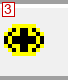 | Zoom +X | `X` | Увеличить масштаб только по оси X. |
| 4 | 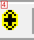 | Zoom +Y | `Y` | Увеличить масштаб только по оси Y. |
| 5 | 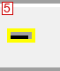 | Zoom − | `−` | Уменьшить масштаб (по обеим осям). |
| 6 | 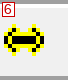 | Zoom −X | `Shift+X` | Уменьшить масштаб по оси X. |
| 7 | 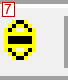 | Zoom −Y | `Shift+Y` | Уменьшить масштаб по оси Y. |
| 8 | 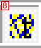 | Topology → Line | `Shift+L` | Слой топологии: рисовать линиями (каркас). |
| 9 | 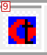 | Topology → Surface | `Shift+S` | Слой топологии: рисовать заливкой (поверхностью). |
| 10 | 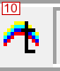 | Topology → Dimension 2/3 | `Shift+D` | Переключить топологию между 2D и 3D. |
| 11 | 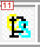 | Boundary → Eps | `E` | Подсветить границы диэлектрика (ε). |
| 12 | 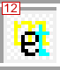 | Boundary → Metal | `M` | Подсветить границы металла. |
| 13 | 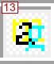 | Boundary → Magnetic | `N` | Подсветить границы магнитной стенки. |
| 14 | 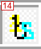 | Boundary → Absorber | `A` | Подсветить границы поглотителя. |
| 15 | 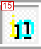 | Boundary → Input | `I` | Подсветить границы входа (порта). |
| 16 | 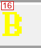 | Topology → Dimensions → Block | `K` | Показать размеры/нумерацию блоков. |
| 17 | 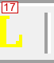 | Topology → Dimensions → Link_List | `Alt+K` | Показать размеры по списку связей (Link List). |
| 18 | 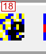 | Eps → Line | `Alt+L` | Слой ε: рисовать линиями. |
| 19 | 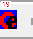 | Eps → Surface | `Alt+S` | Слой ε: рисовать заливкой. |
| 20 | 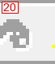 | Eps → Dimension 2/3 | `Alt+D` | Переключить ε между 2D и 3D. |
| 21 | 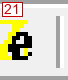 | Eps → Size | `Alt+J` | Авторазмер слоя ε по оси Z (высота). |
| 22 | 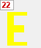 | View → Eps → Type → Eps+ | — | **Режим величины:** показывать проницаемость ε (обычный режим, доступен всегда). |
| 23 | 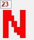 | View → Eps → Type → N | — | **Плазма (X‑мода):** показывать концентрацию электронов N. Доступна, только если в данных есть плазма (блоки `RECT_STAT_N`). |
| 24 | 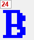 | View → Eps → Type → B | — | **Плазма (X‑мода):** показывать внешнее магнитное поле B (подмагничивание). Доступна при наличии блоков `RECT_STAT_B`. |
| 25 | 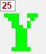 | View → Eps → Type → Y | — | **Плазма (X‑мода):** показывать потери Y. Доступна при наличии блоков `RECT_STAT_Y`. |
| 26 | 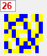 | Field → Line | `L` | Слой поля: рисовать линиями. |
| 27 | 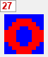 | Field → Surface | `S` | Слой поля: рисовать заливкой. |
| 28 | 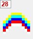 | Field → Dimension 2/3 | `D` | Переключить поле между 2D и 3D. |
| 29 | 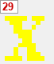 | Size → along an X axies | `Ctrl+J` | Показать размерную сетку вдоль оси X. |
| 30 | 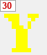 | Size → along an Y axies | `Shift+J` | Показать размерную сетку вдоль оси Y. |
| 31 | 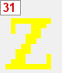 | Field → Size | `J` | Авторазмер слоя поля по оси Z (высота рельефа). |
| 32 | 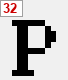 | View → Proportionally | `P` | Включить/выключить пропорциональный масштаб осей X и Y. |
| 33 | 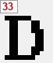 | View → Default | `Ctrl+D` | Сбросить вид к стандартным параметрам. |
| 34 | 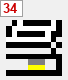 | File → Print | `Ctrl+P` | Печать текущего изображения. |
| 35 | 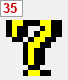 | Help → About | — | О программе (версия). |

> 🟢 **Кнопки 22–25 (EPS · N · B · Y) — новые.** Это переключатель отображаемой величины
> для расчётов плазмы (X‑мода, `tmc_rtx`): **E** (жёлтая) — проницаемость ε; **N** (красная) —
> концентрация электронов; **B** (синяя) — магнитное поле подмагничивания; **Y** (зелёная) —
> потери. Кнопки N, B, Y активны (цветные), только когда в открытом поле присутствует
> соответствующая плазма; иначе они серые (неактивные). Подробнее — раздел 5.3.2.1.

> Подсказка: при наведении курсора на кнопку в программе всплывает её английское название, а в строке
> состояния показывается короткое описание.

Чистый вид панели без нумерации:


---

## 5. Меню

### 5.1. File (Файл)

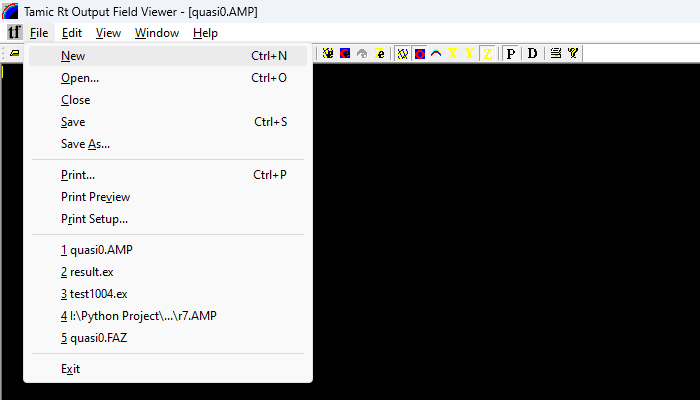

| Пункт | Перевод | Клавиша | Действие |
|-------|---------|---------|----------|
| New | Создать | `Ctrl+N` | Новый пустой документ. |
| Open… | Открыть | `Ctrl+O` | Открыть файл поля (`.tf/.AMP/.FAZ`). |
| Close | Закрыть | — | Закрыть текущий документ. |
| Save | Сохранить | `Ctrl+S` | Сохранить документ. |
| Save As… | Сохранить как | — | Сохранить под другим именем. |
| Print… | Печать | `Ctrl+P` | Печать изображения. |
| Print Preview | Предпросмотр печати | — | Предварительный просмотр перед печатью. |
| Print Setup… | Параметры печати | — | Выбор принтера и параметров страницы. |
| (список 1, 2, 3…) | Недавние файлы | — | Быстрое открытие недавно использованных файлов. |
| Exit | Выход | — | Закрыть программу. |

### 5.2. Edit (Правка)

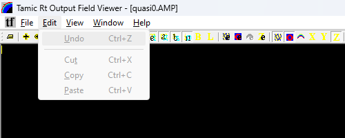

| Пункт | Перевод | Клавиша | Действие |
|-------|---------|---------|----------|
| Undo | Отменить | `Ctrl+Z` | Стандартная команда (в текущем режиме **недоступна** — серая). |
| Cut / Copy / Paste | Вырезать / Копировать / Вставить | `Ctrl+X` / `Ctrl+C` / `Ctrl+V` | Команды буфера обмена (**недоступны** — серые). |

> В этой версии меню **Edit** не задействовано: программа только просматривает данные, не редактирует их.

### 5.3. View (Вид)

Главное меню управления отображением. Содержит вызов окна параметров, три подменю слоёв
(**Topology / Eps / Field**), подменю управления видом (**Zoom / Rotate / Translate**) и переключатели.

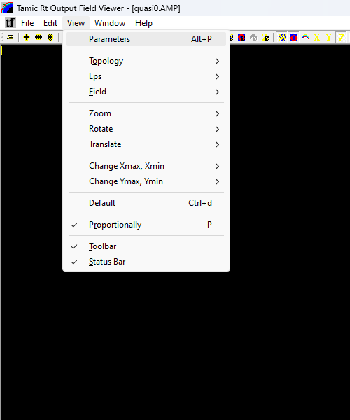

| Пункт | Перевод | Клавиша | Действие |
|-------|---------|---------|----------|
| Parameters | Параметры | `Alt+P` | Открыть окно настроек вида (раздел 6.1). |
| Topology ► | Топология | — | Подменю слоя топологии (5.3.1). |
| Eps ► | Диэлектрик ε | — | Подменю слоя ε (5.3.2). |
| Field ► | Поле | — | Подменю слоя поля (5.3.3). |
| Zoom ► | Масштаб | — | Подменю масштабирования (5.3.4). |
| Rotate ► | Поворот | — | Подменю поворота (3D) (5.3.5). |
| Translate ► | Сдвиг | — | Подменю сдвига сцены (5.3.6). |
| Change Xmax, Xmin ► | Сдвиг окна по X | — | Сдвиг видимого диапазона по X (5.3.7). |
| Change Ymax, Ymin ► | Сдвиг окна по Y | — | Сдвиг видимого диапазона по Y (5.3.7). |
| Default | По умолчанию | `Ctrl+d` | Сбросить вид к стандартным параметрам. |
| Proportionally | Пропорционально | `P` | Сохранять одинаковый масштаб осей X и Y (галочка = включено). |
| Toolbar | Панель инструментов | — | Показать/скрыть панель инструментов. |
| Status Bar | Строка состояния | — | Показать/скрыть строку состояния. |

#### 5.3.1. View → Topology (слой топологии)

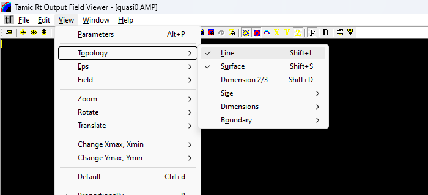

| Пункт | Клавиша | Действие |
|-------|---------|----------|
| Line | `Shift+L` | Рисовать топологию линиями (каркас). |
| Surface | `Shift+S` | Рисовать топологию заливкой. |
| Dimension 2/3 | `Shift+D` | Переключить 2D ↔ 3D. |
| Size ► | — | Размерная сетка вдоль осей (5.3.1.1). |
| Dimensions ► | — | Показ размеров блоков / списка связей (5.3.1.2). |
| Boundary ► | — | Подсветка границ материалов (5.3.1.3). |

**5.3.1.1. Topology → Size** — размерная сетка:

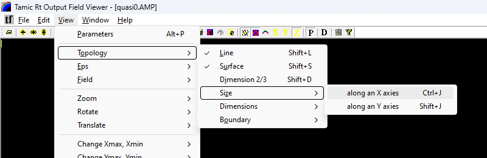

- **along an X axies** (`Ctrl+J`) — нанести размеры вдоль оси X;
- **along an Y axies** (`Shift+J`) — нанести размеры вдоль оси Y.

**5.3.1.2. Topology → Dimensions** — показ размеров элементов:

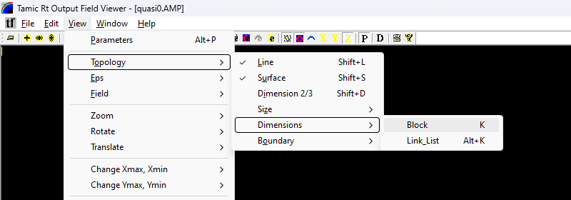

- **Block** (`K`) — размеры/нумерация блоков;
- **Link_List** (`Alt+K`) — размеры по списку связей (Link List).

**5.3.1.3. Topology → Boundary** — подсветка границ материалов (галочка = слой включён):

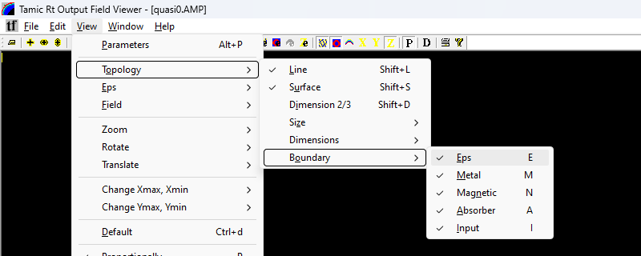

- **Eps** (`E`) — границы диэлектрика;
- **Metal** (`M`) — границы металла;
- **Magnetic** (`N`) — границы магнитной стенки;
- **Absorber** (`A`) — границы поглотителя;
- **Input** (`I`) — границы входа (порта возбуждения).

#### 5.3.2. View → Eps (слой диэлектрика)

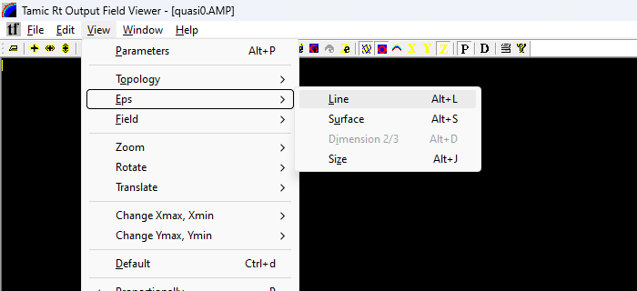

| Пункт | Клавиша | Действие |
|-------|---------|----------|
| Line | `Alt+L` | Рисовать ε линиями. |
| Surface | `Alt+S` | Рисовать ε заливкой. |
| Dimension 2/3 | `Alt+D` | Переключить 2D ↔ 3D (в текущей версии может быть серым). |
| Size | `Alt+J` | Авторазмер слоя ε по оси Z. |
| Type ► | — | Выбор отображаемой величины: ε / N / B / Y (плазма). См. 5.3.2.1. |

#### 5.3.2.1. View → Eps → Type — отображаемая величина (плазма X‑моды)

Подменю **Type** (и новые кнопки панели инструментов 22–25) выбирают, **какую физическую
величину** рисовать в слое «Eps» для расчётов плазмы в X‑моде (ядро `tmc_rtx`):


| Пункт меню | Кнопка | Величина | Когда доступно |
|------------|--------|----------|----------------|
| **Eps+** |  — E, жёлтая | Диэлектрическая проницаемость ε (обычный режим) | Всегда |
| **N** |  — N, красная | Концентрация электронов плазмы N, м⁻³ | Только если в поле есть блоки `RECT_STAT_N` |
| **B** |  — B, синяя | Внешнее магнитное поле подмагничивания B, Тл | Только если есть блоки `RECT_STAT_B` |
| **Y** |  — Y, зелёная | Потери плазмы Y | Только если есть блоки `RECT_STAT_Y` |

**Как пользоваться.** Откройте поле, посчитанное X‑ядром с плазмой (файл `.ex`/`.tf` рядом с
топологией `.tt`, где заданы блоки `RECT_STAT_N/_B/_Y`), затем нажмите нужную кнопку (или пункт
меню). Слой «Eps» переключится с обычной ε на выбранную величину. Если в данных плазмы нет,
кнопки **N/B/Y серые** (неактивные) — доступен только **Eps+**. Выбранный режим запоминается
между запусками.

> Величины N, B, Y соответствуют блокам `RECT_STAT_N` (концентрация электронов, м⁻³),
> `RECT_STAT_B` (магнитное поле подмагничивания, Тл) и `RECT_STAT_Y` (потери) в шаблоне
> задачи `.tpl` — см. руководство по ядру **PlanarRT_X**.

#### 5.3.3. View → Field (слой поля)

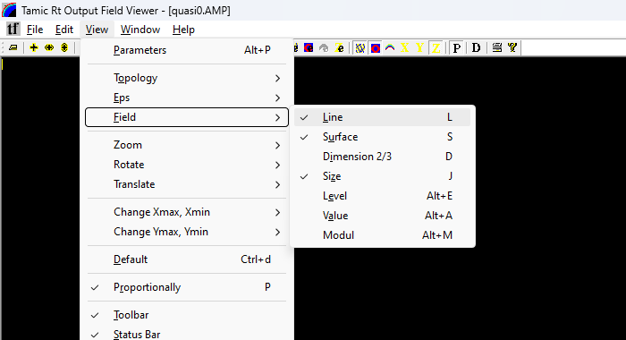

| Пункт | Клавиша | Действие |
|-------|---------|----------|
| Line | `L` | Рисовать поле линиями. |
| Surface | `S` | Рисовать поле заливкой. |
| Dimension 2/3 | `D` | Переключить 2D ↔ 3D. |
| Size | `J` | Авторазмер слоя поля по оси Z (высота рельефа). |
| Level | `Alt+E` | Открыть окно выбора **уровней цвета** (раздел 6.3). |
| Value | `Alt+A` | Режим показа **числового значения** поля под курсором. |
| Modul | `Alt+M` | Показывать **модуль** поля. |

#### 5.3.4. View → Zoom (масштаб)

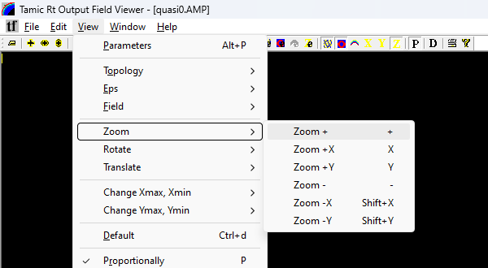

| Пункт | Клавиша | Действие |
|-------|---------|----------|
| Zoom + | `+` | Увеличить (обе оси). |
| Zoom +X | `X` | Увеличить по X. |
| Zoom +Y | `Y` | Увеличить по Y. |
| Zoom − | `−` | Уменьшить (обе оси). |
| Zoom −X | `Shift+X` | Уменьшить по X. |
| Zoom −Y | `Shift+Y` | Уменьшить по Y. |

#### 5.3.5. View → Rotate (поворот, для 3D)

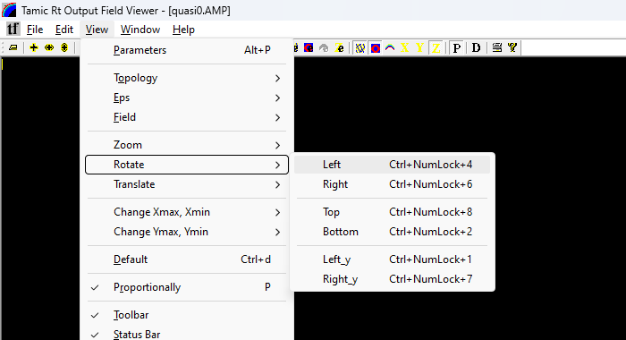

| Пункт | Клавиша | Действие |
|-------|---------|----------|
| Left | `Ctrl+NumLock+4` | Повернуть влево. |
| Right | `Ctrl+NumLock+6` | Повернуть вправо. |
| Top | `Ctrl+NumLock+8` | Наклонить вверх. |
| Bottom | `Ctrl+NumLock+2` | Наклонить вниз. |
| Left_y | `Ctrl+NumLock+1` | Поворот вокруг оси Y влево. |
| Right_y | `Ctrl+NumLock+7` | Поворот вокруг оси Y вправо. |

#### 5.3.6. View → Translate (сдвиг сцены)

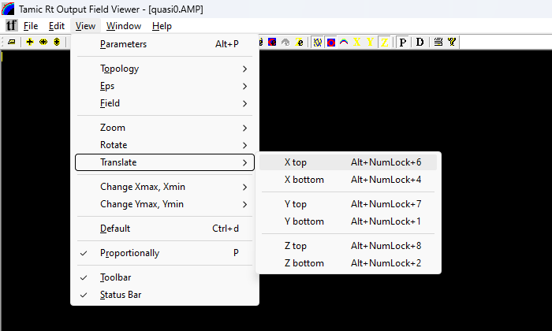

| Пункт | Клавиша | Действие |
|-------|---------|----------|
| X top / X bottom | `Alt+NumLock+6` / `Alt+NumLock+4` | Сдвиг сцены по оси X. |
| Y top / Y bottom | `Alt+NumLock+7` / `Alt+NumLock+1` | Сдвиг сцены по оси Y. |
| Z top / Z bottom | `Alt+NumLock+8` / `Alt+NumLock+2` | Сдвиг сцены по оси Z (приближение/отдаление). |

#### 5.3.7. View → Change Xmax,Xmin и Change Ymax,Ymin (сдвиг окна данных)

Сдвигают видимый диапазон данных (не масштаб, а «прокрутку» по координате).

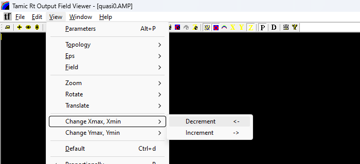


| Подменю | Пункт | Клавиша | Действие |
|---------|-------|---------|----------|
| Change Xmax, Xmin | Decrement | `←` | Сдвинуть диапазон X влево. |
| Change Xmax, Xmin | Increment | `→` | Сдвинуть диапазон X вправо. |
| Change Ymax, Ymin | Decrement | `V` | Сдвинуть диапазон Y вниз. |
| Change Ymax, Ymin | Increment | `^` | Сдвинуть диапазон Y вверх. |

### 5.4. Window (Окно)


| Пункт | Перевод | Действие |
|-------|---------|----------|
| New Window | Новое окно | Открыть ещё одно окно для того же документа. |
| Cascade | Каскадом | Расположить окна каскадом. |
| Tile | Мозаикой | Расположить окна мозаикой. |
| Arrange Icons | Упорядочить значки | Упорядочить свёрнутые окна. |
| (список 1 …) | Открытые документы | Переключение между открытыми файлами (галочка — активный). |

### 5.5. Help (Справка)


| Пункт | Перевод | Действие |
|-------|---------|----------|
| About FldView… | О программе | Сведения о версии (раздел 6.4). |

---

## 6. Диалоговые окна

### 6.1. Parameters (Параметры вида)

Вызывается через **View → Parameters** (`Alt+P`). Это окно с четырьмя вкладками — **Place**, **Topology**,
**Eps**, **Field** — где собраны все настройки отображения. Внизу — кнопки **OK** (применить и закрыть),
**Отмена** (Cancel), **Применить** (Apply).

**Вкладка Place** — оси и общий вид:


- **X axies / Y axies** — настройки осей X и Y:
  - **Auto size** — автоматически подбирать границы (галочка); при снятии можно задать **min** и **max** вручную;
  - **angl** — угол наклона оси (для 3D);
  - **trans** — сдвиг по оси;
  - **Draw size flag** — рисовать размерную шкалу по этой оси.
- **Axies → Draw** — рисовать координатные оси.
- **Text → Color / Font** — цвет и шрифт подписей осей (образец цвета показан квадратом).
- **Long Unit / Time Unit** — единицы длины и времени, прочитанные из файла (например, `mm`, `ns`) — только для чтения.
- **Proportionally** — сохранять одинаковый масштаб осей X и Y.

**Вкладка Topology** — слой топологии:


- **Draw flags** — какие границы подсвечивать: **Eps**, **Metal**, **Magnetic**, **Absorber**, **Input**; рядом образец цвета и кнопка **Change** (сменить цвет); кнопка **Default** возвращает цвета по умолчанию.
- **Size** — показывать размеры: **Block** (блоки), **Link List** (список связей).
- **Draw** — **Line** (каркас) и/или **Surface** (заливка).
- **Dimention** — **2D** или **3D**.
- **Blend** — степень прозрачности слоя (0–100).

**Вкладка Eps** — слой диэлектрической проницаемости:


- **Draw flags** — **Surface** и/или **Line**.
- **Color** — цветовая шкала (градиент), которой раскрашивается ε.
- **Blend** — прозрачность слоя.
- **Dimention** — **2D / 3D**.
- **Z axies** — диапазон по высоте: **Auto size** (авто) либо **min/max** вручную; **Draw size flag** — шкала по Z.
- **Set color** — открыть редактор уровней цвета (раздел 6.3).
- **Default** — сбросить настройки слоя.

**Вкладка Field** — слой поля:


Состав тот же, что у вкладки Eps, плюс:

- **256 Resolution** — использовать 256 цветовых уровней (более плавная картинка вместо 20/40 уровней).
- **Draw Modul** — показывать **модуль** поля (а не знаковое значение).

### 6.2. *(резерв)*

### 6.3. Auto color (Редактор уровней цвета)

Вызывается кнопкой **Set color** на вкладках **Field**/**Eps** окна Parameters (или **View → Field → Level**, `Alt+E`).
Позволяет вручную задать цвет каждого из уровней раскраски.


- **Level 1 … Level 40** — список уровней (двумя колонками по 20); рядом — образец цвета каждого уровня;
  выбранный уровень отмечается переключателем.
- **Change** — изменить цвет выбранного уровня (открывает стандартный выбор цвета Windows).
- **Auto set** — автоматически построить плавную шкалу цветов.
- **Auto set Red / Green / Blue** — построить шкалу в оттенках красного / зелёного / синего.
- **OK** — применить; **Cancel** — отмена.

> Есть также упрощённое окно **«Value for color level»** (показывает числовые значения, соответствующие
> уровням цвета) — оно открывается из режима **View → Field → Value**.

### 6.4. About (О программе)

Вызывается через **Help → About FldView…** или кнопкой .


Показывает: название **Tamic Rt Output Field Viewer**, версию **4.1**, назначение *for draw field*,
copyright *Tamic_soft group (2004)* и адрес *www.tamic.ru*.

В нижней части окна находится синяя **гиперссылка «Открыть руководство пользователя»** — щелчок по ней
открывает это руководство в программе по умолчанию. Кнопка **OK** закрывает окно.

---

## 7. Управление видом мышью и клавиатурой

- **Масштаб** — клавиши `+` / `−` (и `X`/`Y`, `Shift+X`/`Shift+Y` по отдельной оси), либо кнопки 2–7.
- **Прокрутка области** (сдвиг видимого окна данных) — стрелки `←`/`→` (по X) и `^`/`V` (по Y).
- **Поворот 3D-сцены** — `Ctrl` + цифры NumLock (меню Rotate).
- **Сдвиг 3D-сцены / приближение** — `Alt` + цифры NumLock (меню Translate).
- **Сброс вида** — `Ctrl+D` (Default) — если «потеряли» картинку, нажмите эту комбинацию.
- **Пропорции осей** — `P` (Proportionally) — чтобы круг не выглядел эллипсом.

---

## 8. Входные данные: файлы поля `.tf`, `.AMP`, `.FAZ`

### 8.1. Какие файлы открывает программа

FieldView открывает **файлы распределения поля** трёх расширений (фильтр в окне открытия —
`FldVie Files (*.tf;*.AMP;*.FAZ;)`):

| Расширение | Содержимое | Кто создаёт |
|------------|-----------|-------------|
| **`.AMP`** | **Амплитуда** (модуль) поля на частоте анализа | счётные ядра PlanarRT_H / PlanarRT_X |
| **`.FAZ`** | **Фаза** поля на частоте анализа | счётные ядра PlanarRT_H / PlanarRT_X |
| **`.tf`** | **Мгновенное распределение поля** на конкретном шаге расчёта | счётные ядра PlanarRT_H / PlanarRT_X |

Все три файла имеют **одинаковый внутренний формат** (различается только смысл значений) и создаются
ядром по команде `FIELD_DISTRIBUTION_M` в секции `#OUTPUT` файла-шаблона `.tpl` (см. руководство по
PlanarRT_H, раздел 7). Сам пользователь эти файлы **не пишет вручную** — они получаются как результат
расчёта.

### 8.2. Внутренний формат файла

Файл состоит из **текстового заголовка** (11 строк, кодировка ASCII, перевод строки `CR LF`) и
**двоичного массива** значений поля.

Пример заголовка (из `samples/SAMPLE_R/1/quasi0.AMP`):

```text
#TMC_GraphicsOutputFieldFile FormVer2.0 2000
#TMCGROFLD_nT 5653
#TMCGROFLD_Time 8.00008e-009
#TMCGROFLD_Delta 0.0006
#TMCGROFLD_Xmin 0
#TMCGROFLD_Ymin 0
#TMCGROFLD_Accuracy 8
#TMCGROFLD_LongUnit mm 0.001
#TMCGROFLD_TimeUnit ns 1e-009
#TMCGROFLD_nX 688
#TMCGROFLD_nY 502
```

Назначение строк заголовка:

| Строка | Что задаёт |
|--------|-----------|
| `#TMC_GraphicsOutputFieldFile FormVer2.0 2000` | **Сигнатура формата** — обязательная первая строка. По ней программа узнаёт «свой» файл. |
| `#TMCGROFLD_nT` | Номер временно́го шага, на котором сделан снимок (для `.AMP`/`.FAZ` обычно `0`). |
| `#TMCGROFLD_Time` | Физическое время снимка (в системных единицах СИ — секундах). |
| `#TMCGROFLD_Delta` | Шаг пространственной сетки Δ. |
| `#TMCGROFLD_Xmin` | Координата левого края области по X. |
| `#TMCGROFLD_Ymin` | Координата нижнего края области по Y. |
| `#TMCGROFLD_Accuracy` | Размер одного числа в байтах: **`4`** — `float` (одинарная точность), **`8`** — `double` (двойная). |
| `#TMCGROFLD_LongUnit` | Единица длины и множитель перевода в метры (например, `mm 0.001`). |
| `#TMCGROFLD_TimeUnit` | Единица времени и множитель перевода в секунды (например, `ns 1e-009`). |
| `#TMCGROFLD_nX` | Число узлов сетки по оси X (столбцов). Должно быть ≥ 2. |
| `#TMCGROFLD_nY` | Число узлов сетки по оси Y (строк). Должно быть ≥ 2. |

После заголовка идёт **двоичная часть**: `nY` строк по `nX` чисел в каждой. Каждое число — это значение
поля в узле сетки, записанное как `float` (если `Accuracy = 4`) или `double` (если `Accuracy = 8`). Перед
каждой строкой данных стоит разделитель `CR LF` (два байта). Порядок обхода: сначала по X (внутренний
цикл), затем по Y (внешний).

Схематично весь файл:

```text
[11 строк текстового заголовка, каждая оканчивается CR LF]
[CR LF][nX чисел строки Y=0][CR LF][nX чисел строки Y=1] … [CR LF][nX чисел строки Y=nY-1]
```

> ⚙️ **Примечания о формате.**
> - Строки заголовка начинаются с `#` — это «ключи», программа сверяет их и считывает значения.
> - Числовые значения в заголовке (`Time`, `Delta`, …) выводятся в формате `%lg` (например, `8.00008e-009`).
> - Физический размер картинки по X равен `nX · Delta` (в единицах `LongUnit`), по Y — `nY · Delta`.
>   Для примера выше: `688 · 0.0006 м = 0.4128 м = 412.8 мм`.
> - **Менять файл вручную не нужно и не рекомендуется** — он двоичный; неверная правка приведёт к ошибке
>   `bad data file` при открытии. Чтобы получить другое распределение, измените расчёт в `.tpl` и
>   пересчитайте ядром.

### 8.3. Где взять примеры

Готовые файлы поля лежат в каталоге тестовых данных, например:

- `samples/SAMPLE_R/1/quasi0.AMP`, `quasi0.FAZ` — амплитуда и фаза для примера из руководства PlanarRT_H;
- `samples/SAMPLE_R/LINZA/rupor1.tf`, `rupor1.AMP`, `rupor1.FAZ` — рупор с линзой;
- `samples/SAMPLE_R/METAL/RUPOR/r7.tf`, `r7.AMP`, `r7.FAZ` — металлический рупор.

---

## 9. Типовые сценарии

**Посмотреть амплитуду поля (плоская картина):**
1. `File → Open…` → выбрать файл `.AMP`.
2. Убедиться, что включён слой **Field → Surface** (кнопка 23 или `S`).
3. При необходимости — `View → Default` (`Ctrl+D`), затем подобрать масштаб `+`/`−`.
4. Для более плавной раскраски открыть **View → Parameters → Field** и включить **256 Resolution**.

**Перейти к трёхмерному рельефу поля:**
1. Открыть файл, включить **Field → Surface**.
2. Нажать **Field → Dimension 2/3** (кнопка 24 или `D`) — картинка станет объёмной.
3. Поворачивать сцену через **View → Rotate** (`Ctrl`+NumLock-цифры), приближать — **View → Translate → Z**.

**Сравнить амплитуду и фазу:**
1. Открыть `.AMP`. 
2. `Window → New Window` или повторно `File → Open…` для `.FAZ`.
3. Расположить окна `Window → Tile`.

**Настроить цветовую шкалу под свои уровни:**
1. `View → Parameters → Field` → кнопка **Set color** (или `View → Field → Level`, `Alt+E`).
2. Выбрать уровень, нажать **Change** и задать цвет; либо **Auto set** для плавной шкалы.

**Узнать числовое значение поля в точке:**
1. `View → Field → Value` (`Alt+A`).
2. Подвести курсор к нужной точке — значение покажется в подписи/строке состояния.

---

## 10. Возможные проблемы

| Симптом | Что проверить |
|---------|---------------|
| При открытии — ошибка `bad data file` | Файл должен начинаться со строки `#TMC_GraphicsOutputFieldFile FormVer2.0 2000`; не открывайте им посторонние файлы. |
| Ошибка `nX < 2` / `nY < 2` | Файл пустой или повреждён (в нём не записан массив). Пересчитайте ядром. |
| Ошибка `abnormal accuracy` | В заголовке `Accuracy` не равен 4 или 8 — файл повреждён. |
| Область отрисовки чёрная | Включите слой **Field** (кнопки 22–23 / `S`,`L`) и нажмите **View → Default** (`Ctrl+D`). |
| Картинка «уехала» за пределы окна | `View → Default` (`Ctrl+D`), затем `View → Proportionally` (`P`). |
| Круглые объекты выглядят овальными | Включите **View → Proportionally** (`P`). |
| 3D-картинку не видно после поворота | `Ctrl+D` (сброс), затем поворачивайте небольшими шагами. |
| Поворот/сдвиг с NumLock не работает | Убедитесь, что включён **NumLock** на клавиатуре. |

---

## 11. Связанные программы и документы

- **PlanarRT_H** / **PlanarRT_X** — счётные ядра, создающие файлы поля `.tf/.AMP/.FAZ`. См. `planar_rt_h.md`, `planar_rt_x.md`.
- **TMCROS** — просмотр временно́го сигнала (`.t`). См. `tmcros.md`.
- **TMCGROUT** — просмотр S-матрицы (`.s`). См. `tmcgrout.md`.
- **TMC_DN** — просмотр диаграммы направленности. См. `tmc_dn.md`.
- Формат данных поля задаётся библиотекой **TMCIndan** (модуль `FieldIntegrated`) — см. `docs/api/libs/tmcindan.md`.
