# Руководство пользователя — счётное ядро PlanarRT_H (`tmc_rth.exe`)

> Программа: **Planar RT H analyzer** (исполняемый файл `tmc_rth.exe`).
> Интерфейс программы англоязычный — в руководстве приводятся английские названия пунктов как в программе, а рядом — русское пояснение. Подписи на скриншотах русские.

---

## 1. Назначение программы

**PlanarRT_H** — это **счётное ядро** пакета TMC Suite. Оно выполняет электродинамический расчёт
**планарных** (двумерных) структур в **поляризации H** во **временно́й области**: по заданной топологии
(металл, поглотители, диэлектрики, входы) программа шаг за шагом вычисляет, как распространяется и
рассеивается электромагнитное поле.

Простыми словами: вы описываете «карту» расчётной области в текстовом файле-шаблоне `.tpl`, а ядро
«проигрывает» по ней волну во времени и сохраняет результаты:

- **временно́й сигнал** на входах (`.t`) — его потом смотрят во вьювере **TMCROS**;
- **S-матрицу** рассеяния (`.s`) — её смотрят во вьювере **TMCGROUT**;
- **распределение поля** (`.ex`, `.ey`, `.hz`, `.em`, `.ef`) и **топологию** (`.tt`) — их смотрят во вьювере **FieldView**.

Таким образом, PlanarRT_H — это «генератор данных»: он считает, а отдельные программы-вьюверы рисуют
результат. (Парное ядро **PlanarRT_X** делает то же самое для **X-моды** — см. `planar_rt_x.md`.)

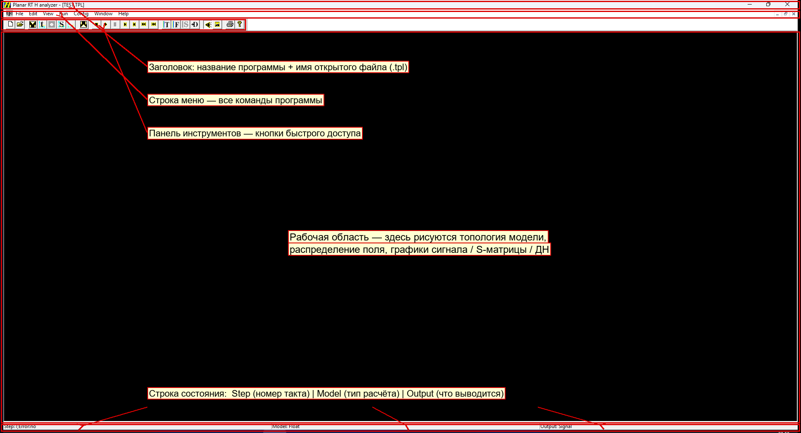

---

## 2. Запуск программы и открытие данных

1. Запустите файл `tmc_rth.exe` (папка `dist/win32/bin/`). Откроется главное окно (см. рисунок выше).
2. Откройте файл-шаблон расчёта: меню **File → Open…** (или кнопка  на панели инструментов, или `Ctrl+O`).
3. В диалоге выбора файла укажите файл с расширением **`.tpl`** (например, `samples/SAMPLE_R/1/TEST.TPL`).
4. После открытия имя файла появится в заголовке окна: `Planar RT H analyzer - [TEST.TPL]`.

> Можно также запустить программу сразу с файлом, перетащив `.tpl` на значок программы или указав путь
> к файлу аргументом командной строки: `tmc_rth.exe "путь\к\файлу.tpl"`.

---

## 3. Главное окно

Главное окно состоит из пяти зон (показаны рамками на рисунке в разделе 1):

| Зона | Назначение |
|------|-----------|
| **Заголовок** | Название программы и имя открытого файла `.tpl`. |
| **Строка меню** | Все команды программы: `File`, `Edit`, `View`, `Run`, `Config`, `Window`, `Help`. |
| **Панель инструментов** | Кнопки быстрого доступа к самым частым командам. |
| **Рабочая область** | Здесь рисуются топология модели, распределение поля и графики (сигнал / S-матрица / ДН). Сразу после открытия файла область чёрная — изображение появляется после команд вывода или расчёта. |
| **Строка состояния** | Слева — `Step` (номер текущего такта расчёта) и признак ошибки `Error`; по центру — `Model` (тип/точность расчёта: `Double` при двойной точности, `Float` при одинарной; в текущей сборке — `Double`); справа — `Output` (что выводится, например `Signal`). |

---

## 4. Панель инструментов

Панель инструментов дублирует самые нужные пункты меню. Кнопки слева направо пронумерованы:

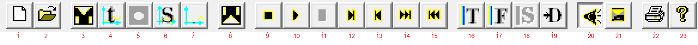

| № | Кнопка | Команда (меню) | Горячая клавиша | Что делает |
|---|--------|----------------|-----------------|------------|
| 1 |  | File → New | `Ctrl+N` | Создать новый (пустой) шаблон. |
| 2 |  | File → Open | `Ctrl+O` | Открыть существующий `.tpl`-файл. |
| 3 |  | Edit → Edit | `Alt+F7` | Открыть текущий `.tpl` во внешнем текстовом редакторе для правки. |
| 4 |  | View → Output | `Alt+Shift+F4` | Показать выходной сигнал (результат во временно́й области). |
| 5 |  | View → Field and topology | — | Показать распределение поля вместе с топологией. |
| 6 |  | View → S-matrix | `Ctrl+Shift+F4` | Показать S-матрицу рассеяния. |
| 7 |  | View → Directional Pattern | `Ctrl+Alt+F4` | Показать диаграмму направленности. |
| 8 |  | View → Statistics | `Shift+F4` | Открыть окно статистики расчёта (см. раздел 6). |
| 9 |  | Run → Load first step | `Shift+F5` | Загрузить первый шаг (вернуться к началу расчёта). |
| 10 |  | Run → Run | `F5` | Запустить расчёт от текущего такта до последнего. |
| 11 |  | Run → Stop | `Alt+F5` | Остановить идущий расчёт. (Активна только во время расчёта.) |
| 12 |  | Run → Run Step | `F8` | Просчитать один текущий шаг. |
| 13 |  | Run → Load Step | `Shift+F8` | Загрузить (перечитать) текущий шаг. |
| 14 |  | Run → Skip Step | `Ctrl+F6` | Пропустить шаг вперёд без вывода. |
| 15 |  | Run → Back Step | `Alt+F6` | Вернуться на шаг назад. |
| 16 |  | Config → Topology | `F4` | Вывести (отрисовать) топологию модели. |
| 17 |  | Config → Field | `Ctrl+F4` | Вывести (отрисовать) поле. |
| 18 |  | Config → Synchronization | — | Синхронизация. В текущей версии пункт **недоступен** (значок серый). |
| 19 |  | Config → Directional Pattern | — | Настройка/вывод диаграммы направленности. |
| 20 |  | Config → Sound | — | Звуковое сопровождение (вкл./выкл., мелодия). |
| 21 |  | Config → AutoRun | — | Автоматический запуск расчёта. |
| 22 |  | File → Print | `Ctrl+P` | Печать текущего изображения. |
| 23 |  | Help → About | — | О программе (версия). |

> Подсказка: при наведении курсора на кнопку в самой программе всплывает её английское название, а в
> строке состояния показывается короткое описание.

---

## 5. Меню

### 5.1. File (Файл)

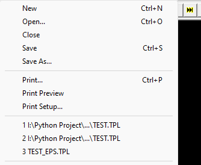

| Пункт | Перевод | Клавиша | Действие |
|-------|---------|---------|----------|
| New | Создать | `Ctrl+N` | Новый пустой шаблон. |
| Open… | Открыть | `Ctrl+O` | Открыть `.tpl`-файл. |
| Close | Закрыть | — | Закрыть текущий документ. |
| Save | Сохранить | `Ctrl+S` | Сохранить документ. |
| Save As… | Сохранить как | — | Сохранить под другим именем. |
| Print… | Печать | `Ctrl+P` | Печать изображения. |
| Print Preview | Предпросмотр печати | — | Предварительный просмотр перед печатью. |
| Print Setup… | Параметры печати | — | Выбор принтера и параметров страницы. |
| (список 1, 2, 3…) | Недавние файлы | — | Быстрое открытие недавно использованных `.tpl`. |
| Exit | Выход | — | Закрыть программу. |

### 5.2. Edit (Правка)


| Пункт | Перевод | Клавиша | Действие |
|-------|---------|---------|----------|
| Edit | Редактировать | `Alt+F7` | Открыть текущий `.tpl` во внешнем редакторе (задаётся в `Config → Editor`). |
| Undo | Отменить | `Ctrl+Z` | Отмена (в текущем режиме недоступно — серый). |
| Cut / Copy / Paste | Вырезать / Копировать / Вставить | `Ctrl+X` / `Ctrl+C` / `Ctrl+V` | Стандартные команды буфера обмена (недоступны — серые). |

### 5.3. View (Вид)

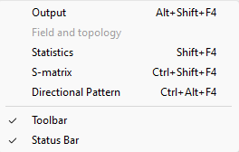

| Пункт | Перевод | Клавиша | Действие |
|-------|---------|---------|----------|
| Output | Выходной сигнал | `Alt+Shift+F4` | Показать выходной сигнал во временно́й области. |
| Field and topology | Поле и топология | — | Показать поле вместе с топологией. (В текущем состоянии пункт может быть серым, пока нет данных.) |
| Statistics | Статистика | `Shift+F4` | Открыть окно статистики расчёта (раздел 6). |
| S-matrix | S-матрица | `Ctrl+Shift+F4` | Показать S-матрицу рассеяния. |
| Directional Pattern | Диаграмма направленности | `Ctrl+Alt+F4` | Показать диаграмму направленности. |
| Toolbar | Панель инструментов | — | Показать/скрыть панель инструментов (галочка = показана). |
| Status Bar | Строка состояния | — | Показать/скрыть строку состояния (галочка = показана). |

### 5.4. Run (Расчёт)


| Пункт | Перевод | Клавиша | Действие |
|-------|---------|---------|----------|
| Run | Запуск | `F5` | Расчёт от текущего такта до последнего. |
| Load first step | Загрузить первый шаг | `Shift+F5` | Вернуться к началу расчёта. |
| Run Step | Шаг расчёта | `F8` | Просчитать один текущий шаг. |
| Load Step | Загрузить шаг | `Shift+F8` | Перечитать текущий шаг. |
| Skip Step | Пропустить шаг | `Ctrl+F6` | Перейти на шаг вперёд без вывода. |
| Back Step | Шаг назад | `Alt+F6` | Вернуться на шаг назад. |
| Stop | Стоп | `Alt+F5` | Остановить идущий расчёт (активно только во время счёта). |

### 5.5. Config (Настройки)


| Пункт | Перевод | Клавиша | Действие |
|-------|---------|---------|----------|
| Editor | Редактор | — | Указать путь к внешнему текстовому редактору для `.tpl` (раздел 6). |
| Viewer ► | Вьюверы | — | Подменю выбора внешних вьюверов (см. ниже). |
| Color ► | Цвет | — | Подменю настройки цвета. |
| Format ► | Формат | — | Подменю формата выходных файлов. |
| Topology | Топология | `F4` | Вывести топологию модели. |
| Field | Поле | `Ctrl+F4` | Вывести распределение поля. |
| Synchronization | Синхронизация | — | (Недоступно — серый.) |
| Directional Pattern | Диаграмма направленности | — | Настройка/вывод ДН. |
| Sound ► | Звук | — | Подменю звукового сопровождения. |
| AutoRun | Автозапуск | — | Автоматический запуск расчёта. |
| Setup | Настройка | — | Общие настройки. ⚠️ Назначение требует уточнения у автора. |

**Подменю Config → Viewer** — выбор внешних программ-вьюверов для просмотра каждого вида данных:

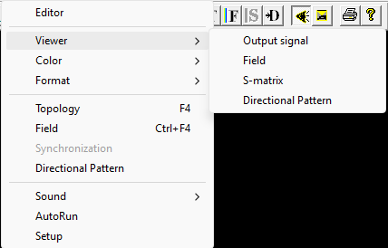

- **Output signal** — вьювер выходного сигнала (TMCROS);
- **Field** — вьювер поля (FieldView);
- **S-matrix** — вьювер S-матрицы (TMCGROUT);
- **Directional Pattern** — вьювер диаграммы направленности (TMC_DN).

**Подменю Config → Color** — настройка цвета:

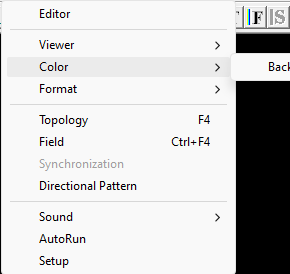

- **BackGround** — цвет фона рабочей области.

**Подменю Config → Format** — формат выходных файлов:

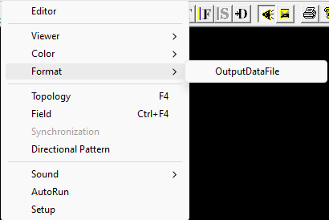

- **OutputDataFile** — настройка формата (точности печати чисел) выходного файла данных.

**Подменю Config → Sound** — звуковое сопровождение:

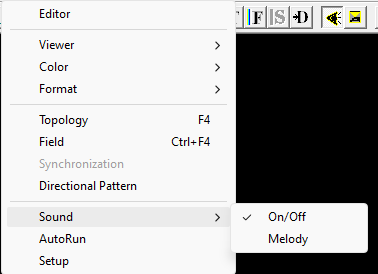

- **On/Off** — включить/выключить звук (галочка = включён);
- **Melody** — выбор мелодии.

### 5.6. Window (Окно)

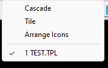

| Пункт | Перевод | Действие |
|-------|---------|----------|
| Cascade | Каскадом | Расположить окна документов каскадом. |
| Tile | Мозаикой | Расположить окна мозаикой. |
| Arrange Icons | Упорядочить значки | Упорядочить свёрнутые окна. |
| (список 1 …) | Открытые документы | Переключение между открытыми `.tpl` (галочка — активный). |

### 5.7. Help (Справка)


| Пункт | Перевод | Действие |
|-------|---------|----------|
| About PlanRT_H… | О программе | Сведения о версии программы. |

---

## 6. Диалоговые окна

### 6.1. About (О программе)

Вызывается через **Help → About PlanRT_H…** или кнопкой .
Показывает название, версию и сведения о разработчике.

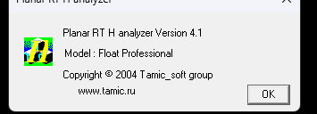

### 6.2. Statistics (Статистика расчёта)

Вызывается через **View → Statistics** (`Shift+F4`) или кнопкой .
Окно показывает параметры расчётной сетки и текущего расчёта.

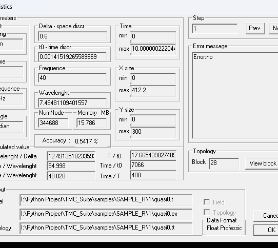

Основные поля:

- **Parameters → Unit** — единицы измерения: `Long` (длина, например `mm`), `Time` (`ns`), `Frequence` (`GHz`), `Angle` (`radian`).
- **Delta - space discr** — шаг пространственной дискретизации (Δ).
- **t0 - time discr** — шаг по времени.
- **Frequence** — рабочая частота.
- **Wavelenght** — длина волны.
- **NumNode** — число узлов сетки; **Memory MB** — объём занятой памяти.
- **Time (min / max)** — временно́й интервал расчёта.
- **X size / Y size (min / max)** — размеры расчётной области.
- **Accuracy** — оценка точности (в процентах).
- **Calculated value** — производные величины: `lenght / Delta`, `Xsize / Wavelenght`, `Ysize / Wavelenght`, `T / t0`, `Time / t0`, `Time / T`.
- **Step** — номер текущего шага, кнопки **Prev. / Next** для переключения шагов.
- **Error message** — сообщение об ошибке (`Error:no` — ошибок нет).
- **Topology → Block** — номер блока; **View block list** — список блоков.
- **Output → Signal / Field / Topology** — пути к выходным файлам; флажки **Field / Topology**; **Data Format** — формат данных (например, `Float Professional`).
- Кнопки **OK** (применить) и **Cancel** (отмена).

### 6.3. Выбор внешнего редактора (Config → Editor)

Команда **Config → Editor** открывает стандартное окно выбора файла, в котором нужно указать
исполняемый файл (`.exe`) внешнего текстового редактора. После этого команда **Edit → Edit** (`Alt+F7`)
будет открывать текущий `.tpl` именно в нём.

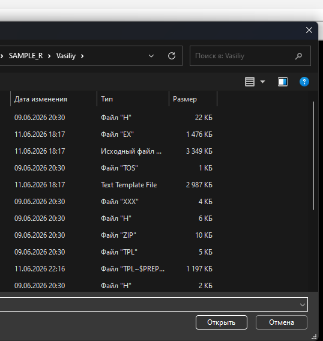

---

## 7. Входные данные: файл-шаблон `.tpl`

### 7.1. Что это и какое расширение

Главный входной файл программы — **текстовый шаблон с расширением `.tpl`** (text template). В нём
описаны: единицы измерения, параметры сетки и времени, топология (геометрия металла, поглотителей,
диэлектриков, входов), связи между блоками и какие выходные файлы создавать.

> 📘 **Как составить свой `.tpl` с нуля** — методика (чертёж → «коробка» → декомпозиция на блоки →
> выбор шага сетки) и **полный справочник входного языка** со всеми ключевыми словами, рисунками
> примитивов и примерами: **[`tpl-guide.md`](tpl-guide.md)**. Ниже — только краткий разбор рабочего
> примера.

Перед расчётом файл проходит **препроцессинг** библиотекой PREPR (раскрываются `#include` и `#define`,
вычисляются выражения). То есть `.tpl` можно писать «по-программистски»: с подключаемыми файлами и
именованными константами.

### 7.2. Сопутствующие файлы

Часто `.tpl` сам по себе короткий и лишь подключает заголовочные файлы `.h`:

- **`.tpl`** — главный файл (точка входа), задаёт сигнатуру, подключения и вызов макроса расчёта;
- **`.h`** — подключаемые файлы с константами (`#define`) и большими блоками топологии (макросы);
- **`.eps`** — файл распределения диэлектрической проницаемости ε (если используется неоднородная среда).

### 7.3. Разбор примера

Рассмотрим рабочий пример `samples/SAMPLE_R/1/TEST.TPL`:

```text
#TMC_RT_H
#include horns.h
#include cir_quas.h

Wozmush    3.141592653589/8; quasi0; 40.0;

#EOF
```

Построчно:

| Строка | Значение |
|--------|----------|
| `#TMC_RT_H` | **Сигнатура файла** — обязательная первая строка, говорит ядру H, что это его шаблон. |
| `#include horns.h` | Подключить файл с **константами** геометрии (см. ниже). |
| `#include cir_quas.h` | Подключить файл, где определён **макрос `Wozmush`** — он разворачивается в полное описание расчётного шага (`#STEP`). |
| `Wozmush 3.141592653589/8; quasi0; 40.0;` | **Вызов макроса** с тремя параметрами: сдвиг `sdvig` = π/8, имя выходного файла `quasi0`, частота `40.0` ГГц. |
| `#EOF` | Признак конца файла. |

> ⚙️ **Комментарии и спецсимволы:**
> - строки, начинающиеся с `#` — директивы препроцессора (`#include`, `#define`, `#STEP`, `#EOF` и т. п.);
> - строки, начинающиеся с `!` — **комментарии** (поясняющий текст, игнорируется при разборе);
> - `\\` в конце строки — **перенос** (склейка) длинной строки макроса;
> - `@ ( … )` и `@\\` — служебные обёртки выражений препроцессора PREPR;
> - точка с запятой `;` разделяет параметры внутри команд.

### 7.4. Файл констант (`horns.h`)

Содержит только именованные константы — их удобно менять, не трогая геометрию:

```text
#define L_box   @ ( 412.00)      // длина расчётной области по X
#define W_box   @ ( 300.00)      // ширина расчётной области по Y
#define W_input @ (   8.00)      // ширина входа
#define W_delta @ (   0.6)       // шаг сетки Δ
#define a2      @ ( 20 )         // геометрические размеры рупора …
#define apert   @ ( 39 )         // апертура
#define alfa    @ ( 7.36/180*3.141593 )   // угол (в радианах)
...
```

Каждый `#define Имя @ ( Выражение )` задаёт константу. В выражениях можно использовать арифметику и
ранее объявленные константы (например, `a1` определён через `W_input`, `h` — через `apert`, `W_input`, `th`).

### 7.5. Файл шага расчёта (`cir_quas.h`)

Здесь определён макрос `Wozmush`, который разворачивается в полный блок **`#STEP … #END_STEP`**. Внутри —
четыре секции:

**Секция `#PARM … #END_PARM`** — параметры расчёта:

| Параметр | Назначение |
|----------|-----------|
| `ANGLE_UNIT radian;` | Единица углов (радианы). |
| `FREQ_UNIT GHz;` | Единица частоты (ГГц). |
| `LONG_UNIT mm;` | Единица длины (мм). |
| `TIME_UNIT ns;` | Единица времени (нс). |
| `DELTA W_delta;` | Пространственный шаг сетки Δ. |
| `TIME 0.; 10.;` | Временно́й интервал расчёта (от 0 до 10). |
| `X_MIN / X_MAX` | Границы области по X (`0` … `L_box`). |
| `Y_MIN / Y_MAX` | Границы области по Y (`0` … `W_box`). |
| `FREQ freq__;` | Рабочая частота (берётся из параметра макроса). |

**Секция `#TOPOLOGY … #END_TOPOLOGY`** — геометрия модели. Состоит из **блоков**:

```text
 BLOCK 1;                         // номер блока
 POLYGON_STAT METAL;              // тип элемента и материал
   L   0;   a1/2;                 // вершины полигона (координаты L x; y;)
   L   a2;  a1/2;
   L   a2;  a1/2+W_delta;
 END_B                            // конец блока
```

Типы элементов топологии, встречающиеся в примере:

| Ключевое слово | Что задаёт |
|----------------|-----------|
| `POLYGON_STAT <материал>` | Полигон (ломаная), вершины задаются строками `L x; y;`. |
| `RECT_STAT <материал>; x1; x2; y1; y2;` | Прямоугольник по двум диапазонам координат. |
| `CIRCLE_STAT <выражение>; r1; r2; f1; f2;` | Кольцевой/круговой сегмент (диапазоны радиуса и угла). |
| `INPUT_X <тип>; y1; y2; t1; t2;` | **Вход вдоль оси Y** — ставится на левую или правую границу «коробки», размеры задаются по Y в диапазоне `y1…y2`, радиоимпульс во временно́м окне `t1…t2`. |
| `INPUT_Y <тип>; x1; x2; t1; t2;` | **Вход вдоль оси X** — ставится на нижнюю или верхнюю границу, размеры задаются по X. |
| `FILE <имя>; x1; x2; y1; y2;` | Загрузка распределения (например ε) из файла на прямоугольной области. |

Материалы: **`METAL`** (идеальный проводник), **`MAGNETIC`** (магнетик — стенка холостого хода),
**`ABSORBER`** (поглотитель). Вместо материала может стоять **выражение** (для неоднородной среды),
например в блоке 20: `CIRCLE_STAT amp*cos(tpg*r0*(f-f0+sdvig__))/exp(...);` — задаёт распределение
возмущения как функцию координат `r`, `f` (радиус, угол) и параметра `sdvig__`.

> ⚠️ **Выражение задаёт добавку ε⁺ к проницаемости вакуума, а не саму ε.** Пластине с ε = 4
> соответствует запись `3`. Отсюда конструкция `(W_eps-1)`, которая встречается во всех авторских
> заданиях.

> ⚠️ **`INPUT_X` — вход вдоль оси Y, а не «по оси X».** Название означает ось, *вдоль* которой
> происходит возбуждение, а размеры входа задаются по *перпендикулярной* оси. Подробно — в
> `tpl-guide.md`, раздел 5.5.

> 📝 В строке 145 примера видна **закомментированная** альтернатива блока 28:
> `\\ FILE prof_rct ; …` — символ `\\` в начале (после переноса) превращает строку в неиспользуемый
> вариант. Так в шаблонах хранят запасные варианты описания.

**Секция `#LINK_LIST … #END_LINK`** — связи блоков и плоскости симметрии:

```text
 T 1; 0.0; W_box/2;     // блок 1 размещается в точке (x0=0.0, y0=W_box/2)
 ...
 T 20; R_vessel+l+a2; W_box/2;
```

Строка **`T <номер блока>; x0; y0;`** размещает блок с указанным номером в координатах `(x0, y0)`
(в единицах из секции `#PARM`). То есть в `#TOPOLOGY` блок описывается «в своей» системе координат, а в
`#LINK_LIST` ему назначается положение в общей расчётной области.

**Секция `#OUTPUT … #END_OUTPUT`** — какие выходные файлы создавать:

```text
 FILE filename__;                              // базовое имя выходных файлов (= quasi0)
 FIELD_DISTRIBUTION_M filename__; freq__; 7; 8; // сохранить распределение поля на частоте freq, шаги 7 и 8
```

| Команда | Назначение |
|---------|-----------|
| `FILE <имя>;` | Базовое имя для выходных файлов. **Обязательна, должна быть первой**; имя не должно содержать точку. |
| `SMATRIX <Sfile>; <частота>; <T_min>; <T_max>;` | Записать S-матрицу в `Sfile.s` для указанной частоты, усреднив по интервалу `T_min…T_max`. |
| `TOPOLOGY;` | Вывести топологию в `<имя>.tt`. |
| `FIELDS;` | Вывести распределение полей. Требует также `TOPOLOGY;`. Сильно замедляет счёт. |
| `FIELD_DISTRIBUTION <имя>; <частота>; <expr>; <expr>;` | Сохранить комплексное распределение поля (модуль → `.em`, фаза → `.ef`). |
| `FIELD_DISTRIBUTION_M <имя>; <частота>; <expr>; <expr>;` | То же, вариант с накоплением в памяти. |

> 📌 Каждый `#STEP` даёт **одну** частотную точку в `.s`. Частотная характеристика получается
> **свипом** — многими шагами с разными `FREQ`, пишущими в один и тот же `Sfile`.

### 7.6. Как подготовить свои данные

1. Скопируйте рабочий пример (`TEST.TPL` + `horns.h` + `cir_quas.h`) в отдельную папку.
2. В `horns.h` поменяйте **константы** под свою задачу (размеры области `L_box`/`W_box`, шаг `W_delta`,
   геометрию рупора и т. д.).
3. При необходимости отредактируйте топологию в `cir_quas.h` (блоки `BLOCK … END_B`).
4. В `.tpl` задайте параметры запуска: сдвиг, имя выходного файла, частоту.
5. Откройте `.tpl` в программе и запустите расчёт (раздел 8).

Для правки удобно настроить внешний редактор (`Config → Editor`) и открывать файл прямо из программы
командой `Edit → Edit` (`Alt+F7`).

---

## 8. Выходные данные

После расчёта ядро создаёт файлы (имена строятся от базового имени, заданного в секции `#OUTPUT`):

| Расширение | Содержимое | Чем смотреть |
|------------|-----------|--------------|
| `.t` | Временно́й сигнал на входах (падающие и отражённые волны) | **TMCROS** |
| `.s` | S-матрица рассеяния | **TMCGROUT** |
| `.tt` | Топология модели | **FieldView** |
| `.ex` | Распределение поля Ex (двоичный файл) | **FieldView** |
| `.ey` | Распределение поля Ey | **FieldView** |
| `.hz` | Распределение поля Hz | **FieldView** |
| `.em` | Модуль комплексного распределения поля | **FieldView** |
| `.ef` | Фаза комплексного распределения поля | **FieldView** |
| `.q`, `.ix`, `.iy` | Служебные файлы | — |
| `.eps` | Распределение диэлектрической проницаемости ε | ядро (вход и выход) |

Имена всех файлов строятся от базового имени, заданного строкой `FILE` в секции `#OUTPUT`. Список
проверен по коду (`src/libs/TMCIndan/TmcRTH_IndanOutput.cpp`, строки 194–204).

> 📌 Расширение **`.tf`** встречается в авторском руководстве 2000 года и в списке форматов, которые
> открывает FieldView (`*.tf;*.AMP;*.FAZ;*.ex`). Текущий код его **не пишет** — это историческое
> расширение версии 2.0p.

> Файлы диаграммы направленности (`.dop` для TMC_DN) ядро напрямую не пишет — данные для ДН
> экспортируются отдельной подсистемой; см. API-документацию `docs/api/libs/tmcindan.md`.

---

## 9. Типовые сценарии

**Открыть готовый расчёт и посмотреть результат:**
1. `File → Open…` → выбрать `.tpl`.
2. `Config → Topology` (`F4`) — убедиться, что топология отрисовалась правильно.
3. `Run → Run` (`F5`) — выполнить расчёт.
4. `View → Output` (`Alt+Shift+F4`) — посмотреть выходной сигнал; `View → S-matrix` — S-матрицу.

**Пошаговый расчёт (для наблюдения за полем):**
1. `Run → Load first step` (`Shift+F5`) — встать в начало.
2. `Run → Run Step` (`F8`) — просчитать один шаг; повторять.
3. `Config → Field` (`Ctrl+F4`) — наблюдать распределение поля на каждом шаге.
4. `Run → Back Step` / `Skip Step` — двигаться по тактам назад/вперёд.

**Проверить параметры сетки и памяти перед длинным расчётом:**
- `View → Statistics` (`Shift+F4`) — посмотреть число узлов, занятую память, шаги Δ и t0, оценку точности.

---

## 10. Возможные проблемы

| Симптом | Что проверить |
|---------|---------------|
| Файл не открывается / ошибка разбора | Первая строка должна быть `#TMC_RT_H`; проверьте, что рядом лежат все `#include`-файлы (`.h`). |
| Рабочая область осталась чёрной | Выполните `Config → Topology` (`F4`) или запустите расчёт — пустой холст до вывода это нормально. |
| `Edit → Edit` ничего не открывает | Сначала укажите редактор в `Config → Editor`. |
| В строке состояния `Error` ≠ `no` | Откройте `View → Statistics` и посмотрите поле **Error message**. |
| Кнопка `Stop` неактивна | Она работает только во время идущего расчёта. |
| Долгий расчёт / нехватка памяти | Уменьшите область или увеличьте шаг `DELTA`; проверьте `NumNode` и `Memory` в окне статистики. |

---

## 11. Связанные программы и документы

- **TMCROS** — просмотр временно́го сигнала (`.t`). См. `tmcros.md`.
- **TMCGROUT** — просмотр S-матрицы (`.s`). См. `tmcgrout.md`.
- **TMC_DN** — просмотр диаграммы направленности. См. `tmc_dn.md`.
- **FieldView** — просмотр поля и топологии (`.ex`, `.tt`).
- **PlanarRT_X** — парное ядро для X-моды. См. `planar_rt_x.md`.
- API-документация ядра: `docs/api/kernels/planar_rt_h.md`; формат данных: `docs/api/libs/tmcindan.md`.
