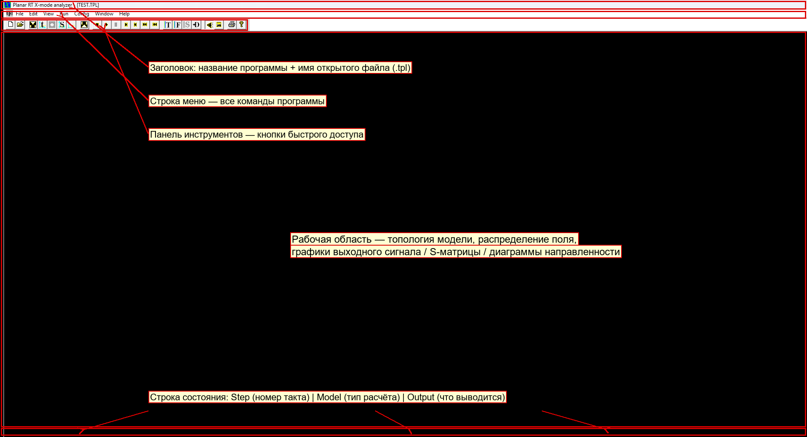
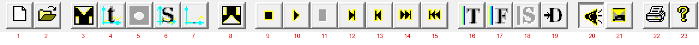
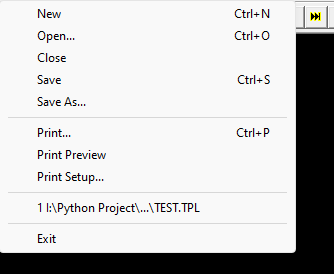
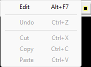
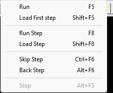
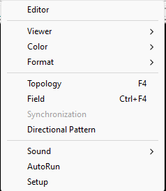
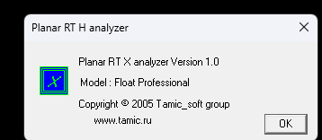
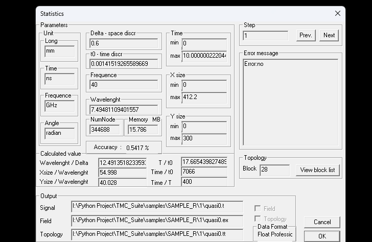

Руководство пользователя — счётное ядро PlanarRT_X (``tmc_rtx.exe``)
====================================================================

.. note::

   Программа: **Planar RT X-mode analyzer** (исполняемый файл ``tmc_rtx.exe``). Интерфейс программы англоязычный — приводятся английские названия пунктов как в программе, рядом — русское пояснение. Подписи на скриншотах русские.

.. note::

   🔁 **PlanarRT_X — это «парная» программа к PlanarRT_H.** Обе собраны из одного исходного кода, поэтому их интерфейс (меню, панель инструментов, диалоги) **полностью совпадает**. Различается только **физика расчёта**: H считает H-поляризацию, X — **X-моду** (см. раздел 7). Если вы уже знакомы с ``planar_rt_h.md``, освоить X не составит труда. Ниже приведено полное описание со скриншотами именно X-программы.

1. Назначение программы
-----------------------

**PlanarRT_X** — **счётное ядро** пакета TMC Suite для электродинамического расчёта **планарных** (двумерных) структур в **X-моде** во **временно́й области**. Как и H-ядро, программа по текстовому шаблону ``.tpl`` (топология области, параметры, выходные данные) «проигрывает» поле во времени и сохраняет результаты для просмотра во вьюверах:

- **временно́й сигнал** на входах (``.t``) → вьювер **TMCROS**;
- **S-матрицу** рассеяния (``.s``) → вьювер **TMCGROUT**;
- **распределение поля** (``.ex``, ``.ey``, ``.hz``, ``.em``, ``.ef``) и **топологию** (``.tt``) → вьювер **FieldView**.

Главное отличие от H-ядра — внутренний алгоритм: в X-моде на каждом узле сетки хранится больше компонент поля и цикл расчёта состоит из **четырёх подтактов** вместо двух (подробнее — раздел 7).

2. Запуск программы и открытие данных
-------------------------------------

1. Запустите файл ``tmc_rtx.exe`` (папка ``dist/win32/bin/``). Откроется главное окно.
2. Откройте шаблон: **File → Open…** (или кнопка |image1| , или ``Ctrl+O``).
3. Выберите файл с расширением **``.tpl``**. В качестве рабочего образца подойдёт ``samples/SAMPLE_R/1/TEST.TPL`` (открывается и H-, и X-ядром).
4. Имя файла появится в заголовке: ``Planar RT X-mode analyzer - [TEST.TPL]``.

.. note::

   Для изучения **формата** удобен файл ``src/kernels/PlanarRT_X/1.TPL`` — он снабжён подробными комментариями ко всем типам блоков (см. раздел 8.2). Учтите: чтобы *запустить* именно его, рядом должен лежать подключаемый им файл ``planrt2.h``; если этого файла нет, используйте для расчёта готовый образец (например, ``TEST.TPL``), а ``1.TPL`` читайте как справочник по синтаксису.

.. note::

   Можно запускать с файлом из командной строки: ``tmc_rtx.exe "путь\к\файлу.tpl"``.

3. Главное окно
---------------

Окно состоит из пяти зон (рамки на рисунке в разделе 1):

.. list-table::
   :header-rows: 1
   :widths: auto

   * - Зона
     - Назначение
   * - **Заголовок**
     - Название программы (``Planar RT X-mode analyzer``) и имя открытого ``.tpl``.
   * - **Строка меню**
     - Команды: ``File``, ``Edit``, ``View``, ``Run``, ``Config``, ``Window``, ``Help``.
   * - **Панель инструментов**
     - Кнопки быстрого доступа.
   * - **Рабочая область**
     - Топология, поле и графики. До команд вывода/расчёта область чёрная.
   * - **Строка состояния**
     - ``Step`` (такт) и ``Error``; ``Model`` (тип расчёта); ``Output`` (что выводится).

4. Панель инструментов
----------------------

Кнопки слева направо (нумерация на рисунке):

.. list-table::
   :header-rows: 1
   :widths: auto

   * - №
     - Кнопка
     - Команда (меню)
     - Горячая клавиша
     - Что делает
   * - 1
     - .. image:: ../../../screenshots/PlanarRT_X/btn-new.png
     - File → New
     - ``Ctrl+N``
     - Создать новый шаблон.
   * - 2
     - .. image:: ../../../screenshots/PlanarRT_X/btn-open.png
     - File → Open
     - ``Ctrl+O``
     - Открыть ``.tpl``.
   * - 3
     - .. image:: ../../../screenshots/PlanarRT_X/btn-edit.png
     - Edit → Edit
     - ``Alt+F7``
     - Открыть ``.tpl`` во внешнем редакторе.
   * - 4
     - .. image:: ../../../screenshots/PlanarRT_X/btn-output.png
     - View → Output
     - ``Alt+Shift+F4``
     - Показать выходной сигнал.
   * - 5
     - .. image:: ../../../screenshots/PlanarRT_X/btn-field1.png
     - View → Field and topology
     - —
     - Показать поле с топологией.
   * - 6
     - .. image:: ../../../screenshots/PlanarRT_X/btn-smatrix.png
     - View → S-matrix
     - ``Ctrl+Shift+F4``
     - Показать S-матрицу.
   * - 7
     - .. image:: ../../../screenshots/PlanarRT_X/btn-dirpat.png
     - View → Directional Pattern
     - ``Ctrl+Alt+F4``
     - Показать диаграмму направленности.
   * - 8
     - .. image:: ../../../screenshots/PlanarRT_X/btn-stat.png
     - View → Statistics
     - ``Shift+F4``
     - Окно статистики (раздел 6).
   * - 9
     - .. image:: ../../../screenshots/PlanarRT_X/btn-loadfirst.png
     - Run → Load first step
     - ``Shift+F5``
     - Вернуться к первому шагу.
   * - 10
     - .. image:: ../../../screenshots/PlanarRT_X/btn-run.png
     - Run → Run
     - ``F5``
     - Расчёт до конца.
   * - 11
     - .. image:: ../../../screenshots/PlanarRT_X/btn-stop.png
     - Run → Stop
     - ``Alt+F5``
     - Остановить расчёт.
   * - 12
     - .. image:: ../../../screenshots/PlanarRT_X/btn-runstep.png
     - Run → Run Step
     - ``F8``
     - Один шаг расчёта.
   * - 13
     - .. image:: ../../../screenshots/PlanarRT_X/btn-loadstep.png
     - Run → Load Step
     - ``Shift+F8``
     - Перечитать текущий шаг.
   * - 14
     - .. image:: ../../../screenshots/PlanarRT_X/btn-skipstep.png
     - Run → Skip Step
     - ``Ctrl+F6``
     - Пропустить шаг вперёд.
   * - 15
     - .. image:: ../../../screenshots/PlanarRT_X/btn-backstep.png
     - Run → Back Step
     - ``Alt+F6``
     - Шаг назад.
   * - 16
     - .. image:: ../../../screenshots/PlanarRT_X/btn-topology.png
     - Config → Topology
     - ``F4``
     - Вывести топологию.
   * - 17
     - .. image:: ../../../screenshots/PlanarRT_X/btn-field.png
     - Config → Field
     - ``Ctrl+F4``
     - Вывести поле.
   * - 18
     - .. image:: ../../../screenshots/PlanarRT_X/btn-sync.png
     - Config → Synchronization
     - —
     - Недоступно (значок серый).
   * - 19
     - .. image:: ../../../screenshots/PlanarRT_X/btn-dirpat2.png
     - Config → Directional Pattern
     - —
     - Настройка/вывод ДН.
   * - 20
     - .. image:: ../../../screenshots/PlanarRT_X/btn-sound.png
     - Config → Sound
     - —
     - Звук (вкл./выкл., мелодия).
   * - 21
     - .. image:: ../../../screenshots/PlanarRT_X/btn-autorun.png
     - Config → AutoRun
     - —
     - Автозапуск расчёта.
   * - 22
     - .. image:: ../../../screenshots/PlanarRT_X/btn-print.png
     - File → Print
     - ``Ctrl+P``
     - Печать изображения.
   * - 23
     - .. image:: ../../../screenshots/PlanarRT_X/btn-about.png
     - Help → About
     - —
     - О программе.

5. Меню
-------

5.1. File (Файл)
~~~~~~~~~~~~~~~~

New (``Ctrl+N``), Open… (``Ctrl+O``), Close, Save (``Ctrl+S``), Save As…, Print… (``Ctrl+P``), Print Preview, Print Setup…, список недавних файлов, Exit. Назначение — как в любой Windows-программе (создать / открыть / сохранить / печатать / выйти).

5.2. Edit (Правка)
~~~~~~~~~~~~~~~~~~

- **Edit** (``Alt+F7``) — открыть текущий ``.tpl`` во внешнем редакторе (задаётся в ``Config → Editor``).
- **Undo / Cut / Copy / Paste** — стандартные команды буфера обмена (в текущем режиме недоступны — серые).

5.3. View (Вид)
~~~~~~~~~~~~~~~

.. image:: ../../../screenshots/PlanarRT_X/menu-view.png
   :alt: Меню View

.. list-table::
   :header-rows: 1
   :widths: auto

   * - Пункт
     - Перевод
     - Клавиша
     - Действие
   * - Output
     - Выходной сигнал
     - ``Alt+Shift+F4``
     - Показать выходной сигнал.
   * - Field and topology
     - Поле и топология
     - —
     - Показать поле с топологией.
   * - Statistics
     - Статистика
     - ``Shift+F4``
     - Окно статистики (раздел 6).
   * - S-matrix
     - S-матрица
     - ``Ctrl+Shift+F4``
     - Показать S-матрицу.
   * - Directional Pattern
     - Диаграмма направленности
     - ``Ctrl+Alt+F4``
     - Показать ДН. ⚠️ В X-моде накопление данных для ДН в текущей версии отключено (см. раздел 7).
   * - Toolbar
     - Панель инструментов
     - —
     - Показать/скрыть панель (галочка = показана).
   * - Status Bar
     - Строка состояния
     - —
     - Показать/скрыть строку состояния.

5.4. Run (Расчёт)
~~~~~~~~~~~~~~~~~

Run (``F5``), Load first step (``Shift+F5``), Run Step (``F8``), Load Step (``Shift+F8``), Skip Step (``Ctrl+F6``), Back Step (``Alt+F6``), Stop (``Alt+F5``). Управление расчётом: запуск целиком, по шагам, навигация по тактам, остановка. (``Stop`` активна только во время счёта.)

5.5. Config (Настройки)
~~~~~~~~~~~~~~~~~~~~~~~

.. list-table::
   :header-rows: 1
   :widths: auto

   * - Пункт
     - Перевод
     - Клавиша
     - Действие
   * - Editor
     - Редактор
     - —
     - Указать внешний редактор для ``.tpl``.
   * - Viewer ►
     - Вьюверы
     - —
     - Выбор внешних вьюверов (подменю).
   * - Color ►
     - Цвет
     - —
     - Настройка цвета (подменю).
   * - Format ►
     - Формат
     - —
     - Формат выходных файлов (подменю).
   * - Topology
     - Топология
     - ``F4``
     - Вывести топологию.
   * - Field
     - Поле
     - ``Ctrl+F4``
     - Вывести поле.
   * - Synchronization
     - Синхронизация
     - —
     - Недоступно (серый).
   * - Directional Pattern
     - Диаграмма направленности
     - —
     - Настройка/вывод ДН.
   * - Sound ►
     - Звук
     - —
     - Звуковое сопровождение (подменю).
   * - AutoRun
     - Автозапуск
     - —
     - Автоматический запуск расчёта.
   * - Setup
     - Настройка
     - —
     - Общие настройки.

**Подменю Config → Viewer** — выбор внешних программ просмотра:

.. image:: ../../../screenshots/PlanarRT_X/submenu-config-viewer.png
   :alt: Подменю Viewer

Output signal (TMCROS), Field (FieldView), S-matrix (TMCGROUT), Directional Pattern (TMC_DN).

**Подменю Config → Color** — ``BackGround`` (цвет фона рабочей области):

.. image:: ../../../screenshots/PlanarRT_X/submenu-config-color.png
   :alt: Подменю Color

**Подменю Config → Format** — ``OutputDataFile`` (формат/точность чисел выходного файла):

.. image:: ../../../screenshots/PlanarRT_X/submenu-config-format.png
   :alt: Подменю Format

**Подменю Config → Sound** — ``On/Off`` (галочка = включён) и ``Melody``:

.. image:: ../../../screenshots/PlanarRT_X/submenu-config-sound.png
   :alt: Подменю Sound

5.6. Window (Окно)
~~~~~~~~~~~~~~~~~~

.. image:: ../../../screenshots/PlanarRT_X/menu-window.png
   :alt: Меню Window

Cascade (каскадом), Tile (мозаикой), Arrange Icons (упорядочить значки), список открытых документов (галочка — активный).

5.7. Help (Справка)
~~~~~~~~~~~~~~~~~~~

**About PlanRT_X…** — сведения о версии программы.

6. Диалоговые окна
------------------

6.1. About (О программе)
~~~~~~~~~~~~~~~~~~~~~~~~

**Help → About PlanRT_X…** или кнопка |image2| . Показывает версию и сведения о разработчике.

.. note::

   Примечание: в заголовке окна About может стоять надпись «Planar RT H analyzer» (общий с H-ядром ресурс), но текст внутри ясно указывает: **Planar RT X analyzer**.

6.2. Statistics (Статистика расчёта)
~~~~~~~~~~~~~~~~~~~~~~~~~~~~~~~~~~~~

**View → Statistics** (``Shift+F4``) или кнопка |image3| . Окно показывает параметры сетки и расчёта.

Поля те же, что и в H-ядре:

- **Unit** — единицы: ``Long``, ``Time``, ``Frequence``, ``Angle``.
- **Delta - space discr** / **t0 - time discr** — шаги по пространству и времени.
- **Frequence**, **Wavelenght** — частота и длина волны.
- **NumNode**, **Memory MB** — число узлов и память.
- **Time / X size / Y size (min/max)** — интервалы расчёта и размеры области.
- **Accuracy** — оценка точности.
- **Calculated value** — производные отношения (``lenght/Delta``, ``Xsize/Wavelenght``, ``T/t0`` и т. д.).
- **Step** + кнопки **Prev. / Next** — навигация по шагам.
- **Error message** — сообщение об ошибке (``Error:no`` — ошибок нет).
- **Topology → Block** + **View block list** — блоки модели.
- **Output** — пути к выходным файлам, флажки **Field / Topology**, **Data Format**.
- Кнопки **OK** / **Cancel**.

7. Чем X-мода отличается от H (для пользователя)
------------------------------------------------

Для пользователя интерфейс и формат данных **одинаковы** с H-ядром. Различается то, что считается «под капотом»:

.. list-table::
   :header-rows: 1
   :widths: auto

   * - Свойство
     - H-ядро
     - X-ядро
   * - Цикл расчёта (1T)
     - 2 подтакта
     - **4 подтакта**
   * - Компонент поля на узле
     - 4
     - **8**
   * - Доп. типы блоков топологии
     - —
     - **``RECT_STAT_Y``, ``CIRCLE_STAT_Y``, ``POLYGON_STAT_Y``, ``FILE_Y``**
   * - Диаграмма направленности
     - накапливается
     - в текущей версии **накопление отключено**
   * - Сигнатура входного файла
     - ``#TMC_RT_H``
     - **``#TMC_RT_H``** (та же)

Практические следствия:

- **Формат ``.tpl`` — тот же**, и первая строка файла остаётся ``#TMC_RT_H`` (отдельной сигнатуры ``#TMC_RT_X`` нет). Поэтому один и тот же шаблон можно открыть и H-, и X-ядром.
- X-ядро дополнительно понимает в секции ``#TOPOLOGY`` блоки с суффиксом **``_Y``** (``RECT_STAT_Y`` и т. д.). ⚠️ Точное назначение суффикса ``_Y`` (задание блока проводимостью по оси Y) стоит уточнить у автора.
- Из-за большего числа компонент поля X-расчёт требует **больше памяти и времени** при той же сетке — следите за ``NumNode`` и ``Memory`` в окне статистики.
- Пункт **View → Directional Pattern** в X-моде может не давать результата, так как накопление данных для ДН в текущей версии отключено.

.. note::

   🛠️ **Только для сборки (не для пользователя готовой программы).** X-ядро компилируется с шестью препроцессорными макросами (``ELECTRON_Q___``, ``ELECTRON_M___``, ``CTMCRTH_INDANBLCK_FILEY``, ``CTMCRTH_INDANBLCK_RECTSTATY``, ``CTMCRTH_INDANBLCK_CIRCSTATY``, ``CTMCRTH_INDANBLCK_POLYGSTTY``), которые задаются **только в свойствах проекта** X-моды. На работу с уже готовым ``tmc_rtx.exe`` это никак не влияет — подробности в ``docs/build-guide/`` и ``docs/api/kernels/planar_rt_x.md``.

8. Входные данные: файл-шаблон ``.tpl``
---------------------------------------

8.1. Расширение и общая идея
~~~~~~~~~~~~~~~~~~~~~~~~~~~~

Главный входной файл — текстовый шаблон **``.tpl``**. Первая строка — сигнатура **``#TMC_RT_H``**. Перед расчётом файл проходит препроцессинг библиотекой PREPR (``#include``, ``#define``, вычисление выражений). Структура файла полностью совпадает с H-ядром (исчерпывающий разбор — в ``planar_rt_h.md``, раздел 7); ниже приведён собственный учебный пример X-ядра.

**Спецсимволы:**

- ``#`` в начале строки — директива препроцессора (``#include``, ``#define``, ``#STEP``, ``#EOF``);
- ``!`` в начале строки — **комментарий** (поясняющий текст, игнорируется);
- ``;`` — разделитель параметров;
- ``\\`` в конце строки — перенос длинной строки.

8.2. Разбор учебного примера ``1.TPL``
~~~~~~~~~~~~~~~~~~~~~~~~~~~~~~~~~~~~~~

Файл ``src/kernels/PlanarRT_X/1.TPL`` снабжён подробными комментариями и показывает почти все возможности формата (это справочный пример синтаксиса; для запуска ему нужен подключаемый ``planrt2.h``). Его структура:

.. code-block:: text

   #TMC_RT_H              ← сигнатура
   #include planrt2.h     ← подключаемые константы

   #STEP                  ← первый шаг расчёта
     #PARM … #END_PARM        — параметры
     #TOPOLOGY … #END_TOPOLOGY — геометрия (блоки)
     #LINK_LIST … #END_LINK    — размещение блоков
     #OUTPUT … #END_OUTPUT     — выходные файлы
   #END_STEP

   #STEP … #END_STEP      ← второй шаг (можно несколько)

   #EOF                   ← конец файла

Файл может содержать **несколько секций ``#STEP``** — это последовательность расчётов (например, разные конфигурации топологии), переключаемых кнопками **Prev./Next** в окне статистики и командами меню ``Run``.

8.3. Секция ``#PARM`` (параметры)
~~~~~~~~~~~~~~~~~~~~~~~~~~~~~~~~~

.. code-block:: text

    ANGLE_UNIT radian;     ! единица углов
    FREQ_UNIT GHz;         ! единица частоты
    LONG_UNIT mm;          ! единица длины
    TIME_UNIT s;           ! единица времени
    DELTA 0.35;            ! шаг сетки Δ
    TIME -.0001; 0.0001;   ! интервал времени (от; до)
    X_MIN -10.0*2-4 ;      ! границы по X (можно выражением)
    X_MAX ( + 500 . 0 ) ;
    Y_MIN (-5.0);          ! границы по Y
    Y_MAX 300.0;
    FREQ 40.0;             ! рабочая частота

Числа можно задавать выражениями; пробелы внутри чисел/скобок допускаются (``( + 500 . 0 )`` = 500.0).

8.4. Секция ``#TOPOLOGY`` (геометрия)
~~~~~~~~~~~~~~~~~~~~~~~~~~~~~~~~~~~~~

Геометрия описывается **блоками** ``BLOCK n; … END_B``. Внутри блока — один элемент. Типы элементов (из комментариев примера):

.. list-table::
   :header-rows: 1
   :widths: auto

   * - Ключевое слово
     - Синтаксис
     - Что задаёт
   * - ``RECT_STAT``
     - ``RECT_STAT E(x,y); x_min; x_max; y_min; y_max;``
     - Неподвижный прямоугольник; ``E(x,y)`` — материал или выражение.
   * - ``CIRCLE_STAT``
     - ``CIRCLE_STAT E(r,f); r_min; r_max; f_min; f_max;``
     - Неподвижный круговой сегмент (диапазоны радиуса ``r`` и угла ``f``).
   * - ``POLYGON_STAT``
     - ``POLYGON_STAT E(x,y); L x; y; …``
     - Неподвижный многоугольник; вершины строками ``L x; y;``.
   * - ``RECT_MOVE``
     - ``RECT_MOVE E(x,y); x_min; x_max; y_min; y_max; Vx; Vy; w;``
     - **Подвижный** прямоугольник со скоростями ``Vx``,``Vy`` и угловой скоростью ``w``.
   * - ``CIRCLE_MOVE``
     - ``CIRCLE_MOVE E(r,f); r_min; r_max; f_min; f_max; Vx; Vy; w;``
     - Подвижный круговой сегмент.
   * - ``POLYGON_MOVE``
     - ``POLYGON_MOVE E(x,y); Vx; Vy; w; L x; y; …``
     - Подвижный многоугольник.
   * - ``INPUT_X``
     - ``INPUT_X <тип>; y_min; y_max; t_min; t_max; [Amp]; [Faza]; [Eps];``
     - **Вход вдоль оси Y** — на левой или правой границе «коробки», размеры по Y в диапазоне ``y_min…y_max``, радиоимпульс во времени ``t_min…t_max``.
   * - ``INPUT_Y``
     - ``INPUT_Y <тип>; x_min; x_max; t_min; t_max; [Amp]; [Faza]; [Eps];``
     - **Вход вдоль оси X** — на нижней или верхней границе, размеры по X.

**``E(x,y)``** — это «материал» элемента; может быть:

- ключевым словом **``METAL``** (идеальный проводник), **``MAGNETIC``** (магнетик — стенка холостого хода) или **``ABSORBER``** (поглотитель);
- **выражением** для неоднородной среды, например ``- ( x^2 + y^2 )`` или ``- ( 3 - r )`` (распределение ε как функция координат).

.. warning::

   ⚠️ **Выражение задаёт добавку ε⁺ к проницаемости вакуума, а не саму ε.** Среде с ε = 4 соответствует запись ``3``, вакууму — ``0``, среде с ε = 0 — ``-1``.

.. warning::

   ⚠️ **Первый параметр входа — это мода, а не форма сигнала.** ``MAGNETIC`` — плоская волна (ширина входа меньше половины длины волны); ``METAL`` или пусто — волна H₁₀ прямоугольного волновода (ширина больше половины, но меньше полной длины волны). Амплитуда и фаза задаются **необязательными параметрами 6 и 7** как выражения от ``t`` и ``f``; параметр 8 — добавка ε в сечении входа. Подробно — в [``tpl-guide.md``](tpl-guide.md), раздел 5.5.

Полное описание всех примитивов, включая плазменные варианты ``RECT_STAT_N`` / ``_B`` / ``_Y``, — в [``tpl-guide.md``](tpl-guide.md).

Пример блока с поясняющими комментариями (как в файле):

.. code-block:: text

    BLOCK 1;
   ! прямоугольник, заполненный распределением ε = -(x²+y²)
   ! RECT_STAT E(x,y); x_min; x_max; y_min; y_max;
    RECT_STAT - ( x^2 + y^2 ) ; -1 ; 3 ; -2; 4;
    END_B

Подвижный элемент добавляет три числа в конце — скорости ``Vx``, ``Vy`` (в ``LONG_UNIT/TIME_UNIT``) и угловую скорость ``w`` (в ``ANGLE_UNIT/TIME_UNIT``):

.. code-block:: text

    BLOCK 3;
   ! подвижный прямоугольник со скоростью (Vx,Vy) и вращением w
    RECT_MOVE - ( x^2 + y^2 ) ; -1; 3; -2; 4; 1.0; -2; 10;
    END_B

.. warning::

   X-ядро дополнительно распознаёт блоки с суффиксом ``_Y`` (``RECT_STAT_Y``, ``CIRCLE_STAT_Y``, ``POLYGON_STAT_Y``, ``FILE_Y``). ⚠️ Их назначение уточняется у автора.

8.5. Секция ``#LINK_LIST`` (размещение блоков)
~~~~~~~~~~~~~~~~~~~~~~~~~~~~~~~~~~~~~~~~~~~~~~

.. code-block:: text

   ! блок n размещается в точке (x0, y0); координаты в единицах из #PARM
   ! T n; x0; y0;
    T 1; -1.0; -0.5;
    T 2; -1.0; -0.5;
    ...

Каждая строка **``T <номер блока>; x0; y0;``** ставит блок в координаты ``(x0, y0)`` общей расчётной области. То есть в ``#TOPOLOGY`` форма блока задаётся «локально», а в ``#LINK_LIST`` — где он стоит.

8.6. Секция ``#OUTPUT`` (выходные файлы)
~~~~~~~~~~~~~~~~~~~~~~~~~~~~~~~~~~~~~~~~

.. code-block:: text

    FILE out1;     ! базовое имя выходных файлов
    FIELDS;        ! сохранять распределение поля
    TOPOLOGY;      ! сохранять топологию

.. list-table::
   :header-rows: 1
   :widths: auto

   * - Команда
     - Назначение
   * - ``FILE <имя>;``
     - Базовое имя для выходных файлов. **Обязательна, должна быть первой**; имя не должно содержать точку.
   * - ``SMATRIX <Sfile>; <частота>; <T_min>; <T_max>;``
     - Записать S-матрицу в ``Sfile.s`` для указанной частоты, усреднив по интервалу ``T_min…T_max``.
   * - ``FIELDS;``
     - Сохранять распределение поля (``.ex`` и др.). Требует также ``TOPOLOGY;``. Сильно замедляет счёт.
   * - ``TOPOLOGY;``
     - Сохранять топологию (``.tt``).
   * - ``FIELD_DISTRIBUTION <имя>; <частота>; <expr>; <expr>;``
     - Комплексное распределение поля (модуль → ``.em``, фаза → ``.ef``).
   * - ``FIELD_DISTRIBUTION_M <имя>; <частота>; <expr>; <expr>;``
     - То же, вариант с накоплением в памяти.

Во втором шаге примера эти строки закомментированы (``! TOPOLOGY``, ``! FIELD``) — значит, для второго шага поле и топология не выводятся.

8.7. Как подготовить свои данные
~~~~~~~~~~~~~~~~~~~~~~~~~~~~~~~~

1. Скопируйте пример ``1.TPL`` (и подключаемый ``planrt2.h``) в отдельную папку.
2. В секции ``#PARM`` задайте единицы, шаг ``DELTA``, интервал ``TIME``, границы области и частоту.
3. Опишите геометрию в ``#TOPOLOGY`` (блоки ``BLOCK … END_B``), при необходимости используйте подвижные элементы ``*_MOVE`` и входы ``INPUT_X`` / ``INPUT_Y``.
4. Разместите блоки в ``#LINK_LIST`` (``T n; x0; y0;``).
5. В ``#OUTPUT`` задайте имя выходных файлов и что сохранять.
6. Откройте ``.tpl`` в программе и запустите расчёт.

9. Выходные данные
------------------

.. list-table::
   :header-rows: 1
   :widths: auto

   * - Расширение
     - Содержимое
     - Чем смотреть
   * - ``.t``
     - Временно́й сигнал на входах
     - **TMCROS**
   * - ``.s``
     - S-матрица рассеяния
     - **TMCGROUT**
   * - ``.ex``
     - Распределение поля Ex (двоичный)
     - **FieldView**
   * - ``.ey``, ``.hz``
     - Распределение полей Ey, Hz
     - **FieldView**
   * - ``.em``, ``.ef``
     - Модуль и фаза комплексного распределения поля
     - **FieldView**
   * - ``.q``, ``.ix``, ``.iy``
     - Служебные файлы
     - —
   * - ``.tt``
     - Топология модели
     - **FieldView**
   * - ``.eps``
     - Распределение ε
     - ядро (вход и выход)

10. Типовые сценарии
--------------------

**Открыть расчёт и посмотреть результат:**

1. ``File → Open…`` → выбрать ``.tpl``.
2. ``Config → Topology`` (``F4``) — проверить топологию.
3. ``Run → Run`` (``F5``) — выполнить расчёт.
4. ``View → Output`` / ``View → S-matrix`` — посмотреть результаты.

**Пошаговый расчёт с наблюдением поля:**

1. ``Run → Load first step`` (``Shift+F5``).
2. ``Run → Run Step`` (``F8``) — по одному шагу.
3. ``Config → Field`` (``Ctrl+F4``) — наблюдать поле.

**Многошаговый шаблон:** если в файле несколько ``#STEP``, переключайтесь между ними кнопками **Prev./Next** в окне статистики.

**Проверка ресурсов:** ``View → Statistics`` (``Shift+F4``) — узлы, память, точность (для X-моды особенно важно из-за повышенного расхода памяти).

11. Возможные проблемы
----------------------

.. list-table::
   :header-rows: 1
   :widths: auto

   * - Симптом
     - Что проверить
   * - Файл не открывается
     - Первая строка — ``#TMC_RT_H``; рядом лежат все ``#include``-файлы.
   * - Рабочая область чёрная
     - Выполните ``Config → Topology`` (``F4``) или запустите расчёт.
   * - ``Edit → Edit`` не работает
     - Сначала задайте редактор в ``Config → Editor``.
   * - ``Error`` ≠ ``no`` в строке состояния
     - Посмотрите **Error message** в окне статистики.
   * - ``View → Directional Pattern`` пуст
     - В X-моде накопление данных для ДН отключено (раздел 7).
   * - Нехватка памяти / медленно
     - X-мода расходует больше ресурсов; увеличьте ``DELTA`` или уменьшите область.

12. Связанные программы и документы
-----------------------------------

- **PlanarRT_H** — парное ядро (H-поляризация). См. ``planar_rt_h.md`` (там же исчерпывающий разбор формата ``.tpl``).
- **TMCROS** (``.t``), **TMCGROUT** (``.s``), **TMC_DN** (ДН), **FieldView** (``.ex``, ``.tt``) — вьюверы.
- API-документация: ``docs/api/kernels/planar_rt_x.md``; формат данных: ``docs/api/libs/tmcindan.md``.
