Файл задания ``.tpl`` — как его создать. Полный справочник входного языка
=========================================================================

.. note::

   Относится к счётным ядрам **PlanarRT_H** (``tmc_rth.exe``) и **PlanarRT_X** (``tmc_rtx.exe``).

   Документ восстановлен по авторскому руководству «TAMIC-Rt H. Программа для электродинамического анализа в H плоскости планарных структур с неоднородным диэлектрическим заполнением, версия 2.0p» (TAMIC_soft group, 2000) и **сверен с текущим исходным кодом** TMC Suite. Места, где нынешний код расходится с руководством 2000 года, отмечены явно — при расхождении верным считается **код**.

1. Что такое файл задания
-------------------------

Входными данными счётного ядра является **геометрия анализируемого устройства**, которая описывается в текстовом файле задания с расширением ``.tpl``. Ядро читает ``.tpl``, проводит расчёт и выдаёт результаты в виде файлов нескольких типов, которые затем смотрят вьюверы пакета.

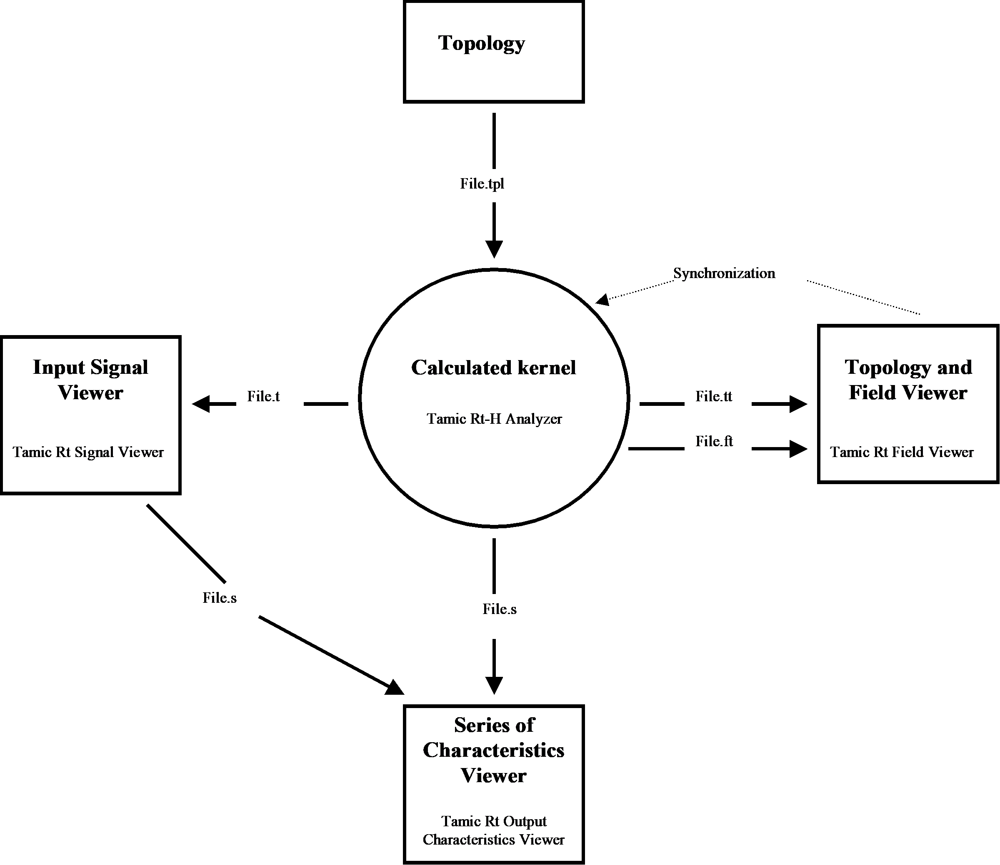

*Структурная схема пакета (рис. 2.1 авторского руководства).*

.. warning::

   ⚠️ **Расхождение с рисунком.** На схеме 2000 года файл поля обозначен ``File.ft``, а в тексте того же руководства — ``File.tf``. В текущем коде поле пишется в файлы ``.ex`` / ``.ey`` / ``.hz`` / ``.em`` / ``.ef`` (см. раздел 8). Расширение ``.tf`` осталось только в списке открываемых FieldView форматов.

Такое разделение (счёт отдельно, просмотр отдельно) позволяет повысить гибкость системы и минимизировать требования к ресурсам компьютера при проведении расчёта.

2. Общая структура файла задания
--------------------------------

Каждая строка файла начинается **уникальным описателем**, который определяет следующие за ним данные.

Файл задания **всегда** начинается строкой ``#TMC_RT_H`` и заканчивается строкой ``#EOF``.

Всё задание делится на **шаги**. Каждый шаг может описывать независимое СВЧ-устройство или его часть; шаг начинается строкой ``#STEP`` и заканчивается ``#END_STEP``:

.. code-block:: text

   #TMC_RT_H          Начало файла задания
   #STEP              Это первый шаг
      Данные для первой задачи
   #END_STEP
   #STEP              Это второй шаг
      Данные для второй задачи
   #END_STEP
   #EOF               Конец файла задания

.. note::

   📌 **Сигнатура ``#TMC_RT_H`` — общая для обоих ядер.** X-ядро (``tmc_rtx.exe``) читает файлы с той же первой строкой ``#TMC_RT_H``, отдельной сигнатуры ``#TMC_RT_X`` в коде нет.

Каждый шаг состоит из четырёх секций, которые рекомендуется располагать в таком порядке:

.. list-table::
   :header-rows: 1
   :widths: auto

   * - Секция
     - Назначение
     - Обязательна?
   * - ``#PARM … #END_PARM``
     - Единицы измерения, шаг сетки, время, границы «коробки», частота
     - В первом шаге — да
   * - ``#TOPOLOGY … #END_TOPOLOGY``
     - Блоки (графические примитивы), из которых состоит устройство
     - Да
   * - ``#LINK_LIST … #END_LINK``
     - Геометрическое положение каждого блока в «коробке»
     - Да
   * - ``#OUTPUT … #END_OUTPUT``
     - Какие выходные файлы формировать
     - Да (нужно хотя бы ``FILE``)

Секция параметров может отсутствовать в шагах, следующих за первым — тогда параметры берутся такими же, как в предыдущем шаге.

2.1. Синтаксис
~~~~~~~~~~~~~~

- Все операторы, имеющие символ ``#``, должны начинаться **с первой позиции строки**.
- Остальные операторы должны иметь **как минимум один пробел** в первой позиции строки.
- **Комментарий** — любая строка или часть строки, начинающаяся с символа ``!``.
- Допустимы пустые строки и строки из одних пробелов.
- Параметры отделяются от идентификатора строки **как минимум одним пробелом**, а между собой — символом ``;``.

В формализованных записях формата ниже приняты обозначения:

.. list-table::
   :header-rows: 1
   :widths: auto

   * - Обозначение
     - Смысл
   * - ``< >``
     - обязательный параметр
   * - ``[ ]``
     - необязательный параметр
   * - ``expression``
     - математическое выражение
   * - ``expression(x,y,r,f)``
     - выражение, содержащее функцию от декартовых (``x``,``y``) или полярных (``r``,``f``) координат
   * - ``n``
     - целое число

3. Методика: как составить задание с нуля
-----------------------------------------

Это тот самый порядок действий, которым пользовался автор. Разберём его на задаче из авторского руководства: **рассеяние плоской волны на плоскопараллельной пластине с ε = 4** на частоте 10 ГГц.

Шаг 1. Нарисовать топологию в H-плоскости
~~~~~~~~~~~~~~~~~~~~~~~~~~~~~~~~~~~~~~~~~

Начинают с чертежа реального устройства в H-плоскости, со всеми размерами.

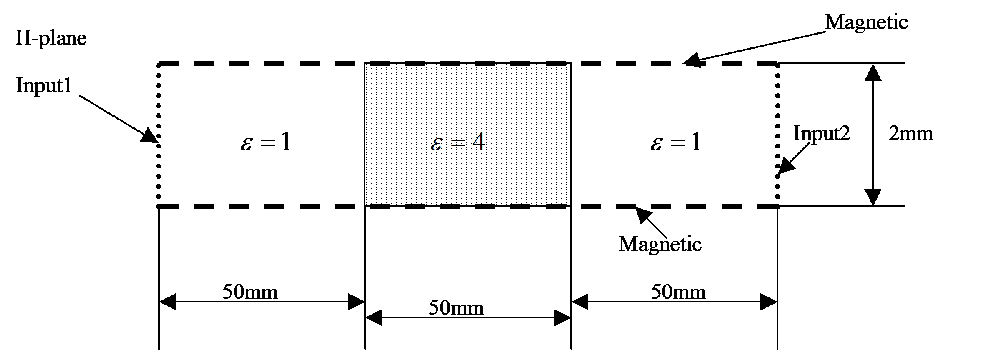

*Расположение плоскопараллельной пластины в H-плоскости (рис. 3.1). Все размеры в миллиметрах.*

Шаг 2. Вписать устройство в «коробку»
~~~~~~~~~~~~~~~~~~~~~~~~~~~~~~~~~~~~~

Всё устройство должно помещаться в прямоугольник — его называют **«коробкой»**. Положение коробки задаётся в секции параметров величинами ``X_MIN``, ``X_MAX``, ``Y_MIN``, ``Y_MAX``.

**Границей коробки является металл или входы устройства.** Это важно: сама граница коробки — всегда металл, если на ней не стоит вход.

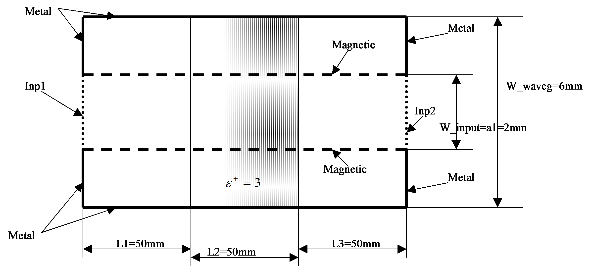

*Расположение пластины в «коробке» и значения задаваемых константных выражений (рис. 3.2).*

Обратите внимание на обозначение **ε⁺ = 3** внутри пластины: это не сама проницаемость, а **добавка** к проницаемости вакуума. Пластине с ε = 4 соответствует добавка ε⁺ = 3 (см. раздел 5.1).

Шаг 3. Декомпозировать геометрию на примитивы
~~~~~~~~~~~~~~~~~~~~~~~~~~~~~~~~~~~~~~~~~~~~~

Полученную геометрию раскладывают на **блоки** — графические примитивы входного языка.

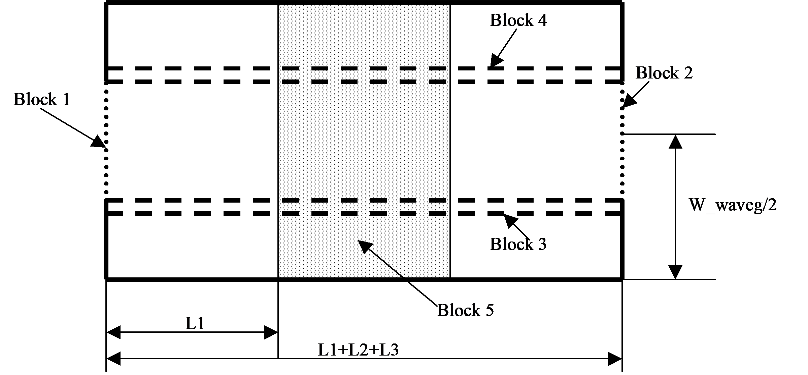

*Декомпозиция заданной геометрии с использованием графических примитивов (рис. 3.3).*

Для нашей задачи получается пять блоков:

.. list-table::
   :header-rows: 1
   :widths: auto

   * - Блок
     - Что это
   * - Block 1, Block 2
     - входы устройства (``INPUT_X``)
   * - Block 3, Block 4
     - прямоугольники с магнитными стенками (``RECT_STAT MAGNETIC``)
   * - Block 5
     - прямоугольник с заданным диэлектрическим распределением (``RECT_STAT``)

Шаг 4. Выбрать шаг сетки Δ
~~~~~~~~~~~~~~~~~~~~~~~~~~

Шаг сетки ``DELTA`` определяет точность. Правила выбора — в разделе 4.5. Кратко: ориентировочно **1/20 длины волны в волноводе** на максимальной частоте диапазона даёт точность около 3 %.

Шаг 5. Написать задание
~~~~~~~~~~~~~~~~~~~~~~~

Каждый блок описывается в секции ``#TOPOLOGY`` **в своей локальной системе координат**, а затем размещается в коробке строкой ``T`` в секции ``#LINK_LIST``.

Полный текст задания (файл ``samples/SAMPLE_R/TEST_MAG/EPS4/TEST0.TPL``, приведён по авторскому руководству — в репозитории файл с тех пор изменялся, см. примечание ниже):

.. code-block:: text

   #TMC_RT_H
   #define L1 @ (   50.00)
   #define L2 @ (   50.00)
   #define L3 @ (   50.00)
   #define W_freq @ (  10 )
   #define W_eps @ ( 4.00 )
   #define W_waveg @ (  6.00 )
   #define W_input @ (  2.00 )
   #define W_delta @ (    0.5 )
   #define W_type @ MAGNETIC
   #define a1 @ ( W_input )
   #STEP
   #PARM
    ANGLE_UNIT radian;
    FREQ_UNIT GHz;
    LONG_UNIT mm;
    TIME_UNIT ns;
    DELTA W_delta;
    TIME 0.; 5;
    X_MIN  0.0;
    X_MAX L1+L2+L3;
    Y_MIN  0.0;
    Y_MAX W_waveg;
    FREQ  10;
   #END_PARM
   #TOPOLOGY
    BLOCK 1;
     INPUT_X   W_type ; -a1/2; a1/2; 0; 200;
    END_B
    BLOCK 2;
     INPUT_X    W_type ; -a1/2; a1/2; 200; 201;
    END_B
    BLOCK 3;
     RECT_STAT W_type ; 0.0; L1+L2+L3; -a1/2-2*W_delta; -a1/2-1*W_delta;
    END_B
    BLOCK 4;
     RECT_STAT W_type ; 0.0;L1+L2+L3; a1/2; a1/2+W_delta;
    END_B
    BLOCK 5;
     RECT_STAT (W_eps-1); 0;L2; 0.0; W_waveg;
    END_B
   #END_TOPOLOGY
   #LINK_LIST
    T 1; 0.0; W_waveg/2;
    T 2; L1+L2+L3; W_waveg/2;
    T 3; 0.0; W_waveg/2;
    T 4; 0.0; W_waveg/2;
    T 5; L1; 0.0;
   #END_LINK
   #OUTPUT
    FILE test1;
    SMATRIX test1; 10; 4; 5;
    FIELDS;
    TOPOLOGY;
   #END_OUTPUT
   #END_STEP
   #EOF

Разбор ключевых мест:

- ``#define W_eps @ ( 4.00 )`` — проницаемость пластины ε = 4;
- ``RECT_STAT (W_eps-1); …`` — в блок передаётся **добавка** ε⁺ = ε − 1 = 3. Отсюда ``-1``;
- ``INPUT_X W_type; -a1/2; a1/2; 0; 200;`` — вход шириной ``a1``, радиоимпульс с 0 по 200 нс;
- второй вход (Block 2) имеет ``T_min = 200``, что **больше времени анализа** (``TIME 0.; 5;``) — так задают вход, на котором **нет** падающей волны, только приём;
- ``SMATRIX test1; 10; 4; 5;`` — записать S-матрицу для частоты 10 ГГц, усреднив с 4 по 5 нс.

.. note::

   📌 **Файл в репозитории отличается от руководства.** В ``samples/SAMPLE_R/TEST_MAG/EPS4/TEST0.TPL`` с 2000 года изменены ``L1=100``, ``L2=600``, ``L3=100``, ``W_eps=-0.01``, ``W_delta=0.1``, ``TIME 0.; 200;``, а у первого входа появились дополнительные параметры (``… 0; 200; 1.; ;`` — амплитуда и фаза, см. раздел 6.4). Приведённый выше текст — из руководства; он показывает исходный замысел.

Шаг 6. Проверить и запустить
~~~~~~~~~~~~~~~~~~~~~~~~~~~~

1. Откройте ``.tpl`` в ядре (``File → Open``).
2. Ошибки разбора выводятся с указанием строки — язык проверяется строго.
3. Запустите расчёт и посмотрите результаты вьюверами (раздел 8).

4. Секция параметров ``#PARM``
------------------------------

.. code-block:: text

   #PARM
       . . .
   #END_PARM

.. note::

   📌 **``#PARM`` или ``#PARMS``?** В авторском руководстве 2000 года разделы «Формат ввода» пунктов 4.1.x написаны через **``#PARMS`` / ``#END_PARMS``** (11 мест), а все реальные примеры и оглавление — через ``#PARM`` / ``#END_PARM``. Это след родственного продукта TAMIC-E/H, где секция действительно называется ``#PARMS``.

   **Оба варианта работают.** Канонические имена в коде — ``#PARM`` и ``#END_PARM`` (``src/Include/TmcRTH_Indan.h``, строка 23), но секции ищутся сравнением **по префиксу** (``strncmp(csCh, csSection, csSection.GetLength())`` в ``TmcRTH_Indan.cpp``, строки 435 и 460), поэтому ``#PARMS`` и ``#END_PARMS`` тоже совпадают. Рекомендуется писать ``#PARM`` / ``#END_PARM``.

Единицы измерения углов, частоты, длин и времени необходимо задавать **до** определения частот и параметров с размерностью длины и времени.

Секция обязательно должна присутствовать в первом шаге. Если в других шагах она отсутствует, то параметры будут такими, как в предыдущем шаге.

4.1. ``ANGLE_UNIT`` — единицы измерения углов
~~~~~~~~~~~~~~~~~~~~~~~~~~~~~~~~~~~~~~~~~~~~~

.. code-block:: text

   ANGLE_UNIT <radian> | <gradus>;

Фиксирует единицу измерения углов аргументов тригонометрических функций.

.. list-table::
   :header-rows: 1
   :widths: auto

   * - Значение
     - Смысл
   * - ``radian``
     - радианы
   * - ``gradus``
     - градусы

По умолчанию — как в предыдущем шаге; если шаг первый — ``radian``.

4.2. ``FREQ_UNIT`` — единицы измерения частоты
~~~~~~~~~~~~~~~~~~~~~~~~~~~~~~~~~~~~~~~~~~~~~~

.. code-block:: text

   FREQ_UNIT <GHz> | <MHz> | <kHz> | <Hz>;

Вводится **до** строки ``FREQ``. По умолчанию в первом шаге — ``GHz``.

4.3. ``LONG_UNIT`` — единицы измерения длины
~~~~~~~~~~~~~~~~~~~~~~~~~~~~~~~~~~~~~~~~~~~~

.. code-block:: text

   LONG_UNIT <mm> | <cm> | <m>;

Вводится **до** строк ``DELTA``, ``X_MIN``, ``X_MAX``, ``Y_MIN``, ``Y_MAX``. По умолчанию в первом шаге — ``mm``.

4.4. ``TIME_UNIT`` — единицы измерения времени
~~~~~~~~~~~~~~~~~~~~~~~~~~~~~~~~~~~~~~~~~~~~~~

.. code-block:: text

   TIME_UNIT <s> | <ms> | <mks> | <ns> | <ps>;

Вводится **до** строки ``TIME``.

.. warning::

   ⚠️ По авторскому руководству, значение по умолчанию в первом шаге — **секунды** (``s``), а не ``ns``. Единицу времени лучше задавать явно.

4.5. ``DELTA`` — шаг сетки (точность анализа)
~~~~~~~~~~~~~~~~~~~~~~~~~~~~~~~~~~~~~~~~~~~~~

.. code-block:: text

   DELTA <expression>;

Физический смысл — размер пространственного дискрета, шага квадратной сетки, на которую разбивается всё устройство. Это **главный параметр точности**.

Рекомендации автора:

1. Для точности около **3 %** величина должна составлять около **1/20 длины волны** в волноводе на максимальной частоте диапазона. Точнее — определяется серией расчётов на сходимость.
2. ⚠️ **При уменьшении шага время анализа растёт пропорционально кубу.** Поэтому первоначальную отработку устройства ведут при низкой точности, повышая её на заключительном этапе.
3. Подбирайте шаг и геометрию так, чтобы **геометрия вписывалась целым числом дискретов**. Если толщина металла 1, 2, 3, 4 мм — берите ``DELTA`` = 1 мм или 0.5 мм, а не 1.02 мм или 0.47 мм.
4. Время счёта минимально, если в «коробке» вдоль X и Y укладывается **целое число** дискретов.

В первом шаге параметр обязателен.

4.6. ``TIME`` — время анализа
~~~~~~~~~~~~~~~~~~~~~~~~~~~~~

.. code-block:: text

   TIME <expression>; <expression>;

Первый параметр — время начала анализа, второй — время окончания. В первом шаге обязателен.

4.7. ``X_MIN``, ``X_MAX``, ``Y_MIN``, ``Y_MAX`` — границы «коробки»
~~~~~~~~~~~~~~~~~~~~~~~~~~~~~~~~~~~~~~~~~~~~~~~~~~~~~~~~~~~~~~~~~~~

.. code-block:: text

   X_MIN <expression>;
   X_MAX <expression>;
   Y_MIN <expression>;
   Y_MAX <expression>;

Задают прямоугольник, в который помещается анализируемая топология. В первом шаге обязательны.

4.8. ``FREQ`` — частота сигналов возбуждения
~~~~~~~~~~~~~~~~~~~~~~~~~~~~~~~~~~~~~~~~~~~~

.. code-block:: text

   FREQ <expression>;

Частота сигналов возбуждения на входах устройства. В первом шаге обязателен.

4.9. Параметры, принимаемые кодом, но не влияющие на расчёт
~~~~~~~~~~~~~~~~~~~~~~~~~~~~~~~~~~~~~~~~~~~~~~~~~~~~~~~~~~~

Разбор этих строк в коде есть, значение сохраняется, но **ни одно ядро его не читает**. Проверено по исходникам: соответствующие геттеры (``dGetHeight``, ``GetDeltaT``, ``IsDeltaTDefine``) не вызываются ни из ``kernels/``, ни из ``fieldview/``, ни из ``viewers/``; поля ``rNUnit`` / ``rBUnit`` не читаются вне модуля разбора.

.. list-table::
   :header-rows: 1
   :widths: auto

   * - Ключевое слово
     - Формат
     - Состояние
   * - ``HEIGHT``
     - ``HEIGHT <expression>;``
     - Разбирается, на расчёт не влияет. Встречается в ``samples/SAMPLE_R/TEST_*/…/HWVGD_1.TPL`` (``HEIGHT 0.1;``)
   * - ``DELTA_T_MECHANICAL``
     - ``DELTA_T_MECHANICAL <expression>;``
     - Разбирается, вызывает ``SetDeltaT()``, но результат не читается
   * - ``N_UNIT``
     - ``N_UNIT <m3> | <cm3> | <mm3>;``
     - Разбирается, множитель не применяется
   * - ``B_UNIT``
     - ``B_UNIT <Tl> | <mTl> | <mkTl>;``
     - Разбирается, множитель не применяется

**Практическое следствие:** концентрация плазмы ``N`` в блоках ``*_STAT_N`` всегда трактуется в **м⁻³**, а индукция ``B`` в блоках ``*_STAT_B`` — всегда в **Тесла**, независимо от того, что написано в ``N_UNIT`` / ``B_UNIT``.

5. Секция топологии ``#TOPOLOGY``
---------------------------------

.. code-block:: text

   #TOPOLOGY
       BLOCK 1;
           <тип примитива и его параметры>
       END_B
       . . .
       BLOCK <n>;
           . . .
       END_B
   #END_TOPOLOGY

Каждому блоку присваивается **уникальный номер** ``<n>`` — целое число больше нуля. Номера **не обязаны идти по порядку** и не обязаны быть непрерывными (в авторском примере с рупорами используются номера 1, 2, 5, 6, 7, 12, 14, 21, 22, 25, 26, 41…46, 104).

Параметры каждого примитива описываются **в его локальной системе координат**. Положение блока в коробке определяется в ``#LINK_LIST`` — поэтому **каждому блоку обязательно должна соответствовать одна строка** в ``#LINK_LIST``.

Все примитивы, кроме входов (``INPUT_X``, ``INPUT_Y``), могут накладываться и пересекаться между собой. Входы обязательно должны помещаться **только на границе «коробки»**.

5.1. Материал или распределение ε
~~~~~~~~~~~~~~~~~~~~~~~~~~~~~~~~~

Первый параметр примитива задаёт либо **материал**, либо **распределение добавки диэлектрической проницаемости**:

.. list-table::
   :header-rows: 1
   :widths: auto

   * - Значение
     - Смысл
   * - ``METAL``
     - металл (идеальный проводник)
   * - ``MAGNETIC``
     - магнетик — стенка холостого хода (магнитная стенка)
   * - ``ABSORBER``
     - поглотитель
   * - ``expression(x,y,r,f)``
     - распределение **добавки** ε⁺ к проницаемости вакуума

**Ключевое соглашение: задаётся добавка, а не сама проницаемость.**

.. list-table::
   :header-rows: 1
   :widths: auto

   * - Нужная ε
     - Что писать
   * - ε = 4
     - ``3``
   * - ε = 9
     - ``8``
   * - ε = 1 (вакуум)
     - ``0``
   * - ε = 0
     - ``-1``
   * - ε = 0.25
     - ``-0.75``

.. note::

   📌 **Важная разница в смысле примитива — материал задаёт КОНТУР, а не заливку.** Если задан **материал**, примитив задаёт **границу** (контур, ломаную линию). Если задано **выражение**, примитив задаёт **область**, заполненную средой. Это хорошо видно на рисунках ниже: у ``RECT_STAT METAL`` металлом является только контур прямоугольника, а у ``RECT_STAT 8`` закрашена вся площадь.

   Подтверждено кодом: ``SetRectMetal`` (``src/kernels/PlanarRT_H/TmcRTHNodeDiel.cpp:2419``) выделяет ``nNumNode = 2*nX + 2*(nY-1)`` узлов — это **периметр**, а не ``nX*nY`` (заливка), и заполняет их четырьмя циклами: нижнее ребро (``y = dYmin``), верхнее (``y = dYmax``), левое (``x = dXmin``), правое (``x = dXmax``).

   **Практическое следствие.** Чтобы получить *сплошной* металлический объект, задавайте его контуром: поле внутрь замкнутого контура не проникает. А чтобы получить сплошную диэлектрическую вставку — задавайте выражение, оно заполняет площадь.

.. warning::

   ⚠️ **Внимание, ``METAL`` и ``MAGNETIC`` меняются местами.** В ``src/Include/Tmcgrviw.h`` (строки 159–165) определения зависят от макроса ``_MODEL_RTE__``: при его наличии ``METAL`` и ``MAGNETIC`` меняются ролями (модель E-плоскости). В штатных сборках H и X этот макрос не задаётся, и слова означают то, что написано.

5.2. ``RECT_STAT`` — неподвижный прямоугольник
~~~~~~~~~~~~~~~~~~~~~~~~~~~~~~~~~~~~~~~~~~~~~~

.. code-block:: text

   BLOCK <n>;
       RECT_STAT [[file_name]]<METAL> | <MAGNETIC> | <ABSORBER> | <expression(x,y,r,f)>;
       <X_min>; <X_max>;
       <Y_min>; <Y_max>;
   END_B

.. list-table::
   :header-rows: 1
   :widths: auto

   * - №
     - Параметр
     - Смысл
   * - 1
     - материал / выражение
     - см. раздел 5.1
   * - 2
     - ``X_min``
     - левая граница по X
   * - 3
     - ``X_max``
     - правая граница по X
   * - 4
     - ``Y_min``
     - нижняя граница по Y
   * - 5
     - ``Y_max``
     - верхняя граница по Y

Необязательный ``[file_name]`` в квадратных скобках перед выражением — **сохранить рассчитанное распределение ε в файл** ``file_name.eps``, чтобы потом переиспользовать его примитивом ``FILE`` (раздел 5.6). Нужно для повышения эффективности при повторении вычислений на больших площадях.

**Два дополнительных условия для ``MAGNETIC`` и ``ABSORBER``:**

1. Разности ``X_max − X_min`` и ``Y_max − Y_min`` должны **превышать ``2*DELTA``** — толщина и высота должны быть больше двух пространственных дискретов.
2. Весь прямоугольник должен находиться в коробке, и его граница должна отстоять от границы коробки **не менее чем на один шаг сетки**.

Примеры
^^^^^^^

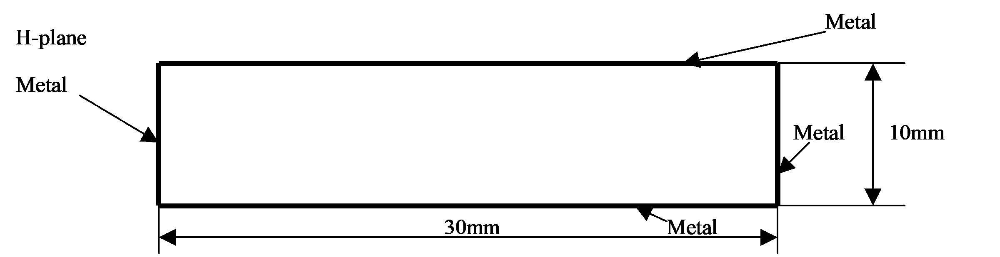

*Рис. 4.1. Неподвижный прямоугольник 30×10 мм, ограниченный металлом.*

.. code-block:: text

   BLOCK 1;
       RECT_STAT METAL; 0; 30; 0; 10;
   END_B

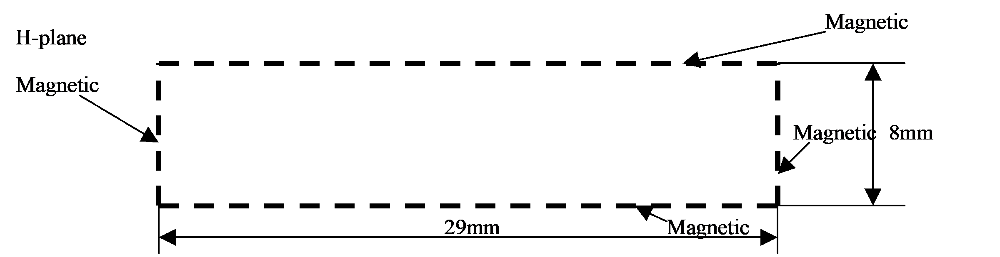

*Рис. 4.2. Прямоугольник 29×8 мм со стенками холостого хода (магнетиком).*

.. code-block:: text

   BLOCK 1;
       RECT_STAT MAGNETIC; -29; 0; -8; 0;
   END_B

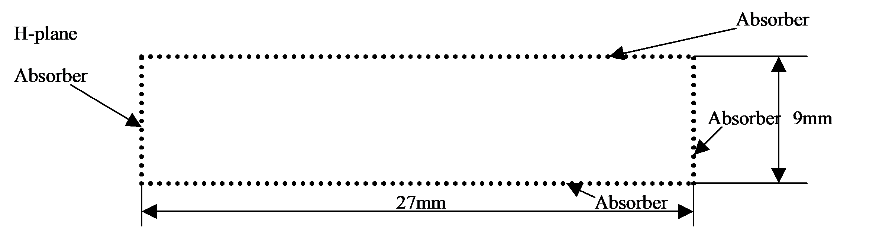

*Рис. 4.3. Прямоугольник 27×9 мм с поглощающими стенками.*

.. code-block:: text

   BLOCK 1;
       RECT_STAT ABSORBER; 0; 27; 0; 9;
   END_B

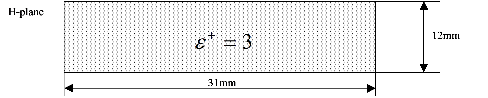

*Рис. 4.4. Прямоугольник 31×12 мм с ε = 4 (добавка ε⁺ = 3).*

.. code-block:: text

   BLOCK 1;
       RECT_STAT 3; 0; 31; 0; 12;
   END_B

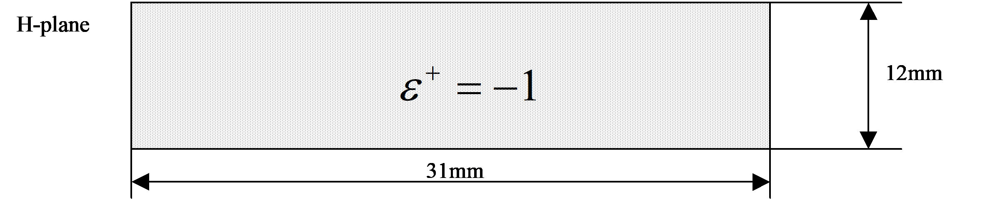

*Рис. 4.5. Прямоугольник 31×12 мм с ε = 0 (добавка ε⁺ = −1).*

.. code-block:: text

   BLOCK 1;
       RECT_STAT -1; 0; 31; 0; 12;
   END_B

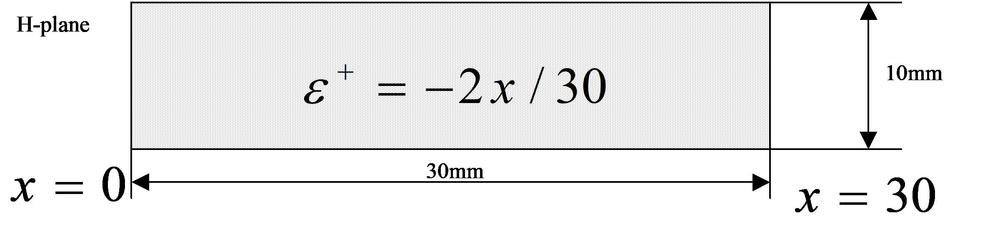

*Рис. 4.6. Прямоугольник 30×10 мм, ε линейно падает вдоль X от 1 на левой границе до −1 на правой (добавка меняется от 0 до −2).*

.. code-block:: text

   BLOCK 1;
       RECT_STAT -2*x/30; 0; 30; 0; 10;
   END_B

5.3. ``CIRCLE_STAT`` — неподвижный сектор
~~~~~~~~~~~~~~~~~~~~~~~~~~~~~~~~~~~~~~~~~

.. code-block:: text

   BLOCK <n>;
       CIRCLE_STAT <METAL> | <MAGNETIC> | <ABSORBER> | <expression(x,y,r,f)>;
       <R_min>; <R_max>;
       <F_min>; <F_max>;
   END_B

.. list-table::
   :header-rows: 1
   :widths: auto

   * - №
     - Параметр
     - Ограничение
   * - 1
     - материал / выражение
     - см. раздел 5.1
   * - 2
     - ``R_min``
     - ≥ 0
   * - 3
     - ``R_max``
     - > ``R_min``
   * - 4
     - ``F_min``
     - ≥ 0
   * - 5
     - ``F_max``
     - > ``F_min``, ≤ 2π

``R_min``, ``R_max`` — в единицах ``LONG_UNIT``; ``F_min``, ``F_max`` — в единицах ``ANGLE_UNIT``.

Примеры
^^^^^^^

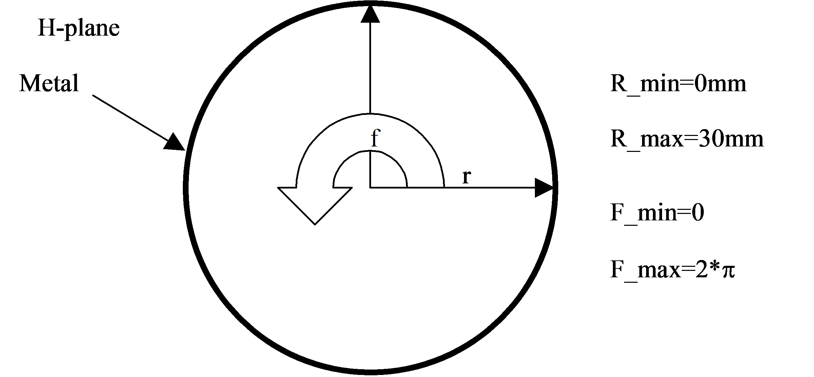

*Рис. 4.7. Металлический круг радиусом 30 мм.*

.. code-block:: text

   BLOCK 1;
       CIRCLE_STAT METAL; 0; 30; 0; 2*3.141592653589;
   END_B

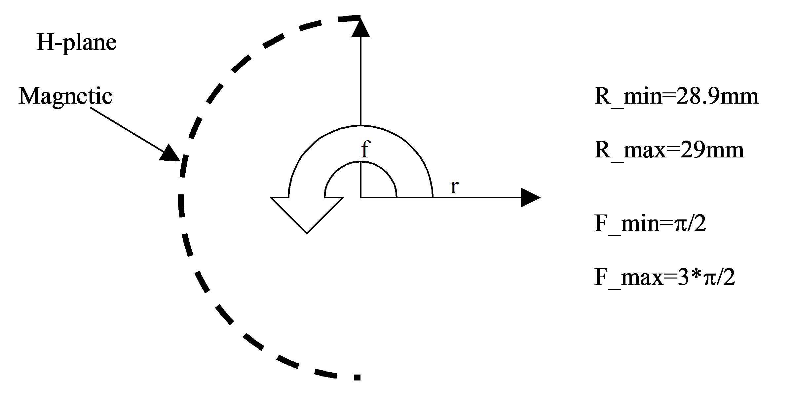

*Рис. 4.8. Полуокружность из магнетика радиусом 29 мм.*

.. code-block:: text

   BLOCK 1;
       CIRCLE_STAT MAGNETIC; 28.9; 29; 3.141592653589/2; 3*3.141592653589/2;
   END_B

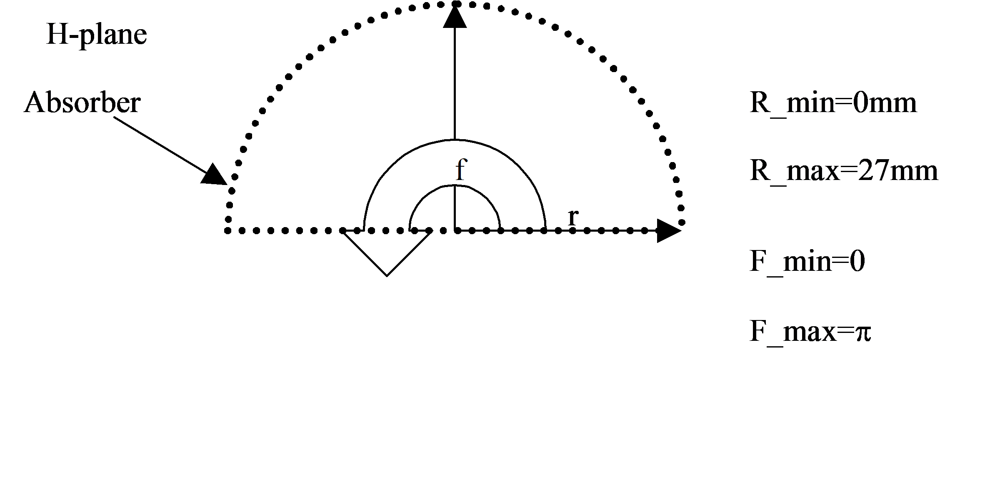

*Рис. 4.9. Полукруг из поглотителя радиусом 27 мм.*

.. code-block:: text

   BLOCK 1;
       CIRCLE_STAT ABSORBER; 0; 27; 0; 3.141592653589;
   END_B

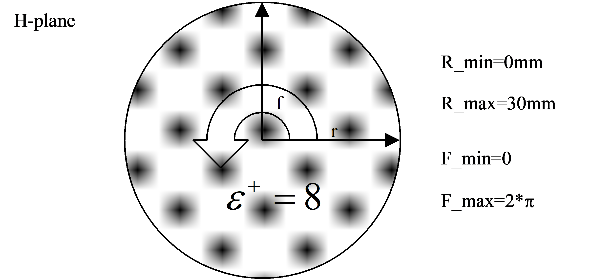

*Рис. 4.10. Круг радиусом 30 мм с ε = 9 (добавка ε⁺ = 8).*

.. code-block:: text

   BLOCK 1;
       CIRCLE_STAT 8; 0; 30; 0; 2*3.141592653589;
   END_B

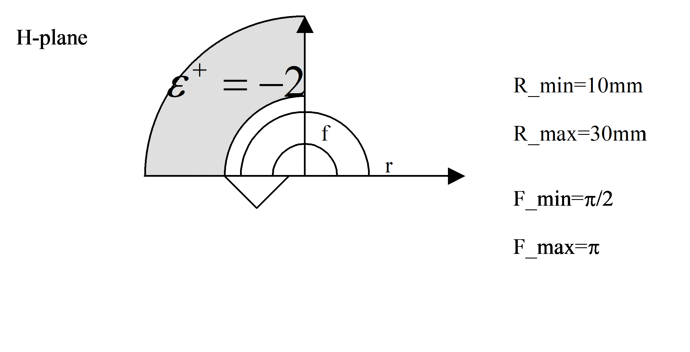

*Рис. 4.11. Сектор с ε = −1 (добавка ε⁺ = −2).*

.. code-block:: text

   BLOCK 1;
       CIRCLE_STAT -2; 10; 30; 3.141592653589/2; 3.141592653589;
   END_B

5.4. ``POLYGON_STAT`` — неподвижный многоугольник
~~~~~~~~~~~~~~~~~~~~~~~~~~~~~~~~~~~~~~~~~~~~~~~~~

.. code-block:: text

   BLOCK <n>;
       POLYGON_STAT <METAL> | <MAGNETIC> | <ABSORBER> | <expression(x,y,r,f)>;
           L <expression>; <expression>;
           L <expression>; <expression>;
           L <expression>; <expression>;
           [L <expression>; <expression>;]
           …
   END_B

В первой строке — материал или выражение. В последующих строках после символа ``L`` вводятся абсцисса и ордината вершины в локальной системе координат блока.

**Поведение зависит от первого параметра — это важно:**

.. list-table::
   :header-rows: 1
   :widths: auto

   * - Первый параметр
     - Поведение
   * - **выражение** (ε)
     - Последняя точка **соединяется** с первой, образуя замкнутую область. Область должна быть **односвязной и выпуклой**, вершины обходятся **по часовой стрелке**. Число вершин должно быть больше 3.
   * - ``METAL``, ``MAGNETIC``, ``ABSORBER``
     - Последняя точка **не соединяется** с первой — формируется **ломаная линия**, а не замкнутая область. Направление обхода и выпуклость соблюдать **не нужно**.

.. warning::

   ⚠️ **Программа не контролирует**, является ли область замкнутой и односвязной, а также правильность направления обхода вершин. Ошибка здесь не диагностируется — она проявится как неверный результат.

Примеры
^^^^^^^

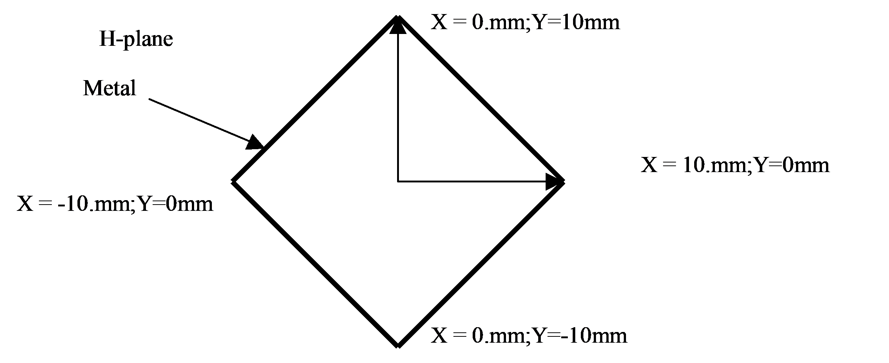

*Рис. 4.12. Металлический четырёхугольник (замкнут явно — первая точка повторена в конце).*

.. code-block:: text

   BLOCK 1;
       POLYGON_STAT METAL;
           L -10; 0;
           L 0; 10;
           L 10; 0;
           L 0; -10;
           L -10; 0;
   END_B

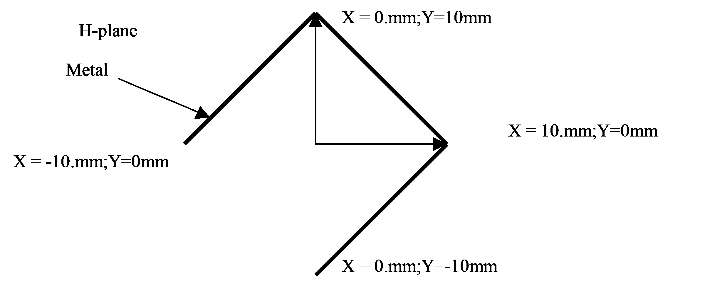

*Рис. 4.13. Металлическая ломаная линия (та же запись без повтора первой точки).*

.. code-block:: text

   BLOCK 1;
       POLYGON_STAT METAL;
           L -10; 0;
           L 0; 10;
           L 10; 0;
           L 0; -10;
   END_B

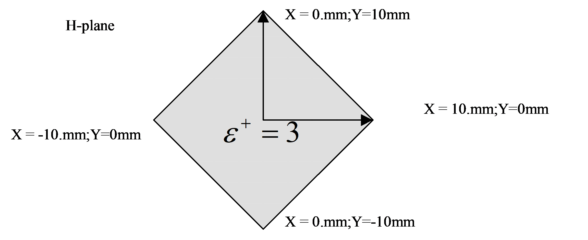

*Рис. 4.14. Диэлектрический четырёхугольник с ε = 4 (добавка ε⁺ = 3) — область замыкается сама.*

.. code-block:: text

   BLOCK 1;
       POLYGON_STAT 3;
           L -10; 0;
           L 0; 10;
           L 10; 0;
           L 0; -10;
   END_B

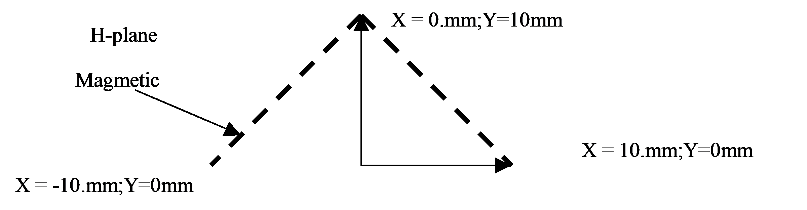

*Рис. 4.15. Ломаная линия из магнитной стенки.*

.. code-block:: text

   BLOCK 1;
       POLYGON_STAT MAGNETIC;
           L -10; 0;
           L 0; 10;
           L 10; 0;
   END_B

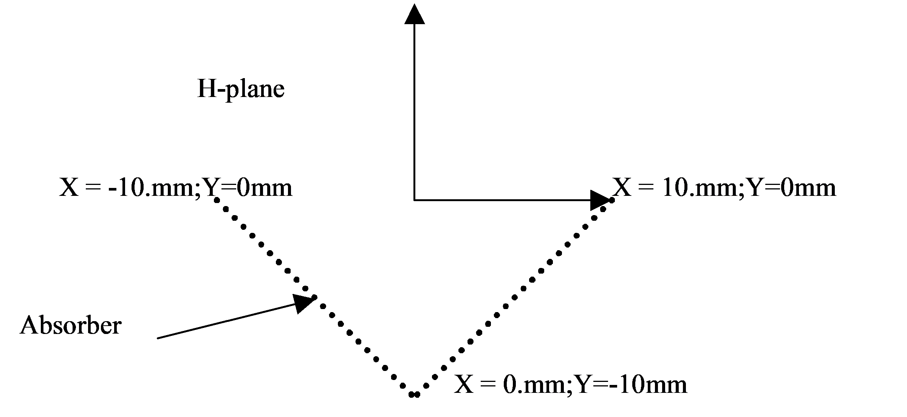

*Рис. 4.16. Ломаная линия из поглотителя.*

.. code-block:: text

   BLOCK 1;
       POLYGON_STAT ABSORBER;
           L 10; 0;
           L 0; -10;
           L -10; 0;
   END_B

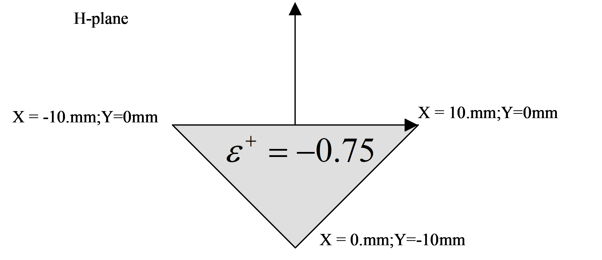

*Рис. 4.17. Диэлектрический треугольник с ε = 0.25 (добавка ε⁺ = −0.75).*

.. code-block:: text

   BLOCK 1;
       POLYGON_STAT -0.75;
           L 10; 0;
           L 0; -10;
           L -10; 0;
   END_B

5.5. ``INPUT_X`` и ``INPUT_Y`` — входы (трансформаторы возбуждения)
~~~~~~~~~~~~~~~~~~~~~~~~~~~~~~~~~~~~~~~~~~~~~~~~~~~~~~~~~~~~~~~~~~~

По функциональному назначению блоки делятся на два типа: **трансформаторы возбуждения** и **внутренние области**. Все примитивы выше — внутренние области.

.. note::

   📌 **Осторожно с названиями — они означают не то, что кажется.** **``INPUT_X`` — это вход вдоль оси Y**, он ставится на **левую или правую** границу коробки, и его размеры задаются по Y. **``INPUT_Y`` — это вход вдоль оси X**, он ставится на **нижнюю или верхнюю** границу коробки, и его размеры задаются по X. На какой именно границе окажется вход, определяется координатами в ``#LINK_LIST``.

.. code-block:: text

   BLOCK <n>;
       INPUT_X [<METAL> | <MAGNETIC>];
       <Y_min>; <Y_max>;
       <T_min>; <T_max>;
       [<Amplitude>]; [<Faza>];
       [<Eps>];
   END_B

.. code-block:: text

   BLOCK <n>;
       INPUT_Y [<METAL> | <MAGNETIC>];
       <X_min>; <X_max>;
       <T_min>; <T_max>;
       [<Amplitude>]; [<Faza>];
       [<Eps>];
   END_B

**Параметры 1–5 (документированы в руководстве 2000 года):**

.. list-table::
   :header-rows: 1
   :widths: auto

   * - №
     - Параметр
     - Смысл
   * - 1
     - тип
     - Мода падающей волны (см. таблицу ниже)
   * - 2
     - ``Y_min`` / ``X_min``
     - Нижняя (левая) граница входа
   * - 3
     - ``Y_max`` / ``X_max``
     - Верхняя (правая) граница входа, > min
   * - 4
     - ``T_min``
     - Время начала радиоимпульса возбуждения
   * - 5
     - ``T_max``
     - Время окончания радиоимпульса возбуждения, > ``T_min``

**Мода возбуждения задаётся первым параметром:**

.. list-table::
   :header-rows: 1
   :widths: auto

   * - Значение
     - Мода
     - Требование к ширине входа
   * - ``MAGNETIC``
     - плоская волна
     - ширина **меньше половины** длины волны входного сигнала
   * - ``METAL`` или пусто
     - первый тип колебаний прямоугольного волновода (волна H₁₀)
     - ширина **больше половины**, но **меньше полной** длины волны

Эти условия необходимо соблюдать, чтобы во входном сечении реализовывался **одномодовый режим** возбуждения и согласования. Мода, по которой смотрится отражённый сигнал, соответствует падающей.

Частота радиоимпульса определяется параметром ``FREQ`` из секции параметров.

.. note::

   💡 **Как задать вход без падающей волны (только приёмный).** Если на входе отсутствует падающая волна, ``T_min`` должно быть **больше времени анализа** из секции параметров (``TIME``). Именно так сделан второй вход в примере раздела 3: ``TIME 0.; 5;`` при ``INPUT_X …; 200; 201;``.

**Параметры 6–8 — расширение, которого нет в руководстве 2000 года.**

Установлено по исходному коду (``ReadInputX`` / ``ReadInputY`` в ``src/libs/TMCIndan/TmcRTH_BolckList.cpp``; вычисление — ``dAmplitude``, ``dFaza``, ``CalculateYForInput`` в ``src/kernels/PlanarRT_H/TmcRTHNodeDiel.cpp``):

.. list-table::
   :header-rows: 1
   :widths: auto

   * - №
     - Параметр
     - Смысл
     - Если не задан
   * - 6
     - ``Amplitude``
     - **Амплитуда** сигнала — выражение от переменных ``t`` (текущее время) и ``f`` (частота)
     - 1.0
   * - 7
     - ``Faza``
     - **Фаза** сигнала — выражение от ``t`` и ``f``, в единицах ``ANGLE_UNIT``
     - 0.0
   * - 8
     - ``Eps``
     - **Добавка ε** в сечении входа (влияет на волновую проводимость входа)
     - не применяется

Все три необязательны, но **параметр 7 обязателен, если задан параметр 6** (иначе — ошибка «Missing separator ';'»). Пустое значение допустимо: ``… 0; 200; 1.; ;`` означает амплитуду 1.0 и фазу по умолчанию — именно так записан первый вход в текущем ``samples/SAMPLE_R/TEST_MAG/EPS4/TEST0.TPL``.

Переменные ``t`` и ``f`` позволяют задать **огибающую импульса** вместо прямоугольного радиоимпульса — например, гауссову.

.. warning::

   ⚠️ Поля кода, хранящие эти параметры (``csVx``, ``csVy``, ``csW``), у **подвижных** блоков (``RECT_MOVE`` и т. п.) означают совсем другое — линейные и угловую скорости. Комментарий в ``src/Include/TmcRTH_BolckList.h`` (строки 139–141) фиксирует оба смысла.

Примеры
^^^^^^^

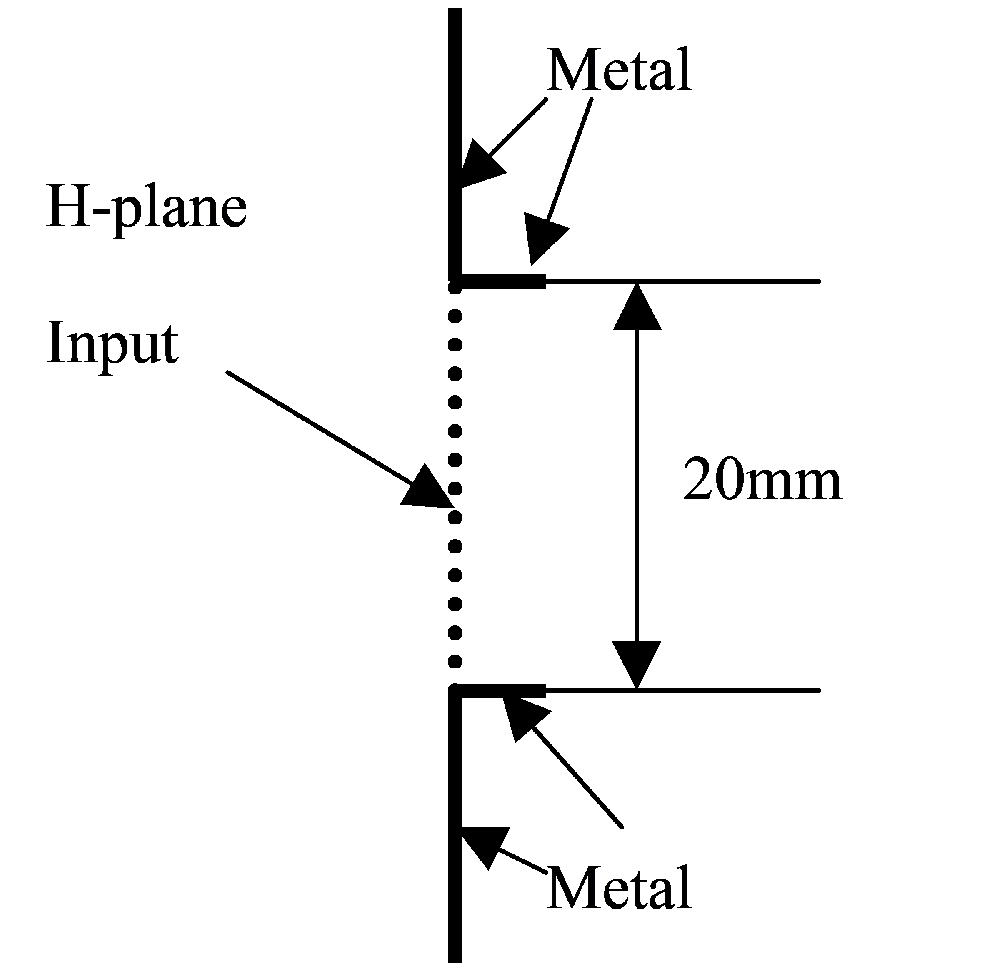

*Рис. 4.18. Волноводный вход (H₁₀) шириной 20 мм, возбуждает систему радиоимпульсом длиной 10 нс.*

.. code-block:: text

   BLOCK 1;
       INPUT_X METAL; 0; 20; 0; 10;
   END_B

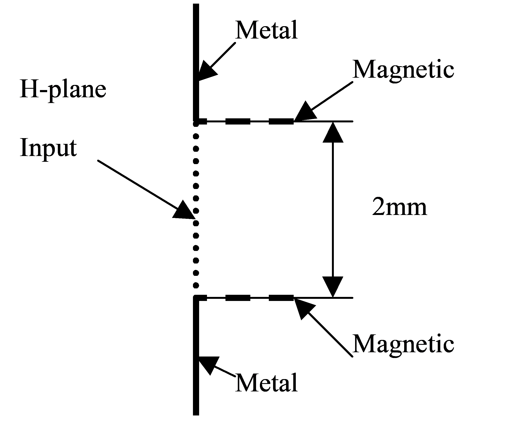

*Рис. 4.19. Вход для плоской волны шириной 2 мм, радиоимпульс длиной 100 нс.*

.. code-block:: text

   BLOCK 1;
       INPUT_X MAGNETIC; 0; 2; 0; 100;
   END_B

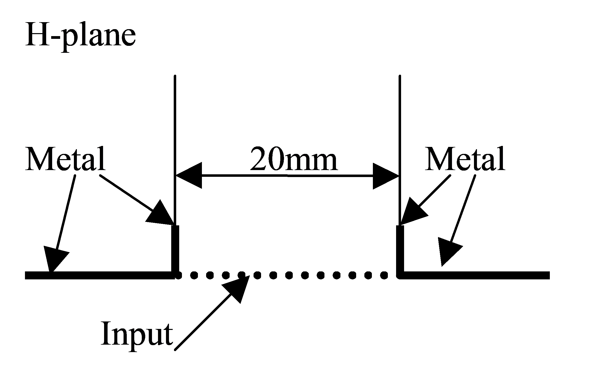

*Рис. 4.20. Волноводный вход (H₁₀) шириной 20 мм вдоль оси X. Тип не указан — эквивалент ``METAL``.*

.. code-block:: text

   BLOCK 1;
       INPUT_Y ; 0; 20; 0; 10;
   END_B

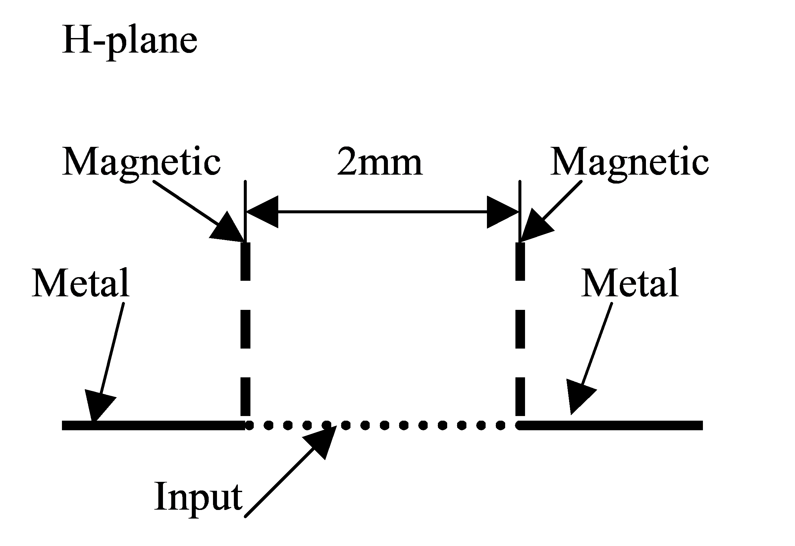

*Рис. 4.21. Вход для плоской волны шириной 2 мм вдоль оси X.*

.. code-block:: text

   BLOCK 1;
       INPUT_Y MAGNETIC; 0; 2; 0; 100;
   END_B

5.6. ``FILE`` — чтение распределения ε из файла
~~~~~~~~~~~~~~~~~~~~~~~~~~~~~~~~~~~~~~~~~~~~~~~

.. code-block:: text

   BLOCK <n>;
       FILE <file_name>;
       <X_min>; <X_max>;
       <Y_min>; <Y_max>;
   END_B

При расчёте распределения ε для **больших площадей** прямоугольников вычисление формулы в каждом узле занимает заметное время. Его можно проделать один раз, сохранив результат в файл (параметр ``[file_name]`` у ``RECT_STAT``, раздел 5.2), а затем подставлять готовое распределение.

.. list-table::
   :header-rows: 1
   :widths: auto

   * - №
     - Параметр
     - Смысл
   * - 1
     - ``file_name``
     - Имя файла с распределением. Должен находиться **в той же директории, что и файл задания**
   * - 2–5
     - ``X_min``, ``X_max``, ``Y_min``, ``Y_max``
     - Границы прямоугольника

.. warning::

   ⚠️ **Величины ``X_min``, ``X_max``, ``Y_min``, ``Y_max`` должны быть такими же**, как у ``RECT_STAT``, из которого формировался файл.

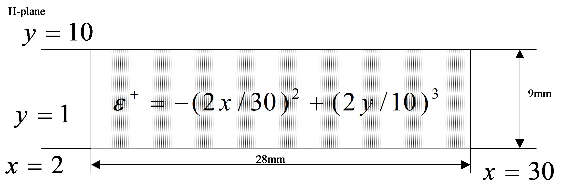

*Рис. 4.22. Прямоугольник 30×10 мм, добавка ε⁺ задана функцией декартовых координат.*

Сначала сохраняем распределение (первый шаг задания):

.. code-block:: text

   BLOCK 1;
       RECT_STAT [distr]-(2*x/30)^2+(2*y/10)^3; 2; 30; 1; 10;
   END_B

Затем используем результат из ``distr.eps``:

.. code-block:: text

   BLOCK 1;
       FILE distr; 2; 30; 1; 10;
   END_B

5.7. Примитивы X-моды (плазма)
~~~~~~~~~~~~~~~~~~~~~~~~~~~~~~

Помимо перечисленных, код принимает **плазменные** варианты примитивов. Их нет в руководстве 2000 года; они относятся к X-моде (``tmc_rtx.exe``) и задают параметры замагниченной плазмы. Полный список определён в ``src/Include/Tmcgrviw.h`` (строки 136–157):

.. list-table::
   :header-rows: 1
   :widths: auto

   * - Суффикс
     - Примитивы
     - Величина
     - Единица
   * - ``_N``
     - ``RECT_STAT_N``, ``CIRCLE_STAT_N``, ``POLYGON_STAT_N``, ``FILE_N``
     - Концентрация электронов N
     - **м⁻³**
   * - ``_B``
     - ``RECT_STAT_B``, ``CIRCLE_STAT_B``, ``POLYGON_STAT_B``, ``FILE_B``
     - Индукция магнитного поля B
     - **Тесла**
   * - ``_Y``
     - ``RECT_STAT_Y``, ``CIRCLE_STAT_Y``, ``POLYGON_STAT_Y``, ``FILE_Y``
     - Параметр Y
     - безразмерная

Параметры (координаты) — такие же, как у соответствующих базовых примитивов.

.. warning::

   📌 **``B`` и ``Y`` действуют только совместно с перекрывающим блоком ``N``** — плазменная ветка расчёта включается при N ≠ 0.

   📌 Единицы всегда м⁻³ и Тесла независимо от ``N_UNIT`` / ``B_UNIT`` — см. раздел 4.9.

   ⚠️ **Известный дефект.** В диспетчере ``src/libs/TMCIndan/TmcRTH_BolckList.cpp`` варианты ``CIRCLE_STAT_N`` / ``_B`` сравниваются по длине строки ``CIRCLE_STAT `` вместо полной длины тега. Для ``RECT_STAT_*`` этот дефект исправлен (баг #15), для ``CIRCLE_STAT_*`` и ``POLYGON_STAT_*`` — **не исправлен**. Пока пользуйтесь ``RECT_STAT_*``. См. ``CHANGELOG.md``.

Также в коде определены примитивы **подвижных** блоков — ``RECT_MOVE``, ``CIRCLE_MOVE``, ``POLYGON_MOVE``.

6. Секция графа связей ``#LINK_LIST``
-------------------------------------

.. code-block:: text

   #LINK_LIST
       T <n>; <X0>; <Y0>;
       . . .
   #END_LINK

Секция служит для указания геометрического положения всех блоков внутри «коробки». Устройство, «разбитое» на блоки в ``#TOPOLOGY``, здесь **собирается** из них — то есть выполняется процедура **рекомпозиции** (объединения) базовых элементов.

Строка ``T <n>; <X0>; <Y0>;`` означает: **начало координат блока ``<n>`` поместить в точку «коробки» с абсциссой ``<X0>`` и ординатой ``<Y0>``**.

Секция обязательна, и **каждому блоку из ``#TOPOLOGY`` должна соответствовать ровно одна строка**.

**Правила наложения блоков:**

1. Блоки могут накладываться друг на друга и пересекаться.
2. **Недопустимо пересечение входов** (``INPUT_X``, ``INPUT_Y``). Входы должны находиться на границе коробки.
3. Если накладываются два или более блока с распределением ε, итоговая добавка в области наложения равна **сумме** добавок от каждого блока.
4. Области ``METAL``, ``MAGNETIC``, ``ABSORBER`` могут накладываться на области, заполненные диэлектриком.
5. При пересечении **между собой** металла, магнетика и поглотителя приоритет определяется **порядком следования блоков в секции топологии**.

7. Секция выходных данных ``#OUTPUT``
-------------------------------------

.. code-block:: text

   #OUTPUT
       . . .
   #END_OUTPUT

Обязательным является **только имя файла выходного сигнала** (``FILE``).

7.1. ``FILE`` — имя файла сигналов (обязательно, первым)
~~~~~~~~~~~~~~~~~~~~~~~~~~~~~~~~~~~~~~~~~~~~~~~~~~~~~~~~

.. code-block:: text

   FILE <file_name>;

Задаёт имя файла, в который записываются падающие и отражённые волны для каждого временно́го дискрета. Файл получает расширение ``.t`` и записывается в директорию файла задания.

.. warning::

   ⚠️ **Строка обязательна и должна быть первой** в секции. Имя **не должно содержать точку** — код проверяет это явно и выдаёт ошибку ``Unresolved simbol '.' in filename``.

От этого имени строятся **все** остальные выходные файлы шага (см. раздел 8).

7.2. ``TOPOLOGY`` — вывод геометрии
~~~~~~~~~~~~~~~~~~~~~~~~~~~~~~~~~~~

.. code-block:: text

   TOPOLOGY;

Необязательна. Если отсутствует — файл геометрии не формируется. Файл получает расширение ``.tt``.

.. note::

   📌 **При включении вывода полей (``FIELDS``) необходимо включить и ``TOPOLOGY``** — иначе FieldView не сможет показать картину.

7.3. ``FIELDS`` — вывод распределения полей
~~~~~~~~~~~~~~~~~~~~~~~~~~~~~~~~~~~~~~~~~~~

.. code-block:: text

   FIELDS;

Необязательна. Включает вывод распределения интенсивности поля.

.. warning::

   ⚠️ **Существенно замедляет анализ.** При проведении серии расчётов этот флаг лучше выключить.

   📌 Если включён режим вывода полей и установлен **флаг синхронизации**, счётное ядро не будет просчитывать следующий временно́й такт, пока FieldView не прорисует текущее распределение полей.

   📌 В файл записывается распределение поля **для одного временно́го такта** (текущего). Это важно, если вы обрабатываете файл сторонними программами.

7.4. ``SMATRIX`` — вывод матрицы рассеяния
~~~~~~~~~~~~~~~~~~~~~~~~~~~~~~~~~~~~~~~~~~

.. code-block:: text

   SMATRIX <Sfile>; <expression>; <T_min>; <T_max>;

.. list-table::
   :header-rows: 1
   :widths: auto

   * - №
     - Параметр
     - Смысл
   * - 1
     - ``Sfile``
     - Имя файла S-матрицы (получит расширение ``.s``)
   * - 2
     - ``expression``
     - Частота (или другой параметр), под которой записывается точка
   * - 3
     - ``T_min``
     - Начало интервала усреднения результата
   * - 4
     - ``T_max``
     - Конец интервала усреднения

Матрица рассеяния вычисляется **усреднением по временно́му интервалу** ``T_min … T_max``. Интервал следует выбирать на **установившемся** участке переходного процесса.

Пример: ``SMATRIX test1; 10; 4; 5;`` — записать S-матрицу для частоты 10 ГГц, усреднённую с 4 по 5 нс.

.. note::

   💡 **Одна точка на шаг.** Каждый ``#STEP`` даёт **одну** частотную точку в ``.s``. Чтобы получить частотную характеристику, нужен **свип** — много шагов с разными ``FREQ``, пишущих в **один и тот же** ``Sfile`` (см. раздел 9). Если сделать ``SMATRIX`` на одной частоте, в ``.s`` будет одна точка и кривая в TMCGROUT не нарисуется — это не ошибка программы.

7.5. ``FIELD_DISTRIBUTION`` и ``FIELD_DISTRIBUTION_M``
~~~~~~~~~~~~~~~~~~~~~~~~~~~~~~~~~~~~~~~~~~~~~~~~~~~~~~

.. code-block:: text

   FIELD_DISTRIBUTION <file_name>; <freq>; <T_min>; <T_max>;
   FIELD_DISTRIBUTION_M <file_name>; <freq>; <T_min>; <T_max>;

Расширение, которого нет в руководстве 2000 года. Определены в ``src/Include/TmcRTH_IndanOutput.h`` (строки 14–15), разбираются в ``src/libs/TMCIndan/TmcRTH_IndanOutput.cpp``. Сохраняют **комплексное распределение поля** на заданной частоте (модуль → ``.em``, фаза → ``.ef``). ``FIELD_DISTRIBUTION_M`` — вариант с накоплением в памяти (``ReadFileDistrInMemory``).

Используется, например, в ``samples/SAMPLE_R/1/TEST.TPL``.

8. Какие файлы создаёт ядро
---------------------------

Имена строятся от базового имени из ``FILE`` в секции ``#OUTPUT``. Список **проверен по коду** (``src/libs/TMCIndan/TmcRTH_IndanOutput.cpp``, строки 194–204):

.. list-table::
   :header-rows: 1
   :widths: auto

   * - Расширение
     - Содержимое
     - Чем смотреть
   * - ``.t``
     - Временны́е сигналы на входах (падающие и отражённые волны)
     - **TMCROS**
   * - ``.s``
     - Матрица рассеяния
     - **TMCGROUT**
   * - ``.tt``
     - Топология устройства
     - **FieldView**
   * - ``.ex``
     - Распределение поля Ex
     - **FieldView**
   * - ``.ey``
     - Распределение поля Ey
     - **FieldView**
   * - ``.hz``
     - Распределение поля Hz
     - **FieldView**
   * - ``.em``
     - Модуль комплексного распределения поля
     - **FieldView**
   * - ``.ef``
     - Фаза комплексного распределения поля
     - **FieldView**
   * - ``.q``
     - Служебный файл
     - —
   * - ``.ix``, ``.iy``
     - Служебные файлы
     - —
   * - ``.eps``
     - Сохранённое распределение ε (из ``RECT_STAT [file_name]``)
     - вход/выход ядра

FieldView открывает форматы ``*.tf``, ``*.AMP``, ``*.FAZ``, ``*.ex`` (строка ``IDR_FLDVIETYPE`` в ресурсах). Расширение **``.tf`` — историческое** (версия 2.0p); текущий код его не пишет.

9. Препроцессор входного языка
------------------------------

Препроцессор работает **непосредственно до ввода данных** и позволяет делать макроопределения и макроподстановки, включать содержимое других файлов и записывать данные математическими выражениями. Функции аналогичны препроцессорам C и FORTRAN.

Прежде всего он необходим, чтобы **структурировать и параметризировать** входные данные — это позволяет избежать ошибок при вводе и модификации.

9.1. Математические выражения
~~~~~~~~~~~~~~~~~~~~~~~~~~~~~

Любые числовые параметры могут быть записаны выражениями. Выражения могут содержать целые и вещественные числа, имена макроопределений, круглые скобки, знаки операций и функции.

**Арифметические операции:**

.. list-table::
   :header-rows: 1
   :widths: auto

   * - Знак
     - Операция
   * - ``+``
     - сложение
   * - ``-``
     - вычитание
   * - ``*``
     - умножение
   * - ``/``
     - деление
   * - ``^``
     - возведение в степень

**Математические функции:**

.. list-table::
   :header-rows: 1
   :widths: auto

   * - Функция
     - Смысл
     - Функция
     - Смысл
   * - ``abs(x)``
     - модуль
     - ``sin(x)``
     - синус
   * - ``exp(x)``
     - экспонента
     - ``cos(x)``
     - косинус
   * - ``log(x)``
     - натуральный логарифм
     - ``tan(x)``
     - тангенс
   * - ``log10(x)``
     - десятичный логарифм
     - ``sinh(x)``
     - синус гиперболический
   * - ``sqrt(x)``
     - корень квадратный
     - ``cosh(x)``
     - косинус гиперболический
   * - ``asin(x)``
     - арксинус
     - ``tanh(x)``
     - тангенс гиперболический
   * - ``acos(x)``
     - арккосинус
     - ``atan(x)``
     - арктангенс

Аргументы тригонометрических функций — в градусах или радианах, в зависимости от ``ANGLE_UNIT``.

.. warning::

   ⚠️ **Приоритет операций в руководстве 2000 года описан так:** «возведение в степень, деление, умножение, вычитание и суммирование». Обратите внимание, что **деление указано перед умножением**, а вычитание — перед сложением, что расходится с общепринятой равноприоритетностью. Не полагайтесь на приоритет — **расставляйте скобки явно**. Выражение в самых внутренних скобках вычисляется первым.

**Переменные координат.** Когда задаётся распределение добавки ε, выражение может содержать:

.. list-table::
   :header-rows: 1
   :widths: auto

   * - Переменная
     - Смысл
     - Единица
   * - ``x``, ``y``
     - декартовы координаты
     - ``LONG_UNIT``
   * - ``r``
     - полярный радиус
     - ``LONG_UNIT``
   * - ``f``
     - полярный угол
     - ``ANGLE_UNIT``

Программа сама подставляет значения этих переменных для точек плоскости.

**Переменные входов.** В параметрах ``Amplitude`` и ``Faza`` примитивов ``INPUT_X`` / ``INPUT_Y`` доступны переменные ``t`` (текущее время) и ``f`` (частота) — см. раздел 5.5.

.. warning::

   ⚠️ Обратите внимание: ``f`` означает **полярный угол** в выражениях для ε, но **частоту** в выражениях амплитуды и фазы входа.

9.2. Макроопределения ``#define``
~~~~~~~~~~~~~~~~~~~~~~~~~~~~~~~~~

.. code-block:: text

   #define <имя>  [par1; par2; ... ; par32;] @ text1(par1 - par32)\\
                                               text2(par1 - par32)\\
                                               text3(par1 - par32)

.. list-table::
   :header-rows: 1
   :widths: auto

   * - Элемент
     - Смысл
   * - ``#define``
     - признак начала макроопределения
   * - ``<имя>``
     - имя макроопределения
   * - ``[par1; …]``
     - формальные параметры (до 32, необязательны)
   * - ``@``
     - разделительный знак
   * - ``textN``
     - замещающий текст
   * - ``\\``
     - символ переноса строк текста

**Правила именования.** Имя отделяется с двух сторон пробелами, может содержать до 32 символов из множества: латинские буквы ``A-Z``, ``a-z``, цифры ``0-9``, символ подчёркивания ``_``. Все макроопределения в одном задании должны иметь **уникальные** имена.

**Замещающий текст** отделяется от имени (или параметров) пробелом, знаком ``@`` и ещё одним пробелом. Если текст содержит несколько строк, в конце всех строк, кроме последней, добавляется пара символов ``\\``. **Текст, следующий за ``\\``, считается комментарием и игнорируется.**

Все макроопределения необходимо размещать **до того места, где они используются**.

⚠️ Главная ловушка: макрос подставляется текстом
^^^^^^^^^^^^^^^^^^^^^^^^^^^^^^^^^^^^^^^^^^^^^^^^

.. code-block:: text

   #define  Length @ 38+12
   #define  Width @ Length/2
    . . .
       RECT_STAT 3; 0; Length; 0; Width;

Результат работы препроцессора:

.. code-block:: text

       RECT_STAT 3; 0; 38+12; 0; 38+12/2;

Длина будет 50, а ширина — **44, а не 25**! Потому что ``38+12/2 = 38+6 = 44``.

**Правильно** — заключать значение в скобки:

.. code-block:: text

   #define  Length @ (38+12)
   #define  Width @ Length/2

Тогда ``Width`` развернётся в ``(38+12)/2 = 25``. Именно поэтому во всех авторских заданиях макроопределения записаны как ``#define L1 @ ( 50.00 )`` — со скобками.

Макросы с параметрами
^^^^^^^^^^^^^^^^^^^^^

.. code-block:: text

   #define  Stp  name1; name2; @ name1+name2
   #define  Stm  param; @ param*param
   . . .
       RECT_STAT 3; 0; (Stm  (Stp 10; 2;);); 0; 40;

Результат:

.. code-block:: text

       RECT_STAT 3; 0; 10+2*10+2; 0; 40;

То есть длина будет **32**, а не 144. Так происходит потому, что **первая и последняя скобки, в которые заключён фактический параметр, заменяются пробелами**.

Если макроопределение, используемое как фактический параметр, имеет свои фактические параметры, его необходимо заключить в скобки.

9.3. Вставка файла ``#include``
~~~~~~~~~~~~~~~~~~~~~~~~~~~~~~~

.. code-block:: text

   #include <file_name>

Вставляет в текст задания содержимое файла ``<file_name>``. Включаемый файл должен находиться **в директории входного задания**.

Это основной приём структурирования: константы выносят в один ``.h``, описание шага — в другой.

.. code-block:: text

   #include parm.h
    . . .
       BLOCK 1;
           RECT_STAT 3; 0; Length; 0; Width;

где ``parm.h`` содержит:

.. code-block:: text

   #define  Length @ (38+12)
   #define  Width @ Length/2

10. Частотный свип: расчёт на нескольких частотах
-------------------------------------------------

Для анализа системы на нескольких частотах нужно повторить процедуру на всех интересующих частотах — это делается **добавлением новых шагов** ``#STEP``. Наиболее удобно использовать при этом макроопределения с параметрами.

Приём автора: весь шаг заворачивается в макрос в отдельном ``.h``-файле, а ``.tpl`` состоит из вызовов этого макроса.

**Файл ``STEP1.H``** — макрос одного шага:

.. code-block:: text

   #define step1 Freq__; File__; SFile__; Tmin__; Tmax__; @\\
   #STEP\\
   #PARM\\
    ANGLE_UNIT radian;\\
    FREQ_UNIT GHz;\\
    LONG_UNIT mm;\\
    TIME_UNIT ns;\\
    DELTA W_delta;\\
    TIME 0.; 5;\\
    X_MIN  0.0;\\
    X_MAX L1+L2+L3;\\
    Y_MIN  0.0;\\
    Y_MAX W_waveg;\\
    FREQ  Freq__ ;\\
   #END_PARM\\
   #TOPOLOGY\\
    BLOCK 1;\\
     INPUT_X   W_type ; -a1/2; a1/2; 0; 200;\\
    END_B\\
    BLOCK 7;\\
     INPUT_X    W_type ; -a1/2; a1/2; 200; 201;\\
    END_B\\
    BLOCK 2;\\
     RECT_STAT W_type ; 0.0; L1+L2+L3; -a1/2-2*W_delta; -a1/2-1*W_delta;\\
    END_B\\
    BLOCK 3;\\
     RECT_STAT W_type ; 0.0;L1+L2+L3; a1/2; a1/2+W_delta;\\
    END_B\\
    BLOCK 5;\\
     RECT_STAT [epsil1](W_eps-1); 0;L2; 0.0; W_waveg;\\
    END_B\\
   #END_TOPOLOGY\\
   #LINK_LIST\\
    T 1; 0.0; W_waveg/2;\\
    T 2; 0.0; W_waveg/2;\\
    T 3; 0.0; W_waveg/2;\\
    T 5; L1; 0.0;\\
    T 7; L1+L2+L3; W_waveg/2;\\
   #END_LINK\\
   #OUTPUT\\
    FILE File__;\\
    SMATRIX SFile__; Freq__; Tmin__; Tmax__;\\
   ! FIELDS;\\
   ! TOPOLOGY;\\
   #END_OUTPUT\\
   #END_STEP\\

**Файл задания** — свип от 10 до 12 ГГц с шагом 0.1 ГГц:

.. code-block:: text

   #TMC_RT_H
   #define L1 @ (   50.00)
   #define L2 @ (   50.00)
   #define L3 @ (   50.00)
   #define W_eps @ ( 4.00 )
   #define W_waveg @ (  400.00 )
   #define W_input @ (  2.00 )
   #define W_delta @ (    0.5 )
   !#define W_type @ METAL
   #define W_type @ MAGNETIC
   #define file_S @ test101
   #define a1 @ ( W_input )
   #include step1.h
   step1 10.0; test100; file_S; 4; 5;
   step1 10.1; test101; file_S; 4; 5;
   step1 10.2; test102; file_S; 4; 5;
   …
   step1 12.0; test120; file_S; 4; 5;
   #EOF

Обратите внимание на приёмы:

- **все шаги пишут S-матрицу в один файл** ``file_S`` — так и накапливается частотная характеристика;
- **имя файла сигналов у каждого шага своё** (``test100``, ``test101``, …) — иначе шаги затрут файлы друг друга;
- ``FIELDS`` и ``TOPOLOGY`` **закомментированы** символом ``!`` — при свипе вывод полей резко замедляет счёт;
- ``RECT_STAT [epsil1](W_eps-1)`` — распределение ε считается один раз и сохраняется в ``epsil1.eps``;
- строка ``!#define W_type @ METAL`` — закомментированная альтернатива; так хранят запасные варианты.

.. note::

   📌 **Ожидаемое расхождение с аналитикой.** Частотная зависимость, рассчитанная на сетке, **сдвигается** относительно точного аналитического решения, потому что длина волны в сетке отличается от точного значения. Программа **выводит эту погрешность в окне статистики**, и сдвиг ей соответствует. Это свойство метода, а не ошибка.

11. Развёрнутый пример: рассеяние на неоднородном цилиндре
----------------------------------------------------------

Задание находится в ``samples/SAMPLE_R/METAL/CIRCLE/RUPOR.TPL``.

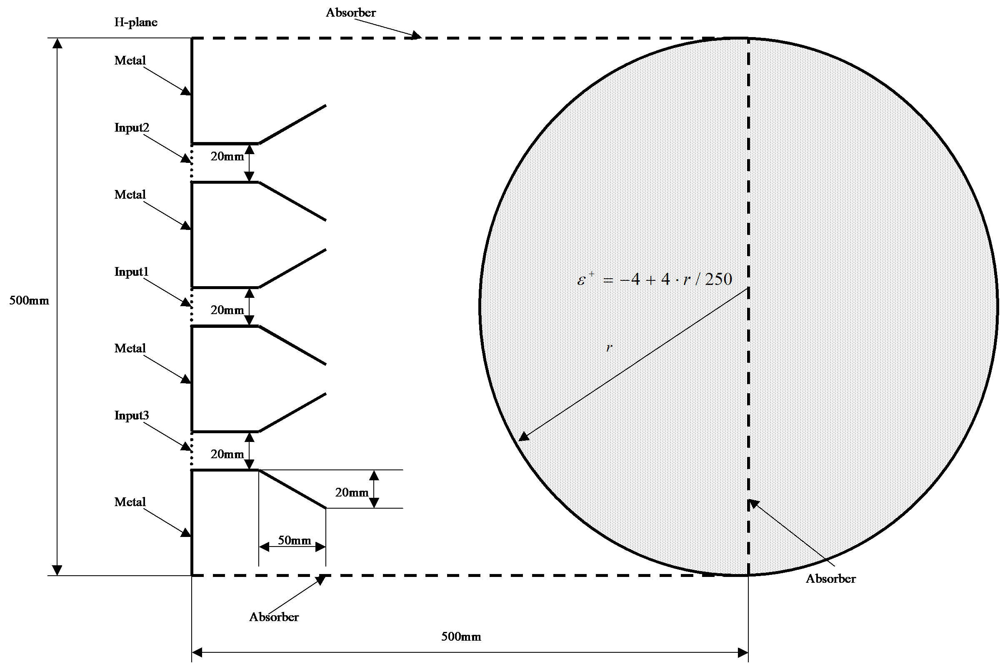

*Рис. 6.1. Система из трёх рупоров для изучения рассеяния на неоднородном диэлектрическом цилиндре радиусом 250 мм. Проницаемость цилиндра зависит от радиуса: на границе равна 1, в центре −5.*

Центральный рупор излучает сигнал, два боковых — приёмные.

Ключевые места задания:

.. code-block:: text

   #define W_eps @ ( -4 + 4*r/(W_waveg/2)+1 )
   …
    BLOCK 104;
     CIRCLE_STAT (W_eps-1); 0; W_waveg/2; 0; 2*3.1415;
    END_B
   …
    BLOCK 8;
     RECT_STAT ABSORBER; L_waveg-5*W_delta; L_waveg - 1*W_delta+0.00; 0.0; W_waveg-2*W_delta;
    END_B

Здесь:

- ``W_eps`` — **функция от полярного радиуса ``r``**: на границе (``r = W_waveg/2``) даёт 1, в центре (``r = 0``) даёт −4 + 1 = −3;
- в блок передаётся ``(W_eps-1)`` — снова добавка;
- блоки 8, 9, 10 — **поглотители по краям коробки**, чтобы волна не отражалась от стенок. Обратите внимание, как их границы отступают от границ коробки на несколько ``W_delta`` — это выполнение требования из раздела 5.2;
- рупоры собраны из ``RECT_STAT METAL`` (стенки) и ``POLYGON_STAT METAL`` (раскрывы), причём одна и та же группа блоков повторена трижды с разными номерами и размещена в ``#LINK_LIST`` на разных высотах (``W_waveg/2``, ``W_waveg/4``, ``3*W_waveg/4``).

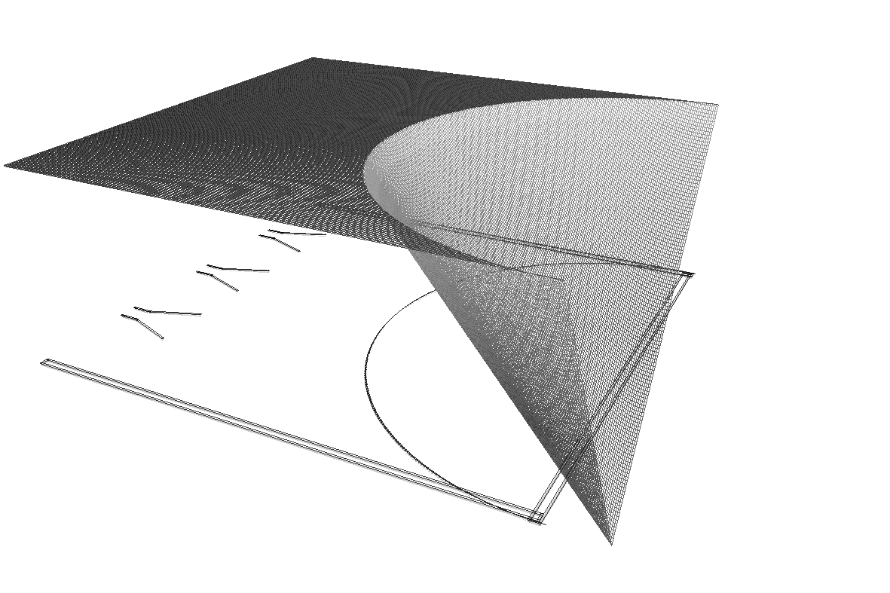

*Рис. 6.2. Распределение диэлектрической проницаемости, как его показывает FieldView.*

12. Таблица ключевых слов
-------------------------

Обозначения: ``expression`` — математическое выражение; ``expression(x,y,r,f)`` — выражение от декартовых или полярных координат; ``n`` — целое число; ``< >`` — обязательный параметр; ``[ ]`` — необязательный.

.. list-table::
   :header-rows: 1
   :widths: auto

   * - Ключевое слово
     - Формат
     - Назначение
   * - ``#TMC_RT_H``
     -
     - Начало файла задания
   * - ``#STEP``
     -
     - Начало шага задания
   * - ``#PARM``
     -
     - Начало секции параметров
   * - ``ANGLE_UNIT``
     - ``<radian> | <gradus>;``
     - Единицы измерения углов
   * - ``FREQ_UNIT``
     - ``<GHz> | <MHz> | <kHz> | <Hz>;``
     - Единицы измерения частоты
   * - ``LONG_UNIT``
     - ``<mm> | <cm> | <m>;``
     - Единицы измерения длины
   * - ``TIME_UNIT``
     - ``<s> | <ms> | <mks> | <ns> | <ps>;``
     - Единицы измерения времени
   * - ``DELTA``
     - ``<expression>;``
     - Точность анализа — размер пространственного дискрета
   * - ``TIME``
     - ``<expression>; <expression>;``
     - Время анализа ``T_min; T_max``
   * - ``X_MIN``
     - ``<expression>;``
     - Абсцисса левого края «коробки»
   * - ``X_MAX``
     - ``<expression>;``
     - Абсцисса правого края «коробки»
   * - ``Y_MIN``
     - ``<expression>;``
     - Ордината нижнего края «коробки»
   * - ``Y_MAX``
     - ``<expression>;``
     - Ордината верхнего края «коробки»
   * - ``FREQ``
     - ``<expression>;``
     - Частота сигналов возбуждения
   * - ``HEIGHT``
     - ``<expression>;``
     - ⚠️ Разбирается, на расчёт не влияет (раздел 4.9)
   * - ``DELTA_T_MECHANICAL``
     - ``<expression>;``
     - ⚠️ Разбирается, на расчёт не влияет (раздел 4.9)
   * - ``N_UNIT``
     - ``<m3> | <cm3> | <mm3>;``
     - ⚠️ Разбирается, множитель не применяется (раздел 4.9)
   * - ``B_UNIT``
     - ``<Tl> | <mTl> | <mkTl>;``
     - ⚠️ Разбирается, множитель не применяется (раздел 4.9)
   * - ``#END_PARM``
     -
     - Конец секции параметров
   * - ``#TOPOLOGY``
     -
     - Начало секции геометрии
   * - ``BLOCK``
     - ``<n>;``
     - Начало блока, ``n > 0``
   * - ``RECT_STAT``
     - ``[[file_name]]<METAL> | <MAGNETIC> | <ABSORBER> | <expression(x,y,r,f)>;`` ``<X_min>; <X_max>; <Y_min>; <Y_max>;``
     - Неподвижный прямоугольник
   * - ``CIRCLE_STAT``
     - ``<METAL> | <MAGNETIC> | <ABSORBER> | <expression(x,y,r,f)>;`` ``<R_min>; <R_max>; <F_min>; <F_max>;``
     - Неподвижный сектор
   * - ``POLYGON_STAT``
     - ``<METAL> | <MAGNETIC> | <ABSORBER> | <expression(x,y,r,f)>;``
     - Неподвижный многоугольник
   * - ``L``
     - ``<expression>; <expression>;``
     - Точка многоугольника ``X0; Y0;``
   * - ``INPUT_X``
     - ``[<METAL> | <MAGNETIC>];`` ``<Y_min>; <Y_max>; <T_min>; <T_max>;`` ``[<Amp>]; [<Faza>]; [<Eps>];``
     - **Вход вдоль оси Y** (на левой/правой границе)
   * - ``INPUT_Y``
     - ``[<METAL> | <MAGNETIC>];`` ``<X_min>; <X_max>; <T_min>; <T_max>;`` ``[<Amp>]; [<Faza>]; [<Eps>];``
     - **Вход вдоль оси X** (на нижней/верхней границе)
   * - ``FILE``
     - ``<file_name>; <X_min>; <X_max>; <Y_min>; <Y_max>;``
     - Чтение распределения ε из файла
   * - ``RECT_STAT_N``, ``CIRCLE_STAT_N``, ``POLYGON_STAT_N``, ``FILE_N``
     - как у базового примитива
     - Концентрация плазмы N, м⁻³ (X-мода)
   * - ``RECT_STAT_B``, ``CIRCLE_STAT_B``, ``POLYGON_STAT_B``, ``FILE_B``
     - как у базового примитива
     - Индукция B, Тесла (X-мода)
   * - ``RECT_STAT_Y``, ``CIRCLE_STAT_Y``, ``POLYGON_STAT_Y``, ``FILE_Y``
     - как у базового примитива
     - Параметр Y (X-мода)
   * - ``RECT_MOVE``, ``CIRCLE_MOVE``, ``POLYGON_MOVE``
     - ⚠️ не документировано
     - Подвижные блоки
   * - ``END_B``
     -
     - Конец блока
   * - ``#END_TOPOLOGY``
     -
     - Конец секции геометрии
   * - ``#LINK_LIST``
     -
     - Начало секции графа связей
   * - ``T``
     - ``<n>; <expression>; <expression>;``
     - Поместить начало координат блока ``n`` в точку ``X0; Y0;``
   * - ``#END_LINK``
     -
     - Конец секции графа связей
   * - ``#OUTPUT``
     -
     - Начало секции выходных данных
   * - ``FILE``
     - ``<file_name>;``
     - Сигналы на входах → ``file_name.t`` (обязательно, первым)
   * - ``TOPOLOGY``
     -
     - Вывод топологии → ``file_name.tt``
   * - ``FIELDS``
     -
     - Вывод распределения полей
   * - ``SMATRIX``
     - ``<Sfile>; <expression>; <T_min>; <T_max>;``
     - S-матрица → ``Sfile.s``
   * - ``FIELD_DISTRIBUTION``
     - ``<file_name>; <freq>; <expression>; <expression>;``
     - Комплексное распределение поля
   * - ``FIELD_DISTRIBUTION_M``
     - ``<file_name>; <freq>; <expression>; <expression>;``
     - То же, с накоплением в памяти
   * - ``#END_OUTPUT``
     -
     - Конец секции выходных данных
   * - ``#END_STEP``
     -
     - Конец шага задания
   * - ``#EOF``
     -
     - Конец входного задания
   * - ``#define``
     - ``<имя> [par1; …] @ <текст>``
     - Макроопределение (препроцессор)
   * - ``#include``
     - ``<file_name>``
     - Вставка файла (препроцессор)
   * - ``!``
     -
     - Комментарий (до конца строки)

13. Типичные ошибки
-------------------

.. list-table::
   :header-rows: 1
   :widths: auto

   * - Симптом
     - Причина
   * - Ширина/длина блока «не та»
     - Макрос без скобок: ``#define L @ 38+12`` вместо ``#define L @ (38+12)``. См. 9.2
   * - Ошибка «Missing file name» / ``Unresolved simbol '.'``
     - Имя в ``FILE`` пустое или содержит точку. См. 7.1
   * - Пустой ``.s``, «Error when read» в TMCGROUT
     - ``SMATRIX`` задан на одной частоте (одна точка — кривая не строится) либо окно ``T_min…T_max`` вне интервала сигнала. См. 7.4
   * - FieldView ничего не показывает
     - Включён ``FIELDS``, но не включён ``TOPOLOGY``. См. 7.2
   * - Расчёт идёт очень долго
     - Слишком мелкий ``DELTA`` (время растёт как куб) либо включён ``FIELDS`` при свипе. См. 4.5, 10
   * - Неверный результат у ``POLYGON_STAT`` с ε
     - Область незамкнута, невыпукла или вершины обойдены против часовой стрелки — **не диагностируется**. См. 5.4
   * - Частотная характеристика сдвинута относительно аналитики
     - Свойство метода (длина волны в сетке). Погрешность выводится в окне статистики. См. 10
   * - Блок не появился в расчёте
     - Для блока нет строки ``T`` в ``#LINK_LIST``. См. 6
   * - ``CIRCLE_STAT_B`` ведёт себя как ``CIRCLE_STAT_N``
     - Известный дефект диспетчера, не исправлен. См. 5.7

14. Источники
-------------

Документ восстановлен по авторским материалам из авторского архива TAMIC и сверен с исходным кодом TMC Suite.

**Использовано:**

.. list-table::
   :header-rows: 1
   :widths: auto

   * - Документ
     - Что взято
   * - ``TMC\DISTR\MANUALS\RT_HPLANAR\rt_hplanar.doc`` (2.6 МБ, 2000)
     - **Основной источник.** Полное описание входного языка, методика составления задания, все рисунки примитивов, примеры
   * - ``TMC\DISTR\MANUALS\RT_HPLANAR\FormEps.doc`` (1999)
     - Формат распределения ε
   * - ``TMC\DISTR\TMC_I\TMC\DOC_SRC\S_FILE.DOC`` (1992)
     - Формат S-файла (см. ``docs/api/libs/sfile95.md``)

Рисунки извлечены из ``rt_hplanar.doc`` (векторные WMF → PNG) и лежат в ``docs/screenshots/tpl/``.

**Проверено и отклонено как не относящееся к TMC Suite:**

.. list-table::
   :header-rows: 1
   :widths: auto

   * - Документ
     - Почему не подошёл
   * - ``TMC\DISTR\MANUALS\TAMICE_H.DOC`` (898 КБ, 1999)
     - Отчёт о НИР по родственному продукту **TAMIC-E/H**. Другой входной язык: ``#PARMS``, ``FRQS``, ``TOLERANCE``, ``WIDTH``, ``GRAPH_K``. Полезен как объяснение разнобоя ``#PARM``/``#PARMS`` (раздел 4)
   * - ``TMC\DISTR\EMSTAR\MANUAL.DOC``
     - Продукт **EMSTAR** — планарный ЭМ-симулятор со своим языком (``LAYER``, ``MEDIA``, ``PORT``, ``EMFRQS``). К TMC Rt отношения не имеет
   * - ``TMC\DISTR\MANUALS\{E2R,H2R,I1R,I2E,I2R,M2E,M2R,W2R}\*.DOC``
     - Руководства других анализаторов семейства TAMIC

15. Связанные документы
-----------------------

- ``docs/user-manual/planar_rt_h.md`` — руководство пользователя ядра H
- ``docs/user-manual/planar_rt_x.md`` — руководство пользователя ядра X
- ``docs/user-manual/fieldview.md`` — просмотр полей и топологии
- ``docs/user-manual/tmcros.md`` — просмотр сигналов ``.t``
- ``docs/user-manual/tmcgrout.md`` — просмотр S-матриц ``.s``
- ``docs/api/libs/prepr.md`` — API препроцессора
- ``docs/api/libs/tmcindan.md`` — API разбора входного языка
- ``CHANGELOG.md`` — известные дефекты
