# Руководство пользователя — программа TMC_DN (`TMC_DN.exe`)

> Пакет **TMC Suite**. Это руководство написано простым языком и рассчитано на пользователя, который видит программу впервые. Все названия пунктов меню и кнопок приведены так, как они выглядят в программе (интерфейс — английский), а рядом дан перевод и пояснение.

---

## 1. Назначение программы

**TMC_DN** (исполняемый файл `TMC_DN.exe`, полное название — *Tamic Directional Pattern Viewer*, «просмотрщик диаграмм направленности Tamic») — это программа для **расчёта и просмотра диаграмм направленности (ДН) антенн и антенных решёток**. Проще говоря, она строит график, у которого:

- **по горизонтальной оси (X)** отложен **угол** (в радианах, в диапазоне примерно от −π до +π) — то есть направление в пространстве, куда «смотрит» антенна;
- **по вертикальной оси (Y)** отложен **уровень диаграммы направленности** (Pattern) — насколько сильно антенна излучает (или принимает) в данном направлении.

**Диаграмма направленности** — это «карта» того, как антенна распределяет излучение по углам: в каких направлениях она излучает сильно (главный лепесток), а в каких слабо (боковые лепестки и провалы). Для антенной решётки (множества излучателей, расставленных в пространстве) форма ДН зависит от координат элементов, их амплитуд и фаз. TMC_DN берёт описание такой решётки, **рассчитывает** её диаграмму направленности и рисует её в виде наглядного графика.

Что умеет программа:

- открывать готовые документы-диаграммы (файлы `.dop`) или напрямую файлы описания решётки (`.DAT`);
- **рассчитывать диаграмму направленности** антенной решётки по описанию её излучателей (когерентное суммирование полей всех элементов по углу);
- вычислять и показывать интегральные характеристики антенны: **КНД** (`Knd`, в том числе в децибелах), **КИП** (`Kip`), а для крупных решёток — **излучённую мощность** (Emitted Power);
- показывать **сразу несколько диаграмм** на одном поле (например, ДН разных решёток для сравнения);
- менять масштаб (увеличение/уменьшение, автоподбор по осям), сдвигать видимую область;
- настраивать цвета фона, сетки, осей и самих кривых, а также шрифт подписей;
- **вносить случайные отклонения (девиации)** в параметры излучателей — координаты, амплитуды, фазы — и смотреть, как при этом «портится» диаграмма; сравнивать получившуюся ДН с **требуемой (эталонной)** ДН;
- печатать диаграмму и сохранять настройки оформления в самом документе `.dop`.

> Расчёт большой решётки может занять заметное время, поэтому TMC_DN считает диаграмму **в фоне** и показывает окно прогресса с двумя индикаторами (готовность текущей ДН и готовность по всем ДН документа). Подробнее — раздел 6.

> Чем TMC_DN отличается от «соседних» программ пакета? **TMCGROUT** показывает частотные характеристики (S-матрицу в зависимости от частоты), **TMCROS** — временны́е сигналы, а **TMC_DN** — диаграммы направленности (уровень излучения в зависимости от угла). Внешне все три очень похожи (сделаны по одной схеме), поэтому меню и панель инструментов у них почти одинаковые. Но TMC_DN дополнительно умеет рассчитывать ДН решётки, считать КНД/КИП и моделировать девиации — этого в других вьюверах нет.

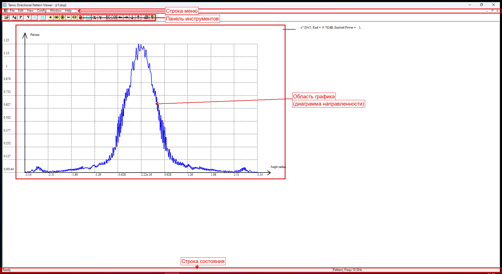

---

## 2. Запуск и открытие данных

### Как запустить программу

1. Найдите файл `TMC_DN.exe` (после сборки он лежит в каталоге `dist/win32/bin` или `dist/win64/bin`).
2. Запустите его двойным щелчком.
3. При первом запуске программа разворачивается на весь экран. Если ранее уже открывались какие-либо файлы, TMC_DN попытается автоматически открыть последний из них (список «недавних файлов» хранится в реестре Windows в разделе `TMC_DN`).

### Какой файл открывать

TMC_DN работает с двумя основными типами файлов (подробно — в разделе 7):

| Файл | Что это | Когда открывать |
|------|---------|-----------------|
| `.dop` | **Документ TMC_DN**: текстовый файл с настройками диаграммы и ссылкой на файл(ы) описания решётки | Обычный способ. Сохраняет цвета, масштаб, список диаграмм |
| `.DAT` | **Файл описания антенной решётки** (частота, излучатели, выражение ДН элемента) | Если хотите построить диаграмму по «сырому» описанию. Программа сама создаст для него документ |

Чтобы открыть файл:

1. Меню **File → Open…** (Файл → Открыть), либо нажмите кнопку «Открыть» на панели инструментов, либо клавиши **Ctrl+O**.
2. В диалоге выберите нужный `.dop` или `.DAT` файл.
3. Программа рассчитает диаграмму направленности (для большой решётки появится окно прогресса) и построит график.

> Если вы открываете `.DAT`-файл, рядом с ним будет создан документ (он хранит настройки отображения). В дальнейшем удобнее открывать именно документ `.dop`.

---

## 3. Главное окно

Главное окно — это многодокументное окно (MDI): внутри него могут быть открыты сразу несколько окон с разными диаграммами.


Окно состоит из четырёх зон:

1. **Строка меню** (вверху) — все команды программы, сгруппированные по разделам (File, Edit, View, Config, Window, Help). Подробно — раздел 5.
2. **Панель инструментов (тулбар)** — ряд кнопок-значков для самых частых действий. Подробно — раздел 4.
3. **Область графика** (центр) — здесь рисуются оси, координатная сетка и сама диаграмма направленности. По горизонтали отложен угол (радианы), по вертикали — уровень ДН. По этой области работает мышь: можно выделить прямоугольник для увеличения (zoom), а двойной щелчок подгоняет масштаб.
4. **Строка состояния (статусбар)** (внизу) — две панели:
   - **левая** — координаты точки под курсором мыши (значение угла по X и значение уровня ДН по Y);
   - **правая** — интегральные характеристики текущей диаграммы: **КНД** (`Knd`, в том числе в дБ) и **КИП** (`Kip`), а для крупной решётки — **излучённая мощность** (Emitted Power) вместо КИП.

---

## 4. Панель инструментов

Панель инструментов дублирует самые частые команды меню в виде кнопок. Если панель не видна, включите её через **View → Toolbar**. Панель и меню у TMC_DN **общие с TMCGROUT** — у программы расчёта ДН (модуль `DiaNapGr`) собственного файла ресурсов нет, поэтому набор кнопок такой же.

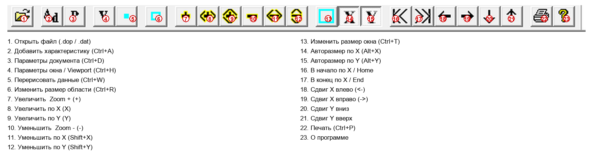

Кнопки идут слева направо. Ниже — назначение каждой.

| № | Кнопка | Название (англ./рус.) | Горячая клавиша | Что делает |
|---|--------|------------------------|-----------------|------------|
| 1 | 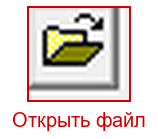 | Open / Открыть файл | Ctrl+O | Открывает файл `.dop` или `.DAT` (то же, что File → Open) |
| 2 | 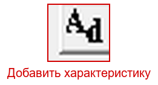 | Add characteristics / Добавить характеристику | Ctrl+A | Добавляет в документ ещё одну диаграмму из выбранного `.DAT`-файла |
| 3 | 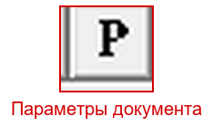 | Characteristics / Параметры документа | Ctrl+D | Открывает таблицу-список всех диаграмм документа (имена, файлы, флаги показа); отсюда же доступны функции девиаций — см. раздел 6 |
| 4 | 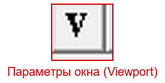 | Viewport / Параметры окна | Ctrl+H | Открывает диалог настройки отображения: пределы по осям, авто-масштаб, формат подписей, точки |
| 5 | 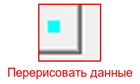 | Redraw data / Перечитать и перерисовать | Ctrl+W | Заново читает данные и пересчитывает/перерисовывает диаграмму |
| 6 | 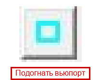 | Resize viewport / Подогнать область графика | Ctrl+R | Подгоняет область рисования под размер окна |
| 7 | 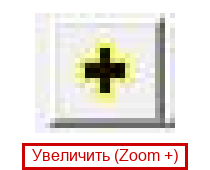 | Zoom + / Увеличить | — | Увеличивает масштаб по обеим осям |
| 8 | 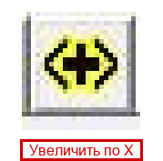 | Zoom +X / Увеличить по X | — | Увеличивает масштаб только по горизонтали (углу) |
| 9 | 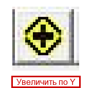 | Zoom +Y / Увеличить по Y | — | Увеличивает масштаб только по вертикали (уровню) |
| 10 | 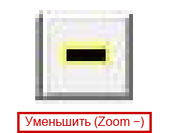 | Zoom − / Уменьшить | — | Уменьшает масштаб по обеим осям |
| 11 | 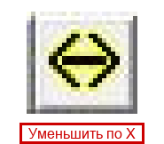 | Zoom −X / Уменьшить по X | Shift+X | Уменьшает масштаб по горизонтали |
| 12 | 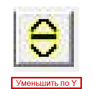 | Zoom −Y / Уменьшить по Y | Shift+Y | Уменьшает масштаб по вертикали |
| 13 | 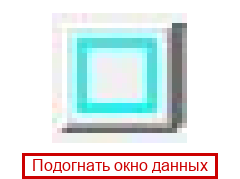 | Resize window / Подогнать окно данных | Ctrl+T | Подгоняет вещественные пределы (окно данных) |
| 14 | 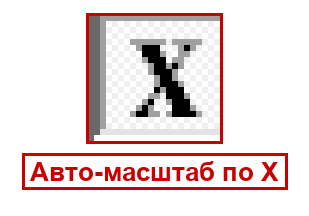 | Auto X size / Авто-масштаб X | Alt+X | Автоматически подбирает пределы по оси X (углу) под данные |
| 15 | 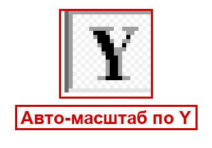 | Auto Y size / Авто-масштаб Y | Alt+Y | Автоматически подбирает пределы по оси Y под данные |
| 16 | 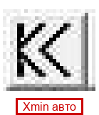 | В начало | — | Переход к началу диапазона по X (углу) |
| 17 | 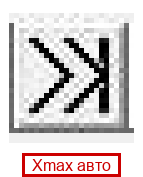 | В конец | — | Переход к концу диапазона по X (углу) |
| 18 | 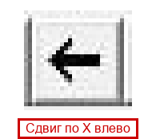 | Сдвиг X влево | — | Сдвигает видимую область по углу влево |
| 19 | 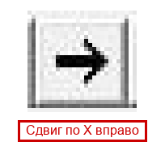 | Сдвиг X вправо | — | Сдвигает видимую область по углу вправо |
| 20 | 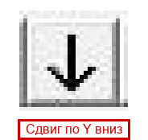 | Сдвиг Y вниз | — | Сдвигает видимую область вниз |
| 21 | 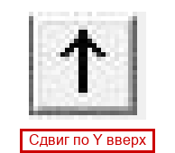 | Сдвиг Y вверх | — | Сдвигает видимую область вверх |
| 22 | 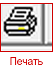 | Print / Печать | Ctrl+P | Печатает текущую диаграмму (то же, что File → Print) |
| 23 |  | About / О программе | — | Показывает окно «О программе TMC_DN» |

---

## 5. Меню

Ниже разобран каждый пункт каждого меню: что он делает, какая у него горячая клавиша и что происходит после выбора. Меню у TMC_DN общее с TMCGROUT.

### 5.1. Меню File (Файл)

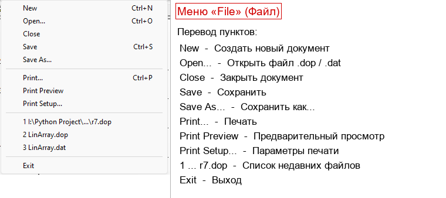

| Пункт | Горячая клавиша | Что делает |
|-------|-----------------|------------|
| **New** (Создать) | Ctrl+N | Создаёт новый пустой документ-диаграмму |
| **Open…** (Открыть) | Ctrl+O | Открывает существующий `.dop` или `.DAT` файл |
| **Close** (Закрыть) | — | Закрывает текущее окно документа |
| **Save** (Сохранить) | Ctrl+S | Сохраняет текущий документ (`.dop`) вместе со всеми настройками оформления |
| **Save As…** (Сохранить как) | — | Сохраняет документ под новым именем |
| **Print…** (Печать) | Ctrl+P | Печатает диаграмму |
| **Print Preview** (Предпросмотр печати) | — | Показывает, как диаграмма будет выглядеть на бумаге |
| **Print Setup…** (Параметры печати) | — | Настройки принтера и страницы |
| **Список последних файлов (MRU)** | — | Быстрое открытие недавно использованных документов |
| **Exit** (Выход) | — | Закрывает программу |

> При сохранении настройки оформления (цвета, шрифт, типы линий) дополнительно запоминаются в реестре Windows и используются как значения по умолчанию для новых документов.

### 5.2. Меню Edit (Правка)

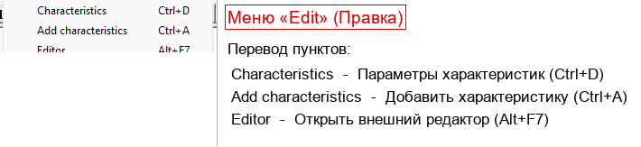

| Пункт | Горячая клавиша | Что делает |
|-------|-----------------|------------|
| **Characteristics** (Параметры документа / таблица диаграмм) | Ctrl+D | Открывает таблицу содержимого документа: список всех диаграмм. Для каждой видно имя графика, имя `.DAT`-файла, флаг «показывать/не показывать». **Отсюда же открываются специфичные для ДН функции — девиации и сравнение с требуемой ДН** (см. раздел 6) |
| **Add characteristics** (Добавить характеристику) | Ctrl+A | Открывает диалог выбора `.DAT`-файла и добавляет из него новую диаграмму в текущий документ |
| **Editor** (Внешний редактор) | Alt+F7 | Открывает файл документа во внешнем текстовом редакторе — для ручного редактирования `.dop` |

> Важно: специфичные для диаграмм направленности диалоги (внесение девиаций, расчёт ДН отклонённой решётки относительно требуемой ДН) открываются **не из верхнего меню**, а из диалога **Characteristics** (Ctrl+D) — у него в TMC_DN добавлены отдельные кнопки. См. раздел 6.4–6.5.

Диалог **Characteristics** (таблица диаграмм документа):

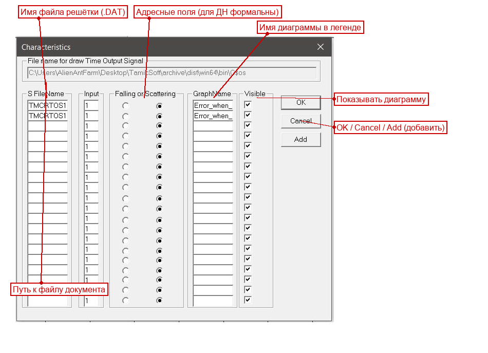

### 5.3. Меню View (Вид)

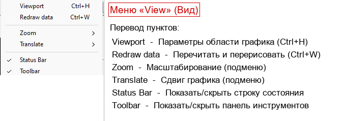

| Пункт | Горячая клавиша | Что делает |
|-------|-----------------|------------|
| **Viewport** (Параметры окна) | Ctrl+H | Открывает диалог настройки отображения: пределы Xmin/Xmax/Ymin/Ymax, авто-масштаб, формат подписей, показ точек-маркеров |
| **Redraw data** (Перечитать и перерисовать) | Ctrl+W | Заново читает данные и пересчитывает/перерисовывает диаграмму. Полезно, если изменилось описание решётки |

Диалог **Viewport** (параметры окна):

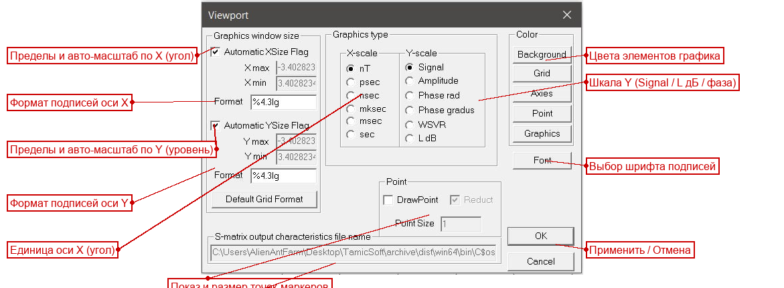
| **Zoom ►** (Масштаб) | — | Подменю масштабирования (см. ниже) |
| **Translate ►** (Сдвиг) | — | Подменю сдвига границ области (см. ниже) |
| **Status Bar** (Строка состояния) | — | Включает/выключает нижнюю строку состояния |
| **Toolbar** (Панель инструментов) | — | Включает/выключает панель инструментов |

#### Подменю View → Zoom (Масштаб)

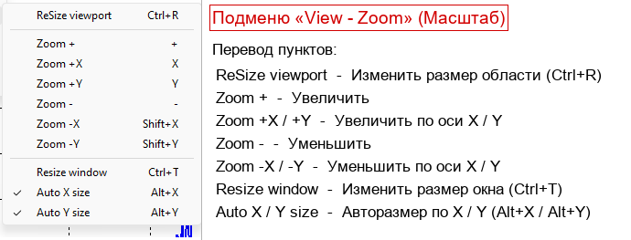

| Пункт | Горячая клавиша | Что делает |
|-------|-----------------|------------|
| **ReSize viewport** (Подогнать область) | Ctrl+R | Подгоняет область рисования под текущее окно |
| **Zoom +** (Увеличить) | — | Увеличивает масштаб по обеим осям |
| **Zoom +X** (Увеличить по X) | — | Увеличивает масштаб только по углу |
| **Zoom +Y** (Увеличить по Y) | — | Увеличивает масштаб только по вертикали |
| **Zoom −** (Уменьшить) | — | Уменьшает масштаб по обеим осям |
| **Zoom −X** (Уменьшить по X) | Shift+X | Уменьшает масштаб по углу |
| **Zoom −Y** (Уменьшить по Y) | Shift+Y | Уменьшает масштаб по вертикали |
| **Resize window** (Подогнать окно данных) | Ctrl+T | Изменяет вещественные пределы окна данных |
| **Auto X size** (Авто-масштаб X) | Alt+X | Включает автоматический подбор пределов по X. В меню появляется галочка |
| **Auto Y size** (Авто-масштаб Y) | Alt+Y | Включает автоматический подбор пределов по Y. В меню появляется галочка |

> При включённом авто-масштабе по оси программа сама подбирает пределы под минимум/максимум данных, и ручные пределы по этой оси игнорируются (поля Xmin/Xmax или Ymin/Ymax в диалоге Viewport становятся недоступны).

#### Подменю View → Translate (Сдвиг)

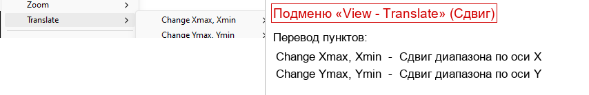

| Пункт | Что делает |
|-------|------------|
| **Change Xmax, Xmin ►** | Вложенное подменю: сдвинуть/изменить верхнюю и нижнюю границы по X (углу), а также перейти к началу/концу диапазона. Сдвиг выполняется шагами (порядка 10 % диапазона) |
| **Change Ymax, Ymin ►** | Вложенное подменю: сдвинуть/изменить верхнюю и нижнюю границы по Y (уровню). Сдвиг шагами (порядка 10 % диапазона) |

> Сдвиг удобен, когда нужно «прокрутить» диаграмму влево/вправо/вверх/вниз, не меняя масштаб. Те же действия дают кнопки сдвига на панели инструментов (№16–21).

### 5.4. Меню Config (Настройки)


| Пункт | Что делает |
|-------|------------|
| **Editor** (Редактор) | Задаёт путь к внешнему текстовому редактору для `.dop`-файлов |
| **Color ►** (Цвет) | Подменю выбора цветов элементов графика (см. ниже) |
| **Font** (Шрифт) | Открывает стандартный диалог выбора шрифта, размера и цвета подписей осей и сетки |

#### Подменю Config → Color (Цвет)

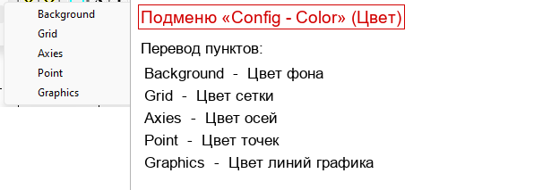

| Пункт | Что меняет |
|-------|------------|
| **Background** (Фон) | Цвет фона области графика |
| **Grid** (Сетка) | Цвет координатной сетки |
| **Axies** (Оси) | Цвет осей координат |
| **Point** (Точки) | Цвет точек-маркеров на кривых |
| **Graphics** (Графики) | Открывает диалог цветов/типов/толщины линий сразу для 16 кривых — здесь же можно задать индивидуальный цвет каждой диаграммы |

> Пункт **Graphics** открывает таблицу из 16 образцов линий. Нажав на нужный образец, вы выбираете цвет, стиль (сплошная, пунктир, точки) и толщину этой линии.

### 5.5. Меню Window (Окно)

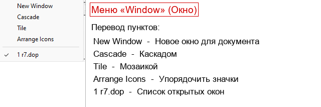

| Пункт | Что делает |
|-------|------------|
| **New Window** (Новое окно) | Открывает ещё одно окно для того же документа (полезно для разных масштабов одной диаграммы) |
| **Cascade** (Каскад) | Располагает окна каскадом |
| **Tile** (Мозаика) | Располагает окна плиткой (рядом) |
| **Arrange Icons** (Упорядочить значки) | Выравнивает свёрнутые окна-значки |
| **Список окон** | Переключение между открытыми окнами документов |

### 5.6. Меню Help (Справка)

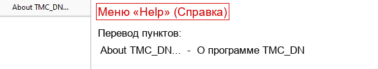

| Пункт | Что делает |
|-------|------------|
| **About TMC_DN…** (О программе) | Показывает окно с названием и версией программы (*Tamic Directional Pattern Viewer*) |

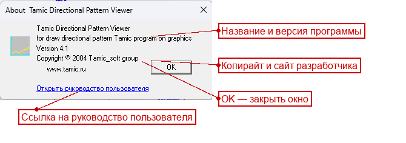

---

## 6. Типовые сценарии работы

Ниже — пошаговые инструкции для самых частых задач.

### 6.1. Открыть документ `.dop`

1. Меню **File → Open…** (или Ctrl+O, или кнопка «Открыть» на панели).
2. Выберите файл с расширением `.dop` (например, `r7.dop`).
3. Программа рассчитает диаграмму направленности. Если решётка большая, появится окно прогресса с двумя индикаторами — дождитесь окончания расчёта.
4. Диаграмма построится автоматически. Если кривая «уехала» за пределы окна — нажмите кнопки авто-масштаба **Auto X size** и **Auto Y size**.

### 6.2. Построить диаграмму по «сырому» описанию `.DAT`

1. Меню **File → Open…** (Ctrl+O).
2. В диалоге выберите файл с расширением `.DAT` (например, `r7.DAT`).
3. Программа прочитает описание решётки, рассчитает диаграмму направленности (для большой решётки — с окном прогресса) и построит график; рядом будет создан документ для хранения настроек отображения. Сохраните его (**File → Save**, Ctrl+S), чтобы в следующий раз открывать уже готовый документ `.dop`.

### 6.3. Прочитать КНД, КИП и излучённую мощность

После того как диаграмма рассчитана и построена:

1. Посмотрите в **правую панель строки состояния** (внизу окна) — там выводятся **КНД** (`Knd`, в том числе в дБ) и **КИП** (`Kip`).
2. Для крупной решётки вместо КИП показывается **Emitted Power** (излучённая мощность).

Что означают эти величины (для пользователя):

- **КНД (коэффициент направленного действия, Knd)** — насколько «остро» антенна излучает в главном направлении по сравнению с антенной, излучающей одинаково во все стороны. Чем больше КНД, тем у́же и сильнее главный лепесток. Часто выражается в **децибелах** (дБ): чем больше дБ, тем направленнее антенна.
- **КИП (коэффициент использования поверхности, Kip)** — мера того, насколько эффективно «работает» вся апертура (поверхность) антенны. Грубо: показывает, близка ли реальная решётка к идеальной по форме амплитудно-фазового распределения.
- **Emitted Power (излучённая мощность)** — суммарная мощность, излучаемая решёткой; программа выводит её вместо КИП для крупных решёток.

### 6.4. Внести случайные отклонения (девиации) в решётку

Эта функция позволяет смоделировать, как на диаграмму направленности влияют **неточности изготовления** антенны: небольшие отклонения координат, амплитуд и фаз отдельных излучателей.

1. Откройте документ или `.DAT`-файл с описанием решётки.
2. Откройте таблицу документа: меню **Edit → Characteristics** (Ctrl+D) или кнопка «Параметры документа» на панели.
3. В этом диалоге найдите кнопку запуска функции **девиаций** и нажмите её. Откроется отдельный диалог внесения отклонений.
4. В диалоге девиаций задаются:
   - **исходный файл** решётки (`.DAT`, источник);
   - **выходной файл** (`.DAT`, куда сохранить отклонённую решётку);
   - **разброс координат** излучателей по X и по Y (в миллиметрах);
   - **разброс амплитуды** (в процентах);
   - **разброс фазы** (в градусах).
5. Программа создаст новый файл решётки, в котором параметры каждого излучателя случайно отклонены в заданных пределах (равномерное распределение). Этот новый `.DAT` можно открыть в TMC_DN и сравнить его диаграмму с исходной.

> Что на входе: исходный файл решётки + величины разброса (X, Y, амплитуда, фаза).
> Что на выходе: новый файл `.DAT` со случайно отклонёнными параметрами излучателей.

### 6.5. Сравнить ДН отклонённой решётки с требуемой (эталонной)

Эта функция считает диаграмму направленности для заданного амплитудно-фазового распределения и сохраняет её **рядом с требуемой (эталонной) ДН** в одном файле сравнения, чтобы их было удобно сопоставить.

1. Откройте таблицу документа: **Edit → Characteristics** (Ctrl+D).
2. В диалоге найдите кнопку запуска функции **сравнения с требуемой ДН** и нажмите её. Откроется отдельный диалог расчёта.
3. В диалоге задаются:
   - **файл распределения амплитуд/фаз** решётки (`.DAT`);
   - **файл требуемой (эталонной) ДН** — задаёт, какую диаграмму вы хотите получить в идеале;
   - **выходной файл сравнения**, в который запишутся две диаграммы (требуемая и фактически рассчитанная) для каждого угла.
4. Программа рассчитает диаграмму для заданного распределения и запишет файл сравнения. Его можно открыть и увидеть, насколько фактическая ДН отличается от требуемой.

> Что на входе: файл распределения амплитуд/фаз + файл требуемой ДН.
> Что на выходе: файл сравнения с тремя колонками — угол · требуемая ДН · рассчитанная ДН.

### 6.6. Настроить масштаб (Zoom / Auto X / Auto Y)

Есть три способа изменить масштаб:

- **Мышью** — зажмите левую кнопку и обведите прямоугольником интересующую область диаграммы; при отпускании кнопки программа увеличит выделенное. Двойной щелчок в области графика подгоняет масштаб обратно.
- **Кнопками панели** — Zoom + / Zoom − (обе оси), Zoom +X/−X, Zoom +Y/−Y (по одной оси).
- **Авто-масштаб** — **View → Zoom → Auto X size** (Alt+X) и **Auto Y size** (Alt+Y). Программа сама подберёт пределы так, чтобы видеть всю диаграмму. Это самый быстрый способ «вписать» график в окно.

### 6.7. Сдвинуть диаграмму (Translate)

1. Меню **View → Translate**.
2. Выберите **Change Xmax, Xmin** (сдвиг по углу) или **Change Ymax, Ymin** (сдвиг по уровню).
3. Во вложенном подменю выберите увеличение или уменьшение нужной границы. Диаграмма сдвинется шагом порядка 10 % диапазона.

Тот же эффект дают кнопки сдвига на панели инструментов (№16–21).

> Сдвиг работает только при выключенном авто-масштабе по соответствующей оси: при включённом авто-масштабе пределы определяются автоматически по данным.

### 6.8. Сменить цвета и оформление

**Цвет фона / сетки / осей / точек:**
1. Меню **Config → Color → Background / Grid / Axies / Point**.
2. В стандартном диалоге выберите цвет → OK.

**Цвет, стиль и толщина кривых:**
1. Меню **Config → Color → Graphics**.
2. В открывшейся таблице нажмите образец нужной диаграммы.
3. Выберите цвет, стиль линии (сплошная/пунктир/точки) и толщину → OK.

**Шрифт подписей:**
1. Меню **Config → Font**.
2. Выберите шрифт, размер и цвет → OK.

### 6.9. Напечатать диаграмму

1. Сначала настройте масштаб и оформление так, как хотите видеть на бумаге.
2. (По желанию) Меню **File → Print Preview** — проверьте, как диаграмма ляжет на страницу.
3. Меню **File → Print…** (Ctrl+P) или кнопка «Печать».
4. Выберите принтер и нажмите OK.

---

## 7. Форматы входных данных

TMC_DN работает с документом `.dop`, файлом описания решётки `.DAT`, а также с файлами распределения `.AMP` (амплитуды) и `.FAZ` (фазы).

### 7.1. Файл документа `.dop`

`.dop` — это **текстовый** файл-документ TMC_DN. Его можно открыть любым текстовым редактором. Он хранит настройки оформления и список диаграмм, но **не хранит сами данные** — данные берутся из файлов `.DAT`, на которые ссылается документ.

**Структура файла** (на примере реального файла `samples/SAMPLE_R/KIRILL/HIPERSOUND/r7.dop`):

```
#TMCGROTS
!Graphics parameters
!Graphics data
!file name : E:\BackUP\ARHIV\WORK\Source\SAMPLE_R\KIRILL\HIPERSOUND\r7.dop
!Data file for draw graphics
!TFileName GraphicsName DrawFlag Input1 Mod1 Input2 Mod2
r7.DAT r7.DAT 1 1 1 1 1
```

**Разбор по строкам:**

| Строка | Назначение |
|--------|------------|
| `#TMCGROTS` | **Сигнатура** — обязательная первая строка. По ней программа узнаёт «свой» файл документа (она такая же, как у документов TMCROS, поскольку TMC_DN построен на той же кодовой базе) |
| Строки, начинающиеся с `!` | **Комментарии** — программа их игнорирует (включая авто-сгенерированный путь и подсказку по столбцам) |
| Строки `#Ключ значение` | **Параметры оформления** (в этом простом примере их нет, но они могут присутствовать — пределы осей, цвета, шрифт; по аналогии с документами TMCGROUT/TMCROS) |
| Последние строки (без `#`) | **Описания диаграмм** — по одной строке на диаграмму |

**Описание диаграммы** (строка данных). Формат столбцов указан в комментарии выше неё:

```
!TFileName GraphicsName DrawFlag Input1 Mod1 Input2 Mod2
r7.DAT     r7.DAT       1        1      1    1      1
```

| Столбец | Значение в примере | Назначение |
|---------|--------------------|------------|
| `TFileName` | `r7.DAT` | Имя файла описания решётки (обычно относительный путь рядом с `.dop`) |
| `GraphicsName` | `r7.DAT` | Подпись диаграммы в легенде |
| `DrawFlag` | `1` | Показывать диаграмму: 1 — да, 0 — нет |
| `Input1`, `Mod1`, `Input2`, `Mod2` | `1 1 1 1` | Адресные поля, унаследованные от общего формата вьюверов. Для ДН значимым является основной адрес; остальные при чтении приводятся к значениям по умолчанию |

### 7.2. Файл описания антенной решётки `.DAT`

`.DAT` — это файл с **описанием антенной решётки**, по которому программа рассчитывает диаграмму направленности. По описанию в API-документации (`docs/api/viewers/tmc_dn.md`, метод `c2DArray::ReadData`) это **текстовый** файл со следующей структурой:

```
Frequence = <частота> Ghz;
N = <число излучателей>;
<выражение собственной ДН одного элемента>
0   X = <x0> mm; Y = <y0> mm; Amplitude = <a0>; Faza = <f0> degree; [FiMin = ... degree; FiMax = ... degree; <выражение>]
1   X = <x1> mm; Y = <y1> mm; Amplitude = <a1>; Faza = <f1> degree; ...
...
```

**Разбор по строкам:**

| Строка | Назначение | Единицы |
|--------|------------|---------|
| `Frequence = … Ghz;` | **Рабочая частота** антенны | ГГц (внутри программы переводится в Гц) |
| `N = …;` | **Число излучателей** в решётке | целое |
| 3-я строка — **выражение** | **Собственная диаграмма направленности одного элемента** (формула). Вычисляется библиотекой `exprint`. Изотропный (всенаправленный) элемент задаётся как `1.`; направленный — выражениями вида `sin(f)`, `cos(f)` и т.п., где `f` — угол | угол в радианах |
| Строки излучателей (по одной на элемент) | Для каждого излучателя: его номер, координаты `X`/`Y`, амплитуда `Amplitude`, фаза `Faza`. Необязательно — угловой диапазон видимости элемента `FiMin`/`FiMax` и собственное выражение ДН | X, Y — мм (внутри → метры); Faza, FiMin, FiMax — градусы (внутри → радианы) |

**Что за что отвечает:**

- **Координаты `X`, `Y`** излучателя задают его положение в плоскости решётки. Именно от взаимного расположения элементов зависит, как складываются их поля по разным углам и какой получается главный лепесток.
- **`Amplitude`** — амплитуда возбуждения элемента (насколько «громко» излучает данный элемент). Распределение амплитуд по решётке влияет на уровень боковых лепестков.
- **`Faza`** — фаза возбуждения элемента (в градусах). Фазовое распределение позволяет «наклонять» главный лепесток (сканирование лучом).
- **Выражение собственной ДН элемента** (3-я строка и/или в строке элемента) задаёт, как излучает один отдельный элемент в зависимости от угла. Это формула на языке библиотеки `exprint` (доступны тригонометрические и другие функции; угол обозначается переменной угла).
- **`FiMin` / `FiMax`** (если заданы) ограничивают угловой диапазон, в котором элемент считается «видимым» (излучающим).

### 7.3. Файлы распределения `.AMP` и `.FAZ`

`.AMP` и `.FAZ` — это **амплитудное** и **фазовое** распределения по элементам (раскрыву) антенны: «карта» того, с какой амплитудой и фазой возбуждается каждая точка апертуры. Из них формируется возбуждение излучателей решётки.

Из доступных файлов видно следующее (на примере `r7.AMP`):

| Ключ заголовка | Значение в примере | Предполагаемый смысл |
|----------------|--------------------|----------------------|
| `#TMC_GraphicsOutputFieldFile FormVer2.0 2000` | — | Сигнатура файла распределения поля (версия формата 2.0) |
| `#TMCGROFLD_nT 1930` | 1930 | Номер временно́го шага, на котором сохранено распределение |
| `#TMCGROFLD_Time 9.10441e-009` | 9.1 нс | Момент времени |
| `#TMCGROFLD_Delta 0.002` | 0.002 | Шаг сетки |
| `#TMCGROFLD_Xmin 0`, `#TMCGROFLD_Ymin 0` | 0 | Начало координат области |
| `#TMCGROFLD_Accuracy 8` | 8 | Размер числа в байтах: `8` — `double` (двойная точность, текущая сборка), `4` — `float` |
| `#TMCGROFLD_LongUnit mm 0.001` | мм | Единица длины (миллиметры) |
| `#TMCGROFLD_TimeUnit ns 1e-009` | нс | Единица времени (наносекунды) |
| `#TMCGROFLD_nX 502`, `#TMCGROFLD_nY 502` | 502 × 502 | Размер сетки распределения |
| Далее | бинарные данные | Двумерный массив значений поля (амплитуды — в `.AMP`, фазы — в `.FAZ`) |

> Файлы `.AMP`/`.FAZ` в таком виде **не предназначены для ручного редактирования** — после заголовка идут бинарно записанные числа. Открывать их следует средствами пакета, а не текстовым редактором.

### 7.4. Как получить файлы данных для TMC_DN

Данные для диаграммы направленности готовит **счётное ядро** при расчёте планарной структуры. Кратко (подробно — в `docs/api/kernels/planar_rt_h.md` и `docs/api/libs/tmcindan.md`):

1. Подготовьте входной файл-шаблон `.tpl` (топология структуры, параметры, секция вывода) и рассчитайте структуру в ядре `tmc_rth.exe` (H-поляризация). В процессе расчёта ядро интегрирует поле по времени (класс `CFieldIntegrated`).
2. Ядро выполняет **экспорт данных для диаграммы направленности** функцией `CFieldIntegrated::ExportToDirectionalPattern` (TMCIndan): по накопленному полю вычисляются амплитуда и фаза излучателей вдоль границ области (Xmin/Xmax/Ymin/Ymax). На этом этапе и формируются файлы амплитудного/фазового распределения и описание решётки.
3. Полученные файлы открываются в **TMC_DN**, где по ним строится и анализируется диаграмма направленности.

Готовые примеры для тренировки лежат в `samples/SAMPLE_R/KIRILL/HIPERSOUND/` (`r7.dop`, `r7.DAT`, `r7.AMP`, `r7.FAZ`).

---

## 8. Возможные проблемы и их решение

| Симптом | Причина | Что делать |
|---------|---------|------------|
| Долгий расчёт, окно прогресса висит | Большая решётка считается в фоновом потоке | Дождитесь окончания: следите за двумя индикаторами (готовность текущей ДН и по всем ДН). Расчёт большой решётки объективно длительный |
| В легенде/области графика надпись об ошибке чтения | Файл `.DAT` не найден, пуст или повреждён | Проверьте, существует ли `.DAT`-файл по указанному в `.dop` пути; подготовьте его заново |
| Сообщение об **ошибке выражения** ДН элемента | Неверная формула в 3-й строке `.DAT` (выражение `exprint`) | Проверьте синтаксис выражения собственной ДН элемента; для всенаправленного элемента используйте `1.` |
| Диаграмма **пустая** или кривая не видна | Включён неудачный масштаб, либо данные вне окна | Нажмите **Auto X size** и **Auto Y size** (Alt+X, Alt+Y), чтобы вписать диаграмму в окно |
| Диаграмма есть, но **«уезжает» за край** | Заданы ручные пределы Xmin/Xmax/Ymin/Ymax | Откройте **View → Viewport** и проверьте пределы, либо включите авто-масштаб |
| После изменения описания решётки диаграмма **не обновилась** | TMC_DN показывает старые данные | Нажмите **View → Redraw data** (Ctrl+W) или кнопку «Перерисовать» — диаграмма пересчитается |
| Кривая **одного цвета** с фоном/её плохо видно | Совпали цвета | **Config → Color → Graphics** — задайте контрастный цвет линии |
| Не открывается файл — сообщение про **«не тот формат»** | Первая строка документа не `#TMCGROTS` | Убедитесь, что открываете корректный документ `.dop` (первая строка должна быть `#TMCGROTS`) либо корректный `.DAT` |
