# Руководство пользователя — программа TMCGROUT (`TMCGROUT.exe`)

> Пакет **TMC Suite**. Это руководство написано простым языком и рассчитано на пользователя, который видит программу впервые. Все названия пунктов меню и кнопок приведены так, как они выглядят в программе (интерфейс — английский), а рядом дан перевод и пояснение.

---

## 1. Назначение программы

**TMCGROUT** (исполняемый файл `TMCGROUT.exe`) — это программа для **просмотра графиков характеристик рассеяния в частотной области**. Проще говоря, она строит графики, у которых:

- **по горизонтальной оси (X)** отложена **частота** (по умолчанию в ГГц);
- **по вертикальной оси (Y)** отложена выбранная характеристика элемента **матрицы рассеяния** (S-матрицы) — например, **модуль** `|S|`, **фаза** в градусах или радианах, **потери** в децибелах или **КСВН**.

Матрица рассеяния (S-матрица) описывает, как устройство (например, планарная структура, рассчитанная счётным ядром `tmc_rth` или `tmc_rtx`) отражает и пропускает сигнал в зависимости от частоты. TMCGROUT берёт результат расчёта — файл S-матрицы — и рисует его в виде наглядного графика.

Что умеет программа:

- открывать готовые документы-графики (файлы `.soc`) или напрямую файлы матрицы рассеяния (`.s`);
- показывать **сразу несколько кривых** на одном поле (например, разные элементы S-матрицы или результаты из разных файлов);
- менять масштаб (увеличение/уменьшение, автоподбор по осям), сдвигать видимую область;
- настраивать цвета фона, сетки, осей и самих кривых, а также шрифт подписей;
- печатать график и сохранять настройки оформления в самом документе `.soc`.

> Обратите внимание: TMCGROUT **только показывает** уже посчитанные данные. Сам расчёт выполняют счётные ядра пакета (`tmc_rth` для H-поляризации, `tmc_rtx` для X-моды). Как получить файл `.s`, описано в разделе 7.


---

## 2. Запуск и открытие данных

### Как запустить программу

1. Найдите файл `TMCGROUT.exe` (после сборки он лежит в каталоге `dist/win32/bin` или `dist/win64/bin`).
2. Запустите его двойным щелчком.
3. При первом запуске программа разворачивается на весь экран. Если ранее уже открывались какие-либо файлы, TMCGROUT попытается автоматически открыть последний из них (список «недавних файлов» хранится в реестре Windows).

### Какой файл открывать

TMCGROUT работает с двумя типами файлов (подробно — в разделе 7):

| Файл | Что это | Когда открывать |
|------|---------|-----------------|
| `.soc` | **Документ TMCGROUT**: текстовый файл с настройками графиков и ссылкой на файл(ы) `.s` | Обычный способ. Сохраняет цвета, масштаб, список кривых |
| `.s` | **Файл матрицы рассеяния** (результат расчётного ядра) | Если хотите быстро посмотреть «сырой» результат. Программа сама создаст для него документ `.soc` |

Чтобы открыть файл:

1. Меню **File → Open…** (Файл → Открыть), либо нажмите кнопку «Открыть» на панели инструментов, либо клавиши **Ctrl+O**.
2. В диалоге выберите нужный `.soc` или `.s` файл.
3. График появится в окне документа.

> Если вы открываете `.s`-файл, рядом с ним будет создан документ `.soc` с тем же именем (он хранит настройки отображения). В дальнейшем удобнее открывать именно `.soc`.

---

## 3. Главное окно

Главное окно — это многодокументное окно (MDI): внутри него могут быть открыты сразу несколько окон с разными графиками.


Окно состоит из четырёх зон:

1. **Строка меню** (вверху) — все команды программы, сгруппированные по разделам (File, Edit, View, Config, Window, Help). Подробно — раздел 5.
2. **Панель инструментов (тулбар)** — ряд кнопок-значков для самых частых действий. Подробно — раздел 4.
3. **Область графика** (центр) — здесь рисуются оси, координатная сетка и сами кривые. По этой области работает мышь: можно выделить прямоугольник для увеличения (zoom), а двойной щелчок подгоняет масштаб.
4. **Строка состояния (статусбар)** (внизу) — две панели:
   - **левая** — координаты точки под курсором мыши (значение частоты по X и значение характеристики по Y);
   - **правая** — название текущего типа характеристики (что отложено по оси Y: модуль, фаза, потери или КСВН).

---

## 4. Панель инструментов

Панель инструментов дублирует самые частые команды меню в виде кнопок. Если панель не видна, включите её через **View → Toolbar**.

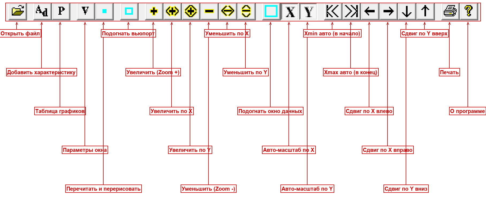

Кнопки идут слева направо. Ниже — назначение каждой.

| № | Кнопка | Название (англ./рус.) | Что делает |
|---|--------|------------------------|------------|
| 1 | 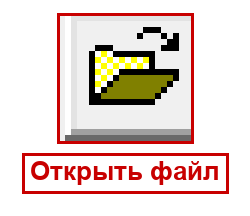 | Open / Открыть файл | Открывает файл `.soc` или `.s` (то же, что File → Open) |
| 2 | 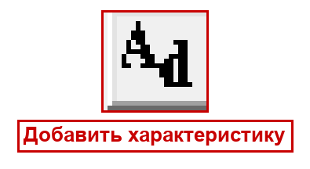 | Add characteristics / Добавить характеристику | Добавляет в текущий документ ещё одну кривую из выбранного `.s`-файла |
| 3 | 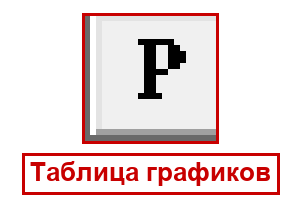 | Characteristics / Таблица графиков | Открывает таблицу со списком всех кривых документа (имена, входы/моды, флаги показа) |
| 4 | 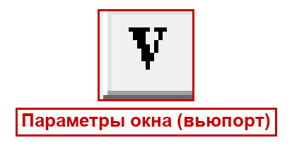 | Viewport / Параметры окна | Открывает диалог настройки отображения: пределы по осям, единицы, тип характеристики, формат подписей, точки |
| 5 | 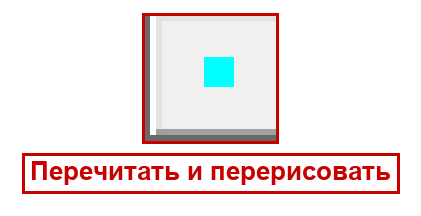 | Redraw data / Перечитать и перерисовать | Заново читает данные из файлов и перерисовывает график |
| 6 |  | Resize viewport / Подогнать вьюпорт | Подгоняет область рисования под размер окна |
| 7 |  | Zoom + / Увеличить | Увеличивает масштаб по обеим осям |
| 8 |  | Zoom +X / Увеличить по X | Увеличивает масштаб только по горизонтали (частоте) |
| 9 |  | Zoom +Y / Увеличить по Y | Увеличивает масштаб только по вертикали |
| 10 |  | Zoom − / Уменьшить | Уменьшает масштаб по обеим осям |
| 11 |  | Zoom −X / Уменьшить по X | Уменьшает масштаб только по горизонтали |
| 12 |  | Zoom −Y / Уменьшить по Y | Уменьшает масштаб только по вертикали |
| 13 |  | Resize window / Подогнать окно данных | Подгоняет вещественные пределы (окно данных) |
| 14 |  | Auto X size / Авто-масштаб X | Автоматически подбирает пределы по оси X (частоте) под данные |
| 15 |  | Auto Y size / Авто-масштаб Y | Автоматически подбирает пределы по оси Y под данные |
| 16 |  | Xmin авто / автоподбор левой границы X | Подгоняет нижнюю границу по X под данные |
| 17 |  | Xmax авто / автоподбор правой границы X | Подгоняет верхнюю границу по X под данные |
| 18 |  | Сдвиг по X влево | Сдвигает видимую область по частоте влево |
| 19 |  | Сдвиг по X вправо | Сдвигает видимую область по частоте вправо |
| 20 |  | Сдвиг по Y вниз | Сдвигает видимую область вниз |
| 21 |  | Сдвиг по Y вверх | Сдвигает видимую область вверх |
| 22 | 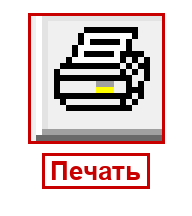 | Print / Печать | Печатает текущий график (то же, что File → Print) |
| 23 |  | About / О программе | Показывает окно «О программе» |

---

## 5. Меню

Ниже разобран каждый пункт каждого меню: что он делает, какая у него горячая клавиша и что происходит после выбора.

### 5.1. Меню File (Файл)

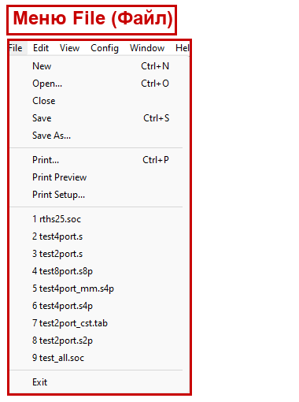

| Пункт | Горячая клавиша | Что делает |
|-------|-----------------|------------|
| **New** (Создать) | Ctrl+N | Создаёт новый пустой документ-график |
| **Open…** (Открыть) | Ctrl+O | Открывает существующий `.soc` или `.s` файл |
| **Close** (Закрыть) | — | Закрывает текущее окно документа |
| **Save** (Сохранить) | Ctrl+S | Сохраняет текущий документ (`.soc`) вместе со всеми настройками оформления |
| **Save As…** (Сохранить как) | — | Сохраняет документ под новым именем |
| **Print…** (Печать) | Ctrl+P | Печатает график |
| **Print Preview** (Предпросмотр печати) | — | Показывает, как график будет выглядеть на бумаге |
| **Print Setup…** (Параметры печати) | — | Настройки принтера и страницы |
| **Список последних файлов (1–9)** | — | Быстрое открытие недавно использованных документов |
| **Exit** (Выход) | — | Закрывает программу |

> При сохранении настройки оформления (цвета, шрифт, типы линий) дополнительно запоминаются в реестре Windows и используются как значения по умолчанию для новых документов.

### 5.2. Меню Edit (Правка)

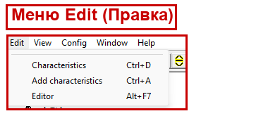

| Пункт | Горячая клавиша | Что делает |
|-------|-----------------|------------|
| **Characteristics** (Характеристики / таблица графиков) | Ctrl+D | Открывает таблицу содержимого документа: список всех кривых (до 20). Для каждой видно имя графика, имя S-файла, входы/моды и флаг «показывать/не показывать» |
| **Add characteristics** (Добавить характеристику) | Ctrl+A | Открывает диалог выбора `.s`-файла и добавляет из него новую кривую в текущий документ |
| **Editor** (Внешний редактор) | Alt+F7 | Открывает файл документа во внешнем текстовом редакторе (по умолчанию `winword.exe`) — для ручного редактирования `.soc` |

> «Входы» и «моды» (Input1/Mod1, Input2/Mod2) — это адрес элемента S-матрицы: какой вход с какой модой связан с каким выходом. Подробнее — раздел 7.

### 5.3. Меню View (Вид)

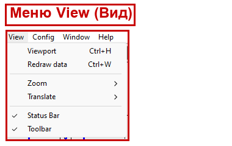

| Пункт | Горячая клавиша | Что делает |
|-------|-----------------|------------|
| **Viewport** (Параметры окна) | Ctrl+H | Открывает диалог настройки отображения: пределы Xmin/Xmax/Ymin/Ymax, авто-масштаб, единица оси X, тип характеристики Y, формат подписей, показ точек-маркеров |
| **Redraw data** (Перечитать и перерисовать) | Ctrl+W | Заново читает данные из файлов и перерисовывает график. Полезно, если файл `.s` пересчитан заново |
| **Zoom ►** (Масштаб) | — | Подменю масштабирования (см. ниже) |
| **Translate ►** (Сдвиг) | — | Подменю сдвига границ области (см. ниже) |
| **Status Bar** (Строка состояния) | — | Включает/выключает нижнюю строку состояния |
| **Toolbar** (Панель инструментов) | — | Включает/выключает панель инструментов |

#### Подменю View → Zoom (Масштаб)

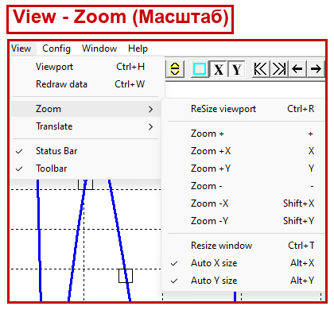

| Пункт | Горячая клавиша | Что делает |
|-------|-----------------|------------|
| **ReSize viewport** (Подогнать область) | Ctrl+R | Подгоняет область рисования под текущее окно |
| **Zoom +** (Увеличить) | — | Увеличивает масштаб по обеим осям |
| **Zoom +X** (Увеличить по X) | — | Увеличивает масштаб только по частоте |
| **Zoom +Y** (Увеличить по Y) | — | Увеличивает масштаб только по вертикали |
| **Zoom −** (Уменьшить) | — | Уменьшает масштаб по обеим осям |
| **Zoom −X** (Уменьшить по X) | Shift+X | Уменьшает масштаб по частоте |
| **Zoom −Y** (Уменьшить по Y) | Shift+Y | Уменьшает масштаб по вертикали |
| **Resize window** (Подогнать окно данных) | Ctrl+T | Изменяет вещественные пределы окна данных |
| **Auto X size** (Авто-масштаб X) | Alt+X | Включает автоматический подбор пределов по X. В меню появляется галочка |
| **Auto Y size** (Авто-масштаб Y) | Alt+Y | Включает автоматический подбор пределов по Y. В меню появляется галочка |

> При включённом авто-масштабе по оси программа сама подбирает пределы под минимум/максимум данных, и ручные пределы по этой оси игнорируются (поля Xmin/Xmax или Ymin/Ymax в диалоге Viewport становятся недоступны).

#### Подменю View → Translate (Сдвиг)

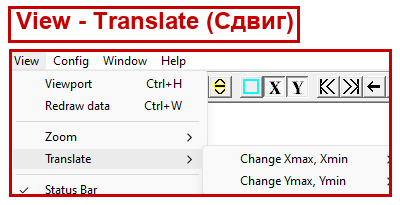

| Пункт | Что делает |
|-------|------------|
| **Change Xmax, Xmin ►** | Вложенное подменю: сдвинуть/изменить верхнюю и нижнюю границы по X (частоте). Сдвиг выполняется шагами (порядка 10 % диапазона) |
| **Change Ymax, Ymin ►** | Вложенное подменю: сдвинуть/изменить верхнюю и нижнюю границы по Y. Сдвиг шагами (порядка 10 % диапазона) |

> Сдвиг удобен, когда нужно «прокрутить» график влево/вправо/вверх/вниз, не меняя масштаб.

### 5.4. Меню Config (Настройки)

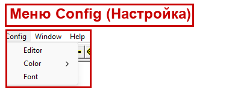

| Пункт | Что делает |
|-------|------------|
| **Editor** (Редактор) | Задаёт путь к внешнему текстовому редактору для `.soc`-файлов (по умолчанию `winword.exe`) |
| **Color ►** (Цвет) | Подменю выбора цветов элементов графика (см. ниже) |
| **Font** (Шрифт) | Открывает стандартный диалог выбора шрифта подписей осей и сетки (по умолчанию Times New Roman) |

#### Подменю Config → Color (Цвет)

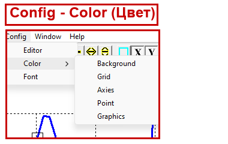

| Пункт | Что меняет |
|-------|------------|
| **Background** (Фон) | Цвет фона области графика (по умолчанию белый) |
| **Grid** (Сетка) | Цвет координатной сетки |
| **Axies** (Оси) | Цвет осей координат |
| **Point** (Точки) | Цвет точек-маркеров на кривых |
| **Graphics** (Графики) | Открывает диалог цветов/типов/толщины линий сразу для 16 кривых — здесь же можно задать индивидуальный цвет каждой кривой |

> Пункт **Graphics** открывает таблицу из 16 образцов линий. Нажав на нужный образец, вы выбираете цвет, стиль (сплошная, пунктир, точки) и толщину этой линии.

### 5.5. Меню Window (Окно)

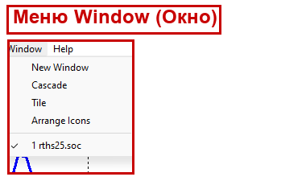

| Пункт | Что делает |
|-------|------------|
| **New Window** (Новое окно) | Открывает ещё одно окно для того же документа (полезно для разных масштабов одного графика) |
| **Cascade** (Каскад) | Располагает окна каскадом |
| **Tile** (Мозаика) | Располагает окна плиткой (рядом) |
| **Arrange Icons** (Упорядочить значки) | Выравнивает свёрнутые окна-значки |
| **Список окон** | Переключение между открытыми окнами документов |

### 5.6. Меню Help (Справка)


| Пункт | Что делает |
|-------|------------|
| **About TMCGROUT…** (О программе) | Показывает окно с названием и версией программы |

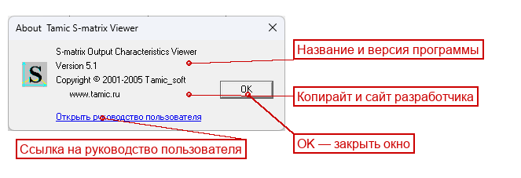

---

## 6. Типовые сценарии работы

Ниже — пошаговые инструкции для самых частых задач.

### 6.1. Открыть документ `.soc`

1. Меню **File → Open…** (или Ctrl+O, или кнопка «Открыть» на панели).
2. Выберите файл с расширением `.soc` (например, `rths25.soc`).
3. График построится автоматически. Если кривая «уехала» за пределы окна — нажмите кнопки авто-масштаба **Auto X size** и **Auto Y size**.

### 6.2. Добавить ещё одну характеристику (Add characteristics)

1. Откройте документ (см. 6.1).
2. Меню **Edit → Add characteristics** (Ctrl+A) или кнопка «Добавить характеристику».
3. В диалоге выберите нужный `.s`-файл.
4. Новая кривая добавится в документ. Чтобы посмотреть/настроить список всех кривых, откройте **Edit → Characteristics** (Ctrl+D).
5. В таблице можно включать и выключать показ каждой кривой (флаг вывода), а также задавать входы/моды нужного элемента S-матрицы.

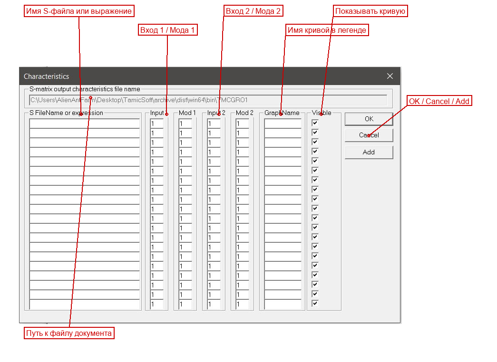

### 6.3. Настроить масштаб (Zoom / Auto X / Auto Y)

Есть три способа изменить масштаб:

- **Мышью** — зажмите левую кнопку и обведите прямоугольником интересующую область графика; при отпускании кнопки программа увеличит выделенное. Двойной щелчок в области графика подгоняет масштаб обратно.
- **Кнопками панели** — Zoom + / Zoom − (обе оси), Zoom +X/−X, Zoom +Y/−Y (по одной оси).
- **Авто-масштаб** — **View → Zoom → Auto X size** (Alt+X) и **Auto Y size** (Alt+Y). Программа сама подберёт пределы так, чтобы видеть всю кривую. Это самый быстрый способ «вписать» график в окно.

### 6.4. Сдвинуть график (Translate)

1. Меню **View → Translate**.
2. Выберите **Change Xmax, Xmin** (сдвиг по частоте) или **Change Ymax, Ymin** (сдвиг по вертикали).
3. Во вложенном подменю выберите увеличение или уменьшение нужной границы. График сдвинется шагом порядка 10 % диапазона.

Тот же эффект дают кнопки сдвига на панели инструментов (№18–21).

> Сдвиг работает только при выключенном авто-масштабе по соответствующей оси: при включённом авто-масштабе пределы определяются автоматически по данным.

### 6.5. Сменить цвета и тип характеристики

**Цвет фона / сетки / осей / точек:**
1. Меню **Config → Color → Background / Grid / Axies / Point**.
2. В стандартном диалоге выберите цвет → OK.

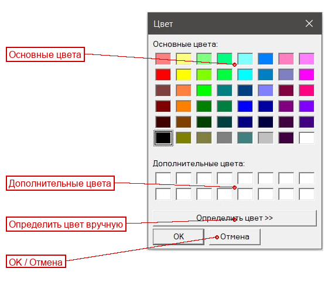

**Цвет, стиль и толщина кривых:**
1. Меню **Config → Color → Graphics**.
2. В открывшейся таблице нажмите образец нужной кривой.
3. Выберите цвет, стиль линии (сплошная/пунктир/точки) и толщину → OK.

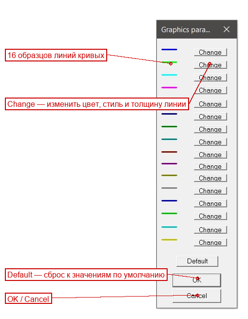

**Что отложено по оси Y (модуль, фаза, потери, КСВН) и единицы оси X:**
1. Меню **View → Viewport** (Ctrl+H) или кнопка «Параметры окна».
2. В диалоге выберите тип характеристики Y и единицу оси X (Гц/кГц/МГц/ГГц), при желании задайте пределы и формат подписей → OK.

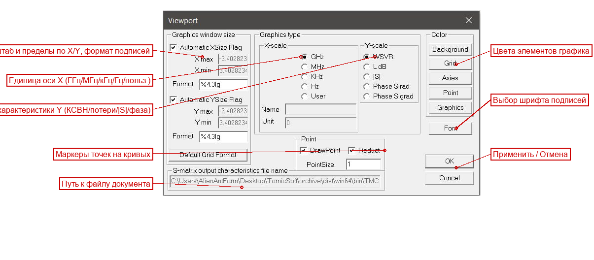

### 6.6. Напечатать график

1. Сначала настройте масштаб и оформление так, как хотите видеть на бумаге.
2. (По желанию) Меню **File → Print Preview** — проверьте, как график ляжет на страницу.
3. Меню **File → Print…** (Ctrl+P) или кнопка «Печать».
4. Выберите принтер и нажмите OK.

---

## 7. Форматы входных данных

TMCGROUT работает с двумя форматами файлов: документ `.soc` и файл матрицы рассеяния `.s`.

### 7.1. Файл документа `.soc`

`.soc` — это **текстовый** файл-документ TMCGROUT. Его можно открыть любым текстовым редактором. Он хранит настройки оформления и список кривых, но **не хранит сами данные** — данные берутся из файлов `.s`, на которые ссылается документ.

**Структура файла** (на примере реального файла `samples/SAMPLE_R/TEST_MET/EPS4/rths25.soc`):

```
#TMCGROUT
!Graphics parameters
#dXAxiesUnit 0
#dXAxiesName
#PointDrawFlag 1; 1;
#nXType 0
#nYType 2
#Xmin 40
#Xmax 49.8
#Ymin -0.0011383
#Ymax 0.00128368
#nAFlagX 1
#nAFlagY 1
#EditorFileName  winword.exe
#sDrawTextFont Times New Roman;-37;0;0;0;400;0;0;0;1;
#sDrawTextColor 0;
#sDrawBckgrdColor 16777215;
#sDrawAxiesColor 0;
#sDrawGridColor 0;
#sDrawPointColor 0; 16711680; 0; 75; ...
!Graphics data
!file name : E:\WORK\Source\SAMPLE_R\TEST_MET\EPS4\rths25.soc
!Data file for draw S-matrix graphics
!SFileName GraphicsName DrawFlag Input1 Mod1 Input2 Mod2
rths25.s rths25.s 1 1 1 2 1
```

**Разбор по строкам:**

| Строка | Назначение |
|--------|------------|
| `#TMCGROUT` | **Сигнатура** — обязательная первая строка. По ней программа узнаёт «свой» файл |
| Строки, начинающиеся с `!` | **Комментарии** — программа их игнорирует (включая авто-сгенерированный путь и подсказку по столбцам) |
| Строки `#Ключ значение` | **Параметры оформления** (см. таблицу ниже) |
| Последние строки (без `#`) | **Описания кривых** — по одной строке на кривую |

**Параметры оформления (`#Ключ`):**

| Ключ | Что задаёт | Значения |
|------|-----------|----------|
| `#dXAxiesUnit` | Множитель пользовательской единицы оси X | число (для пользовательской единицы) |
| `#dXAxiesName` | Имя пользовательской единицы оси X | текст |
| `#PointDrawFlag` | Рисовать ли маркеры точек на кривых | 0 — нет, 1 — да |
| `#nXType` | **Тип оси X (единица частоты)** | 0 — ГГц, 1 — МГц, 2 — кГц, 3 — Гц, 4 — пользовательская |
| `#nYType` | **Тип оси Y (характеристика)** | 0 — КСВН, 1 — потери (дБ), 2 — модуль `\|S\|`, 3 — фаза (рад), 4 — фаза (град) |
| `#Xmin`, `#Xmax` | Пределы по оси X | числа в выбранной единице частоты |
| `#Ymin`, `#Ymax` | Пределы по оси Y | числа |
| `#nAFlagX` | Авто-масштаб по X | 0 — выкл, 1 — вкл |
| `#nAFlagY` | Авто-масштаб по Y | 0 — выкл, 1 — вкл |
| `#EditorFileName` | Внешний редактор документа | путь к `.exe` |
| `#sDrawTextFont` | Шрифт подписей | параметры шрифта (имя, размер и т.д.) |
| `#sDrawTextColor` | Цвет текста подписей | число COLORREF |
| `#sDrawBckgrdColor` | Цвет фона | число COLORREF (16777215 = белый) |
| `#sDrawAxiesColor` | Цвет осей | число COLORREF (0 = чёрный) |
| `#sDrawGridColor` | Цвет сетки | число COLORREF |
| `#sDrawPointColor` | Цвета/параметры маркеров для 16 кривых | список чисел |

> **Единицы измерения.** В примере `rths25.soc` стоит `#nXType 0` — значит, ось X в **ГГц**, а пределы `#Xmin 40`, `#Xmax 49.8` означают диапазон **40…49.8 ГГц**. Параметр `#nYType 2` означает, что по Y отложен **модуль `|S|`**.

**Описание кривой** (строка данных). Формат столбцов указан в комментарии выше неё:

```
!SFileName GraphicsName DrawFlag Input1 Mod1 Input2 Mod2
rths25.s   rths25.s     1        1      1    2      1
```

| Столбец | Значение в примере | Назначение |
|---------|--------------------|------------|
| `SFileName` | `rths25.s` | Имя файла матрицы рассеяния (обычно относительный путь рядом с `.soc`) |
| `GraphicsName` | `rths25.s` | Подпись кривой в легенде |
| `DrawFlag` | `1` | Показывать кривую: 1 — да, 0 — нет |
| `Input1` | `1` | Номер первого входа элемента S-матрицы |
| `Mod1` | `1` | Номер моды первого входа |
| `Input2` | `2` | Номер второго входа |
| `Mod2` | `1` | Номер моды второго входа |

То есть в примере строится элемент S-матрицы, связывающий **вход 1 (мода 1)** и **вход 2 (мода 1)** — это «проходная» характеристика (передача между двумя входами).

**Для сравнения — простой документ** `samples/SAMPLE_R/horns.soc`:

```
#TMCGROUT
...
#nXType 0
#nYType 1
#Xmin -3.40282e+038
#Xmax -3.40282e+038
...
#nAFlagX 0
#nAFlagY 0
...
horns.s horns.s 1 1 1 1 1
```

Здесь `#nYType 1` — по оси Y **потери в дБ**; пределы заданы как `-3.40282e+038` (это «не задано»/минимально возможное число `float`); элемент S-матрицы — вход 1 (мода 1) ↔ вход 1 (мода 1), то есть **отражение от первого входа**.

> Если выражение имени файла заключено в **фигурные скобки** `{...}`, это означает не одиночный файл, а **график-выражение** (расчёт кривой по формуле над несколькими `.s`-файлами). Это продвинутая возможность; подробности — в API-документации (`docs/api/viewers/tmcgrout.md`, класс `CTMCGrExpression`).

### 7.2. Файл матрицы рассеяния `.s`

`.s` — это файл с **самими данными матрицы рассеяния**: для набора частот хранятся комплексные значения элементов S-матрицы. Это результат работы счётного ядра (`tmc_rth` или `tmc_rtx`).

По структуре файл **смешанный** — текстовый заголовок плюс числовые данные. Начало файла (пример `rths25.s`):

```
SMT 102

 TAMIC-RTH V 2.00
2 TAMIC_soft group. TAMIC Rt-H Planar Analyzer. 2000

 Tamic Output Signal Viewer
. E:\WORK\Source\SAMPLE_R\TEST_MET\EPS4\rths25.s
```

| Элемент | Что это |
|---------|---------|
| `SMT 102` | Метка файла S-матрицы и число точек/параметр (102) |
| `TAMIC-RTH V 2.00` | Версия программы-генератора (счётного ядра) |
| Строка `TAMIC_soft group…` | Подпись разработчика |
| `. <путь>` | Исходный путь к файлу |
| Далее | Блок частот и блок комплексных значений S-параметров (для каждой частоты — значения элементов матрицы) |

> Файл `.s` **не предназначен для ручного редактирования** — он содержит бинарно записанные числа. Открывать его нужно через TMCGROUT, а не текстовым редактором.

### 7.3. Как получить файлы `.s` и `.soc`

Файл `.s` создаётся **счётным ядром** при расчёте планарной структуры. Кратко (подробно — в `docs/api/kernels/planar_rt_h.md` и руководствах по ядрам):

1. Подготовьте входной файл-шаблон `.tpl` (топология структуры, параметры, секция вывода). В секции `OUTPUT` должен быть включён вывод S-матрицы (флаг `SMATRIX`) и задано имя выходного файла.
2. Запустите счётное ядро: `tmc_rth.exe` (для H-поляризации) или `tmc_rtx.exe` (для X-моды), откройте в нём `.tpl` и выполните расчёт (Run All).
3. По завершении ядро запишет файл `.s` с матрицей рассеяния (имя задаётся в секции вывода).
4. Откройте полученный `.s` в TMCGROUT — программа автоматически создаст рядом документ `.soc`. Дальше настройте оформление и сохраните (`Ctrl+S`).

Готовые примеры для тренировки лежат в `samples/SAMPLE_R/` (например, `TEST_MET/EPS4/rths25.s` + `rths25.soc`).

---

## 8. Возможные проблемы и их решение

| Симптом | Причина | Что делать |
|---------|---------|------------|
| В легенде/области графика надпись **`Error_when_read…`** | Файл `.s` не найден, пуст или повреждён | Проверьте, существует ли `.s`-файл по указанному в `.soc` пути; пересчитайте его ядром заново |
| График **пустой** или кривая не видна | Включён неудачный масштаб, либо данные вне окна | Нажмите **Auto X size** и **Auto Y size** (Alt+X, Alt+Y), чтобы вписать кривую в окно |
| Кривая есть, но **«уезжает» за край** | Заданы ручные пределы Xmin/Xmax/Ymin/Ymax | Откройте **View → Viewport** и проверьте пределы, либо включите авто-масштаб |
| После пересчёта `.s` график **не обновился** | TMCGROUT показывает старые данные | Нажмите **View → Redraw data** (Ctrl+W) или кнопку «Перечитать» |
| Кривая **одного цвета** с фоном/её плохо видно | Совпали цвета | **Config → Color → Graphics** — задайте контрастный цвет линии |
| Открыли `.s` — **создался лишний файл** `.soc` (или `.$OC`) | Это нормально: документ для `.s` создаётся автоматически (если `.soc` уже занят, используется `.$OC`) | Сохраните настройки в нужный `.soc` через **File → Save As…** |
| Не открывается файл — сообщение про **«не тот формат»** | Первая строка файла не `#TMCGROUT` (для `.soc`) | Убедитесь, что открываете корректный документ; первая строка должна быть `#TMCGROUT` |
