# Руководство пользователя — программа TMCROS (`TMCROS.exe`)

> Пакет **TMC Suite**. Это руководство написано простым языком и рассчитано на пользователя, который видит программу впервые. Все названия пунктов меню и кнопок приведены так, как они выглядят в программе (интерфейс — английский), а рядом дан перевод и пояснение.

---

## 1. Назначение программы

**TMCROS** (полное название в заголовке окна — *Tamic Rt Output Signal Viewer*, «просмотрщик выходного сигнала Tamic Rt») — это программа для **просмотра временны́х сигналов**. Проще говоря, она строит графики, у которых:

- **по горизонтальной оси (X)** отложено **время** — в отсчётах (номерах точек) либо в секундах и их долях (мс, мкс, нс, пс);
- **по вертикальной оси (Y)** отложен **сигнал** во времени либо вычисленная по нему величина — амплитудная огибающая, фаза (в радианах или градусах), КСВН или потери в децибелах.

Откуда берутся эти сигналы? Их рассчитывают счётные ядра пакета — `tmc_rth` (H-поляризация) и `tmc_rtx` (X-мода). При расчёте планарной структуры ядро может сохранить **временно́й сигнал** многополюсника — как меняется во времени отклик в каждом порту (входе). TMCROS читает этот сигнал из файла `.t` и показывает его в виде наглядного графика.

Что умеет программа:

- открывать готовые документы-графики (файлы `.tos`) или напрямую файлы временно́го сигнала (`.t`);
- показывать **сразу несколько кривых** на одном поле (например, сигналы с разных входов или из разных файлов);
- менять масштаб (увеличение/уменьшение, автоподбор по осям), сдвигать видимую область;
- настраивать цвета фона, сетки, осей и самих кривых, а также шрифт подписей;
- печатать график и сохранять настройки оформления в самом документе `.tos`;
- **главная особенность** — преобразовывать временно́й сигнал обратно в **матрицу рассеяния** (S-матрицу) на заданных частотах. Эта функция называется **To S-matrix** (подсистема «время → S-матрица», TtoS) и описана в разделе 6.7.

> Чем TMCROS отличается от «соседней» программы **TMCGROUT**? TMCGROUT показывает **частотные** характеристики (S-матрицу в зависимости от частоты), а TMCROS показывает **временны́е** сигналы. Внешне они очень похожи (сделаны по одной схеме), поэтому меню и кнопки у них почти одинаковые. Но TMCROS дополнительно умеет восстанавливать S-матрицу из сигнала — этого в TMCGROUT нет.

> Обратите внимание: TMCROS **только показывает и преобразует** уже посчитанные данные. Сам расчёт сигнала выполняют счётные ядра (`tmc_rth`, `tmc_rtx`). Как получить файл `.t`, описано в разделе 7.

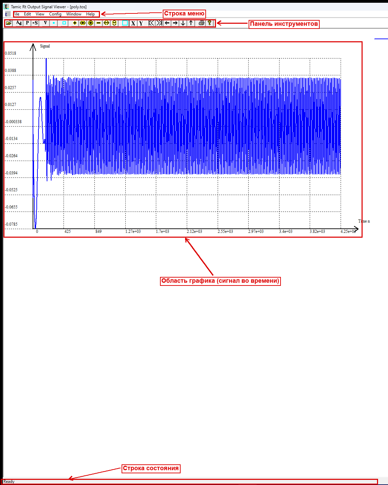

---

## 2. Запуск и открытие данных

### Как запустить программу

1. Найдите файл `TMCROS.exe` (после сборки он лежит в каталоге `dist/win32/bin` или `dist/win64/bin`).
2. Запустите его двойным щелчком.
3. При первом запуске программа разворачивается на весь экран. Если ранее уже открывались какие-либо файлы, TMCROS попытается автоматически открыть последний из них (список «недавних файлов» хранится в реестре Windows в разделе `TMCROS`).

### Какой файл открывать

TMCROS работает с двумя типами файлов (подробно — в разделе 7):

| Файл | Что это | Когда открывать |
|------|---------|-----------------|
| `.tos` | **Документ TMCROS**: текстовый файл с настройками графиков и ссылкой на файл(ы) `.t` | Обычный способ. Сохраняет цвета, масштаб, список кривых |
| `.t` | **Файл временно́го сигнала** (результат расчётного ядра) | Если хотите быстро посмотреть «сырой» результат. Программа сама создаст для него документ |

Чтобы открыть файл:

1. Меню **File → Open…** (Файл → Открыть), либо нажмите кнопку «Открыть» на панели инструментов, либо клавиши **Ctrl+O**.
2. В диалоге выберите нужный `.tos` или `.t` файл.
3. График сигнала появится в окне документа.

> Если вы открываете `.t`-файл, рядом с ним будет создан документ (он хранит настройки отображения). В дальнейшем удобнее открывать именно документ.

---

## 3. Главное окно

Главное окно — это многодокументное окно (MDI): внутри него могут быть открыты сразу несколько окон с разными графиками.


Окно состоит из четырёх зон:

1. **Строка меню** (вверху) — все команды программы, сгруппированные по разделам (File, Edit, View, Config, Window, Help). Подробно — раздел 5.
2. **Панель инструментов (тулбар)** — ряд кнопок-значков для самых частых действий. Подробно — раздел 4.
3. **Область графика** (центр) — здесь рисуются оси, координатная сетка и сами кривые сигнала. По этой области работает мышь: можно выделить прямоугольник для увеличения (zoom), а двойной щелчок подгоняет масштаб.
4. **Строка состояния (статусбар)** (внизу) — две панели:
   - **левая** — координаты точки под курсором мыши (значение времени по X и значение сигнала по Y);
   - **правая** — служебная информация о текущем графике (тип характеристики, отложенной по оси Y: сигнал, амплитуда, фаза, КСВН или потери).

---

## 4. Панель инструментов

Панель инструментов дублирует самые частые команды меню в виде кнопок. Если панель не видна, включите её через **View → Toolbar**.

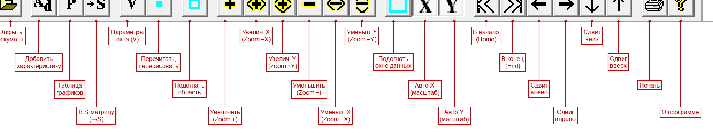

Кнопки идут слева направо. Ниже — назначение каждой. Перечень и порядок взяты из ресурса программы (`IDR_MAINFRAME TOOLBAR` в файле `src/viewers/Tmcrtout/TMCGROUT.rc`), а пояснения — из таблицы подсказок (STRINGTABLE) того же файла. Тонкие вертикальные промежутки на панели — это разделители (SEPARATOR), они группируют кнопки по смыслу.

| № | Кнопка | Команда (ID) | Название (англ./рус.) | Что делает |
|---|--------|--------------|------------------------|------------|
| 1 |  | `ID_FILE_OPEN` | Open / Открыть файл | Открывает файл `.tos` или `.t` (то же, что File → Open) |
| 2 |  | `ID_EDIT_ADDCHARACTERISTICS` | Add characteristics / Добавить характеристику | Добавляет в документ ещё одну кривую из выбранного `.t`-файла |
| 3 |  | `ID_EDIT_DOCUMENT` | Characteristics / Таблица графиков | Открывает таблицу со списком всех кривых документа (имена, файлы, входы/моды, флаги показа) |
| 4 | 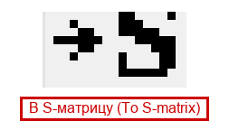 | `ID_EDIT_TOSMATRIX` | **To S-matrix / В S-матрицу** | Открывает диалог преобразования сигнала в S-матрицу (главная функция TMCROS, раздел 6.7) |
| 5 |  | `ID_EDIT_GRAPHICSPARAMETERS` | Viewport / Параметры окна | Открывает диалог настройки отображения: пределы по осям, единицы времени, тип характеристики Y, формат подписей, точки |
| 6 |  | `ID_VIEW_GRAPHICS` | Redraw data / Перечитать и перерисовать | Заново читает данные из файлов и перерисовывает график |
| 7 |  | `ID_VIEW_RESIZECTRLR` | Resize viewport / Подогнать область графика | Подгоняет область рисования под размер окна |
| 8 |  | `ID_VIEW_ZOOM_ZOOMP` | Zoom + / Увеличить | Увеличивает масштаб по обеим осям |
| 9 |  | `ID_VIEW_ZOOM_ZOOMXP` | Zoom +X / Увеличить по X | Увеличивает масштаб только по горизонтали (времени) |
| 10 |  | `ID_VIEW_ZOOM_ZOOMYP` | Zoom +Y / Увеличить по Y | Увеличивает масштаб только по вертикали (сигналу) |
| 11 |  | `ID_VIEW_ZOOM_ZOOM` | Zoom − / Уменьшить | Уменьшает масштаб по обеим осям |
| 12 |  | `ID_VIEW_ZOOM_ZOOMX` | Zoom −X / Уменьшить по X | Уменьшает масштаб только по горизонтали |
| 13 |  | `ID_VIEW_ZOOM_ZOOMY` | Zoom −Y / Уменьшить по Y | Уменьшает масштаб только по вертикали |
| 14 |  | `ID_VIEW_RESIZEWINDOW` | Resize window / Подогнать окно данных | Подгоняет вещественные пределы (окно данных) |
| 15 |  | `ID_VIEW_AUTOXSIZE` | Auto X size / Авто-масштаб X | Автоматически подбирает пределы по оси X (времени) под данные |
| 16 |  | `ID_VIEW_AUTOYSIZE` | Auto Y size / Авто-масштаб Y | Автоматически подбирает пределы по оси Y под данные |
| 17 |  | `ID_VIEW_TRANSLATE_CHANGEXMAXXMIN_HOME` | Change Xmin auto (Home) / В начало | Переход к началу диапазона по X (клавиша Home) |
| 18 |  | `ID_VIEW_TRANSLATE_CHANGEXMAXXMIN_END` | Change Xmax auto (End) / В конец | Переход к концу диапазона по X (клавиша End) |
| 19 |  | `ID_VIEW_CHANGEXMAXXMIN_DECRIMENT` | Decrement Xmin/Xmax / Сдвиг влево | Сдвигает видимую область по времени влево |
| 20 |  | `ID_VIEW_CHANGEXMAXXMIN_INCREMENT` | Increment Xmin/Xmax / Сдвиг вправо | Сдвигает видимую область по времени вправо |
| 21 |  | `ID_VIEW_CHANGEYMAXYMIN_DECREMENT` | Decrement Ymin/Ymax / Сдвиг вниз | Сдвигает видимую область вниз |
| 22 |  | `ID_VIEW_CHANGEYMAXYMIN_INCREMENT` | Increment Ymin/Ymax / Сдвиг вверх | Сдвигает видимую область вверх |
| 23 |  | `ID_FILE_PRINT` | Print / Печать | Печатает текущий график (то же, что File → Print) |
| 24 |  | `ID_APP_ABOUT` | About / О программе | Показывает окно «О программе TMCROS» |

> Примечание о кнопках «P» и «V». При предварительном осмотре панели на скриншоте `toolbar.png` некоторые значки были помечены наблюдателем как «P» (предполагаемая кнопка №3) и «V» (предполагаемая кнопка №5) с неопределённым назначением. Однако ресурс программы (раздел `IDR_MAINFRAME TOOLBAR`) **не содержит** отдельных кнопок с такими командами: в нём перечислены ровно 24 команды, приведённые в таблице выше. Скорее всего, «P» — это значок кнопки **Characteristics** (`ID_EDIT_DOCUMENT`, №3), а «V» — значок кнопки **Viewport / Параметры окна** (`ID_EDIT_GRAPHICSPARAMETERS`, №5); буквы на значках — лишь стилизованные пиктограммы, а не отдельные функции. Тем не менее точную сверку значков с командами лучше подтвердить визуально.

---

## 5. Меню

Ниже разобран каждый пункт каждого меню: что он делает, какая у него горячая клавиша и что происходит после выбора. Структура взята из ресурса меню `IDR_TMCGROTYPE` (меню при открытом документе).

### 5.1. Меню File (Файл)

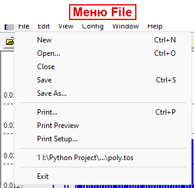

| Пункт | Горячая клавиша | Что делает |
|-------|-----------------|------------|
| **New** (Создать) | Ctrl+N | Создаёт новый пустой документ-график |
| **Open…** (Открыть) | Ctrl+O | Открывает существующий `.tos` или `.t` файл |
| **Close** (Закрыть) | — | Закрывает текущее окно документа |
| **Save** (Сохранить) | Ctrl+S | Сохраняет текущий документ (`.tos`) вместе со всеми настройками оформления |
| **Save As…** (Сохранить как) | — | Сохраняет документ под новым именем |
| **Print…** (Печать) | Ctrl+P | Печатает график |
| **Print Preview** (Предпросмотр печати) | — | Показывает, как график будет выглядеть на бумаге |
| **Print Setup…** (Параметры печати) | — | Настройки принтера и страницы |
| **Recent File / список последних файлов** | — | Быстрое открытие недавно использованных документов |
| **Exit** (Выход) | — | Закрывает программу |

> При сохранении настройки оформления (цвета, шрифт, типы линий) дополнительно запоминаются в реестре Windows и используются как значения по умолчанию для новых документов.

### 5.2. Меню Edit (Правка)

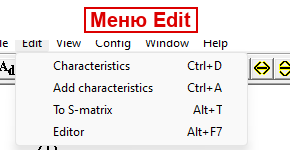

| Пункт | Горячая клавиша | Что делает |
|-------|-----------------|------------|
| **Characteristics** (Характеристики / таблица графиков) | Ctrl+D | Открывает таблицу содержимого документа: список всех кривых (до 20). Для каждой видно имя графика, имя `.t`-файла, входы/моды и флаг «показывать/не показывать» |
| **Add characteristics** (Добавить характеристику) | Ctrl+A | Открывает диалог выбора `.t`-файла и добавляет из него новую кривую в текущий документ |
| **To S-matrix** (В S-матрицу) | **Alt+T** | **Открывает диалог преобразования временно́го сигнала в матрицу рассеяния** (главная функция TMCROS). Подробно — раздел 6.7 |
| **Editor** (Внешний редактор) | Alt+F7 | Открывает файл документа во внешнем текстовом редакторе — для ручного редактирования `.tos` |

> «Входы» и «моды» (Input1/Mod1, Input2/Mod2) — это адрес столбца в файле сигнала: какой вход (порт) с какой компонентой показывать. Подробнее — раздел 7.

### 5.3. Меню View (Вид)

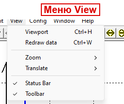

| Пункт | Горячая клавиша | Что делает |
|-------|-----------------|------------|
| **Viewport** (Параметры окна) | Ctrl+H | Открывает диалог настройки отображения: пределы Xmin/Xmax/Ymin/Ymax, авто-масштаб, единица оси X (время), тип характеристики Y, формат подписей, показ точек-маркеров |
| **Redraw data** (Перечитать и перерисовать) | Ctrl+W | Заново читает данные из файлов и перерисовывает график. Полезно, если файл `.t` пересчитан заново |
| **Zoom ►** (Масштаб) | — | Подменю масштабирования (см. ниже) |
| **Translate ►** (Сдвиг) | — | Подменю сдвига границ области (см. ниже) |
| **Status Bar** (Строка состояния) | — | Включает/выключает нижнюю строку состояния |
| **Toolbar** (Панель инструментов) | — | Включает/выключает панель инструментов |

#### Подменю View → Zoom (Масштаб)

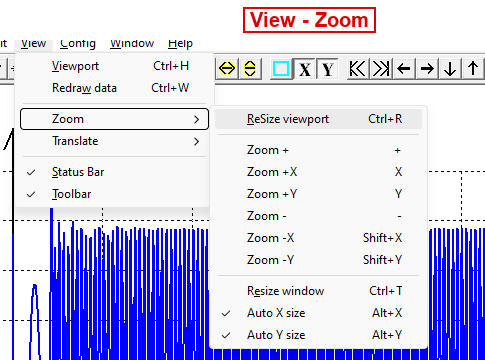

| Пункт | Горячая клавиша | Что делает |
|-------|-----------------|------------|
| **ReSize viewport** (Подогнать область) | Ctrl+R | Подгоняет область рисования под текущее окно |
| **Zoom +** (Увеличить) | + | Увеличивает масштаб по обеим осям |
| **Zoom +X** (Увеличить по X) | X | Увеличивает масштаб только по времени |
| **Zoom +Y** (Увеличить по Y) | Y | Увеличивает масштаб только по вертикали |
| **Zoom −** (Уменьшить) | − | Уменьшает масштаб по обеим осям |
| **Zoom −X** (Уменьшить по X) | Shift+X | Уменьшает масштаб по времени |
| **Zoom −Y** (Уменьшить по Y) | Shift+Y | Уменьшает масштаб по вертикали |
| **Resize window** (Подогнать окно данных) | Ctrl+T | Изменяет вещественные пределы окна данных |
| **Auto X size** (Авто-масштаб X) | Alt+X | Включает автоматический подбор пределов по X. В меню появляется галочка |
| **Auto Y size** (Авто-масштаб Y) | Alt+Y | Включает автоматический подбор пределов по Y. В меню появляется галочка |

> При включённом авто-масштабе по оси программа сама подбирает пределы под минимум/максимум данных, и ручные пределы по этой оси игнорируются (поля Xmin/Xmax или Ymin/Ymax в диалоге Viewport становятся недоступны).

#### Подменю View → Translate (Сдвиг)

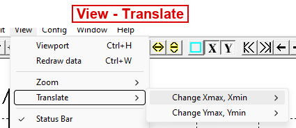

| Пункт | Вложенные команды | Что делает |
|-------|-------------------|------------|
| **Change Xmax, Xmin ►** | **Decrement** (← / стрелка влево), **Increment** (→ / стрелка вправо), **Home** (Home), **End** (End) | Сдвиг видимой области по времени влево/вправо, а также переход к началу (Home) и концу (End) диапазона |
| **Change Ymax, Ymin ►** | **Decrement** (V / стрелка вниз), **Increment** (^ / стрелка вверх) | Сдвиг видимой области вверх/вниз |

> Сдвиг удобен, когда нужно «прокрутить» график влево/вправо/вверх/вниз, не меняя масштаб. Шаг сдвига — порядка 10 % текущего диапазона.

### 5.4. Меню Config (Настройки)

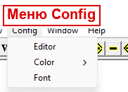

| Пункт | Что делает |
|-------|------------|
| **Editor** (Редактор) | Задаёт путь к внешнему текстовому редактору для `.tos`-файлов |
| **Color ►** (Цвет) | Подменю выбора цветов элементов графика (см. ниже) |
| **Font** (Шрифт) | Открывает стандартный диалог выбора шрифта, размера и цвета подписей осей и сетки |

#### Подменю Config → Color (Цвет)

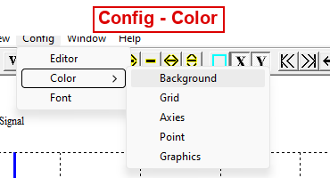

| Пункт | Что меняет |
|-------|------------|
| **Background** (Фон) | Цвет фона области графика |
| **Grid** (Сетка) | Цвет координатной сетки |
| **Axies** (Оси) | Цвет осей координат |
| **Point** (Точки) | Цвет точек-маркеров на кривых |
| **Graphics** (Графики) | Открывает диалог цветов/типов/толщины линий сразу для 16 кривых — здесь же можно задать индивидуальный цвет каждой кривой |

> Пункт **Graphics** открывает таблицу из 16 образцов линий. Нажав на нужный образец, вы выбираете цвет, стиль (Solid — сплошная, Dash — пунктир, Dot — точки, DashDot, DashDotDot) и толщину этой линии.

### 5.5. Меню Window (Окно)

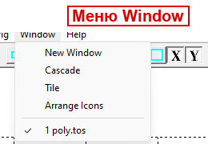

| Пункт | Что делает |
|-------|------------|
| **New Window** (Новое окно) | Открывает ещё одно окно для того же документа (полезно для разных масштабов одного графика) |
| **Cascade** (Каскад) | Располагает окна каскадом |
| **Tile** (Мозаика) | Располагает окна плиткой (рядом) |
| **Arrange Icons** (Упорядочить значки) | Выравнивает свёрнутые окна-значки |
| **Список окон** | Переключение между открытыми окнами документов |

### 5.6. Меню Help (Справка)

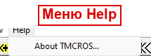

| Пункт | Что делает |
|-------|------------|
| **About TMCROS…** (О программе) | Показывает окно с названием и версией программы (*Tamic Rt Output Signal Viewer*) |

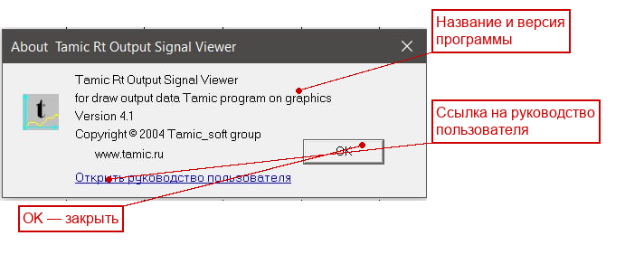

---

## 6. Типовые сценарии работы

Ниже — пошаговые инструкции для самых частых задач.

### 6.1. Открыть документ `.tos`

1. Меню **File → Open…** (или Ctrl+O, или кнопка «Открыть» на панели).
2. Выберите файл с расширением `.tos` (например, `poly.tos`).
3. График сигнала построится автоматически. Если кривая «уехала» за пределы окна — нажмите кнопки авто-масштаба **Auto X size** и **Auto Y size**.

### 6.2. Открыть «сырой» сигнал `.t`

1. Меню **File → Open…** (Ctrl+O).
2. В диалоге выберите файл с расширением `.t` (например, `poly.t`).
3. Программа прочитает сигнал и построит график; рядом будет создан документ для хранения настроек отображения. Сохраните его (**File → Save**, Ctrl+S), чтобы в следующий раз открывать уже готовый документ.

### 6.3. Добавить ещё одну характеристику (Add characteristics)

1. Откройте документ (см. 6.1).
2. Меню **Edit → Add characteristics** (Ctrl+A) или кнопка «Добавить характеристику».
3. В диалоге выберите нужный `.t`-файл.
4. Новая кривая добавится в документ. Чтобы посмотреть/настроить список всех кривых, откройте **Edit → Characteristics** (Ctrl+D).
5. В таблице можно включать и выключать показ каждой кривой (флаг вывода), а также задавать вход/моду нужного столбца сигнала.

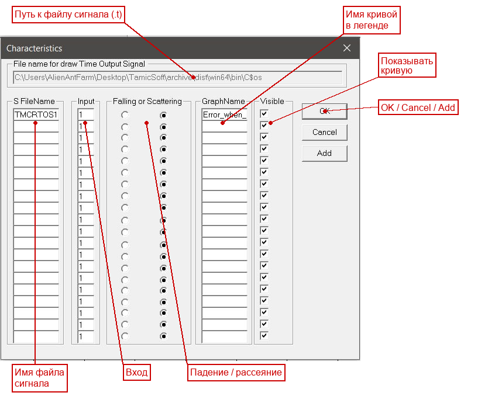

### 6.4. Настроить масштаб (Zoom / Auto X / Auto Y)

Есть три способа изменить масштаб:

- **Мышью** — зажмите левую кнопку и обведите прямоугольником интересующую область графика; при отпускании кнопки программа увеличит выделенное. Двойной щелчок в области графика подгоняет масштаб обратно.
- **Кнопками панели** — Zoom + / Zoom − (обе оси), Zoom +X/−X, Zoom +Y/−Y (по одной оси).
- **Авто-масштаб** — **View → Zoom → Auto X size** (Alt+X) и **Auto Y size** (Alt+Y). Программа сама подберёт пределы так, чтобы видеть всю кривую. Это самый быстрый способ «вписать» график в окно.

### 6.5. Сдвинуть график (Translate)

1. Меню **View → Translate**.
2. Выберите **Change Xmax, Xmin** (сдвиг по времени) или **Change Ymax, Ymin** (сдвиг по вертикали).
3. Во вложенном подменю выберите **Decrement** или **Increment** (либо клавиши-стрелки). Для перехода в начало/конец диапазона по времени используйте **Home**/**End**.

Тот же эффект дают кнопки сдвига на панели инструментов (№17–22).

> Сдвиг работает только при выключенном авто-масштабе по соответствующей оси: при включённом авто-масштабе пределы определяются автоматически по данным.

### 6.6. Сменить цвета и тип характеристики

**Цвет фона / сетки / осей / точек:**
1. Меню **Config → Color → Background / Grid / Axies / Point**.
2. В стандартном диалоге выберите цвет → OK.

**Цвет, стиль и толщина кривых:**
1. Меню **Config → Color → Graphics**.
2. В открывшейся таблице нажмите образец нужной кривой.
3. Выберите цвет, стиль линии (Solid/Dash/Dot/DashDot/DashDotDot) и толщину → OK.

**Что отложено по оси Y и единицы оси X (время):**
1. Меню **View → Viewport** (Ctrl+H) или кнопка «Параметры окна».
2. В диалоге выберите тип характеристики Y (Signal, Amplitude, WSVR, L dB, Phase rad, Phase grad) и единицу оси X (nT — отсчёты, либо pс/нс/мкс/мс/с), при желании задайте пределы и формат подписей → OK.

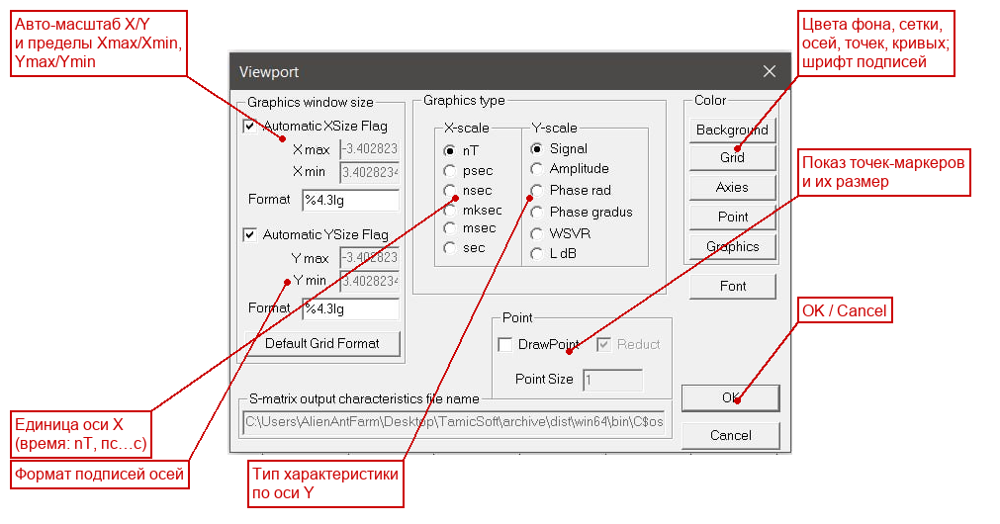

### 6.7. Восстановить S-матрицу из сигнала (To S-matrix)

Это главная, отличающая TMCROS функция. Она берёт один или несколько временны́х сигналов (`.t`) и вычисляет по ним **матрицу рассеяния** на заданных частотах, сохраняя результат в файл S-матрицы (`.s`). Полученный `.s`-файл затем можно открыть в программе TMCGROUT и смотреть как обычную частотную характеристику.

**Идея метода (кратко).** Временно́й сигнал на каждом входе считается гармоническим колебанием `s(t) = A·sin(ω·t + φ)` на заданной частоте. По соседним отсчётам сигнала программа восстанавливает амплитуду `A` и фазу `φ` — то есть комплексное значение элемента S-матрицы — и усредняет результат по выбранному диапазону времени. Вход, на котором есть сигнал (возбуждённый вход), определяет строку S-матрицы.

**Пошагово:**

1. Откройте документ с сигналом (`.tos`) или сам `.t`-файл.
2. Меню **Edit → To S-matrix** (Alt+T) или кнопка «В S-матрицу» на панели.
3. Откроется диалог преобразования (см. рисунок ниже). В нём:

   - **список входных файлов `.t`** (до 20) с флажком «обрабатывать» у каждого. Кнопкой **Add** добавьте нужные файлы сигнала;
   - поле **выходного `.s`-файла** — имя результата; по умолчанию это `<имя документа>.s`. Изменить его можно кнопкой **Change**, удалить файл с диска — кнопкой **Delete**;
   - **частота** для каждого входного файла (в Гц). Чтобы быстро заполнить столбец частот арифметической прогрессией (начальная частота + шаг), нажмите кнопку **Fill X value**;
   - **диапазон времени** `Tmin`/`Tmax` и единица времени — задают, на каком участке сигнала выполняется восстановление.
4. Нажмите кнопку **Export to S** (или **OK**). Программа по очереди обработает все отмеченные файлы и запишет результат в один `.s`-файл.
5. Откройте полученный `.s` в **TMCGROUT**, чтобы увидеть восстановленную частотную характеристику.

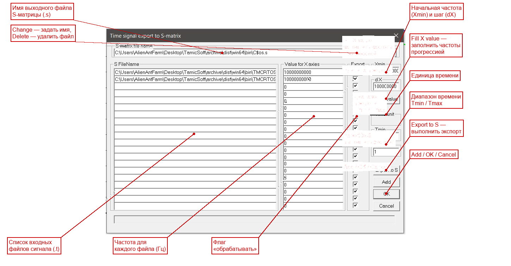

> Что на входе: один или несколько файлов сигнала `.t` + список частот + диапазон времени.
> Что на выходе: один файл S-матрицы `.s` (каждый обработанный файл добавляет в него свою строку матрицы).

> Если при экспорте произошла ошибка (например, файл сигнала не найден или в нём слишком мало точек), процесс останавливается, а текст ошибки показывается в диалоге.

### 6.8. Напечатать график

1. Сначала настройте масштаб и оформление так, как хотите видеть на бумаге.
2. (По желанию) Меню **File → Print Preview** — проверьте, как график ляжет на страницу.
3. Меню **File → Print…** (Ctrl+P) или кнопка «Печать».
4. Выберите принтер и нажмите OK.

---

## 7. Форматы входных данных

TMCROS работает с двумя форматами файлов: документ `.tos` и файл временно́го сигнала `.t`.

### 7.1. Файл документа `.tos`

`.tos` — это **текстовый** файл-документ TMCROS. Его можно открыть любым текстовым редактором. Он хранит настройки оформления и список кривых, но **не хранит сами данные** — данные берутся из файлов `.t`, на которые ссылается документ.

**Структура файла** (на примере реального файла `samples/SAMPLE_R/ABSORBER/poly.tos`):

```
#TMCGROTS
!Graphics parameters
!Graphics data
!file name : E:\BackUP\ARHIV\WORK\Source\SAMPLE_R\ABSORBER\poly.tos
!Data file for draw graphics
!TFileName GraphicsName DrawFlag Input1 Mod1 Input2 Mod2
poly.t poly.t 1 1 1 1 1
```

**Разбор по строкам:**

| Строка | Назначение |
|--------|------------|
| `#TMCGROTS` | **Сигнатура** — обязательная первая строка. По ней программа узнаёт «свой» файл документа |
| Строки, начинающиеся с `!` | **Комментарии** — программа их игнорирует (включая авто-сгенерированный путь и подсказку по столбцам) |
| Строки `#Ключ значение` | **Параметры оформления** (в этом простом примере их нет, но они могут присутствовать — см. ниже) |
| Последние строки (без `#`) | **Описания кривых** — по одной строке на кривую |

**Параметры оформления (`#Ключ`).** В полном документе TMCROS могут присутствовать ключи настройки осей и цветов (по аналогии с документом TMCGROUT). Основные из них:

| Ключ | Что задаёт | Значения |
|------|-----------|----------|
| `#nXType` | **Тип оси X (единица времени)** | 0 — отсчёты (nT), 1 — пс, 2 — нс, 3 — мкс, 4 — мс, 5 — с |
| `#nYType` | **Тип оси Y (характеристика)** | 0 — сигнал (Signal), 1 — амплитуда (Amplitude), 2 — фаза рад (Phase rad), 3 — фаза град (Phase grad), 4 — КСВН (WSVR), 5 — потери дБ (L dB) |
| `#Xmin`, `#Xmax` | Пределы по оси X (времени) | числа в выбранной единице |
| `#Ymin`, `#Ymax` | Пределы по оси Y | числа |
| `#nAFlagX` / `#nAFlagY` | Авто-масштаб по X / по Y | 0 — выкл, 1 — вкл |
| `#sDrawBckgrdColor` / `#sDrawGridColor` / `#sDrawAxiesColor` / `#sDrawPointColor` / `#sDrawTextColor` | Цвета фона, сетки, осей, точек, текста | числа COLORREF (16777215 = белый, 0 = чёрный) |
| `#sDrawTextFont` | Шрифт подписей | параметры шрифта (имя, размер и т.д.) |
| `#EditorFileName` | Внешний редактор документа | путь к `.exe` |

> Соответствие чисел `#nXType` и `#nYType` названиям пунктов взято из описания типов осей в API-документации (`docs/api/viewers/tmcros.md`, §3.2 и §3.3). В диалоге **Viewport** ось Y предлагается семью пунктами: Signal, Amplitude, WSVR, L dB, Phase in radian, Phase in gradus, Delta Phase.

**Описание кривой** (строка данных). Формат столбцов указан в комментарии выше неё:

```
!TFileName GraphicsName DrawFlag Input1 Mod1 Input2 Mod2
poly.t     poly.t       1        1      1    1      1
```

| Столбец | Значение в примере | Назначение |
|---------|--------------------|------------|
| `TFileName` | `poly.t` | Имя файла временно́го сигнала (обычно относительный путь рядом с `.tos`) |
| `GraphicsName` | `poly.t` | Подпись кривой в легенде |
| `DrawFlag` | `1` | Показывать кривую: 1 — да, 0 — нет |
| `Input1` | `1` | Номер первого входа (порта) в файле сигнала |
| `Mod1` | `1` | Номер моды/компоненты первого входа |
| `Input2` | `1` | Номер второго входа |
| `Mod2` | `1` | Номер моды/компоненты второго входа |

> В отличие от частотного документа TMCGROUT, здесь столбцы Input/Mod адресуют **столбец временно́го сигнала** в файле `.t`, а не элемент S-матрицы. По коду программы значимым является первый адрес (`Input1`/`Mod1`); второй адрес при чтении сигнала приводится к значениям по умолчанию.

### 7.2. Файл временно́го сигнала `.t`

`.t` — это файл с **самим временны́м сигналом** многополюсника: для каждого момента времени хранятся отсчёты сигнала по всем входам (портам). Это результат работы счётного ядра (`tmc_rth` или `tmc_rtx`). Файл **текстовый**, его можно открыть любым редактором.

Начало файла (пример `samples/SAMPLE_R/ABSORBER/poly.t`):

```
#TMC_GraphicsOutputSignalFile FormVer2.0 2000
!File name E:\BackUP\ARHIV\WORK\Source\SAMPLE_R\ABSORBER\poly.t
#TMC_GROTS_Freq 1e+010
#TMC_GROTS_InpNum -2
!nT	nBlock	Up	Uo
        0              0   7              0              0   8              0              0
        1  4.717309e-012   7      0.2920765    -0.05489582   8              0              0
        2  9.434617e-012   7      0.5586809     0.03530808   8              0              0
        ...
```

| Элемент | Что это |
|---------|---------|
| `#TMC_GraphicsOutputSignalFile FormVer2.0 2000` | **Сигнатура** файла сигнала (версия формата 2.0, год 2000) |
| `!File name <путь>` | Комментарий с исходным путём к файлу (строки с `!` игнорируются) |
| `#TMC_GROTS_Freq 1e+010` | **Частота** (Гц), на которой считался сигнал — здесь 10 ГГц. Используется при восстановлении амплитуды/фазы и в функции To S-matrix |
| `#TMC_GROTS_InpNum -2` | Служебная строка с числом входов |
| `!nT  nBlock  Up  Uo` | Комментарий-подсказка с названиями столбцов |
| Строки данных (начинаются с пробела) | Сами отсчёты сигнала: для каждой точки — её номер, время и далее по каждому входу — номер входа и пара чисел (Re/Im отсчёта сигнала) |

**Как читать строку данных** (на примере точки №1):

```
        1  4.717309e-012   7      0.2920765    -0.05489582   8              0              0
```

| Поле | Значение | Смысл |
|------|----------|-------|
| `1` | номер точки | Порядковый номер отсчёта (он же «время в отсчётах», тип оси X = nT) |
| `4.717309e-012` | время, с | Момент времени данного отсчёта (здесь ≈ 4.72 пс) |
| `7  0.2920765  -0.05489582` | вход 7: Re, Im | Номер первого входа и пара значений сигнала (вещественная и мнимая часть отсчёта) |
| `8  0  0` | вход 8: Re, Im | Номер второго входа и пара значений (здесь нули — вход не возбуждён) |

То есть в каждой строке после номера точки и времени идут **тройки** «номер входа + два числа» — по одной тройке на каждый вход (порт) структуры.

### 7.3. Как получить файлы `.t` и `.tos`

Файл `.t` создаётся **счётным ядром** при расчёте планарной структуры с выводом временно́го сигнала. Кратко (подробно — в `docs/api/kernels/planar_rt_h.md` и руководствах по ядрам):

1. Подготовьте входной файл-шаблон `.tpl` (топология структуры, параметры, секция вывода). В секции вывода должен быть включён вывод **временно́го сигнала** и задано имя выходного файла `.t`.
2. Запустите счётное ядро: `tmc_rth.exe` (для H-поляризации) или `tmc_rtx.exe` (для X-моды), откройте в нём `.tpl` и выполните расчёт.
3. По завершении ядро запишет файл `.t` с временны́м сигналом.
4. Откройте полученный `.t` в TMCROS — программа автоматически создаст рядом документ. Дальше настройте оформление и сохраните (`Ctrl+S`).

Готовые примеры для тренировки лежат в `samples/SAMPLE_R/` (например, `ABSORBER/poly.t` + `poly.tos`, а также `1/quasi0.tos`).

---

## 8. Возможные проблемы и их решение

| Симптом | Причина | Что делать |
|---------|---------|------------|
| В легенде/области графика надпись **`Error_when_read…`** | Файл `.t` не найден, пуст или повреждён | Проверьте, существует ли `.t`-файл по указанному в `.tos` пути; пересчитайте его ядром заново |
| График **пустой** или кривая не видна | Включён неудачный масштаб, либо данные вне окна | Нажмите **Auto X size** и **Auto Y size** (Alt+X, Alt+Y), чтобы вписать кривую в окно |
| Кривая есть, но **«уезжает» за край** | Заданы ручные пределы Xmin/Xmax/Ymin/Ymax | Откройте **View → Viewport** и проверьте пределы, либо включите авто-масштаб |
| После пересчёта `.t` график **не обновился** | TMCROS показывает старые данные | Нажмите **View → Redraw data** (Ctrl+W) или кнопку «Перечитать» |
| Кривая **одного цвета** с фоном/её плохо видно | Совпали цвета | **Config → Color → Graphics** — задайте контрастный цвет линии |
| Функция **To S-matrix** выдаёт ошибку | Не выбран ни один файл, файл `.t` недоступен, мало точек в диапазоне `Tmin..Tmax`, не задана частота | Проверьте список файлов и флажки, задайте корректный диапазон времени и частоты; убедитесь, что файл сигнала существует |
| Не открывается файл — сообщение про **«не тот формат»** | Первая строка документа не `#TMCGROTS` | Убедитесь, что открываете корректный документ; первая строка `.tos` должна быть `#TMCGROTS`, а файла сигнала — `#TMC_GraphicsOutputSignalFile…` |
